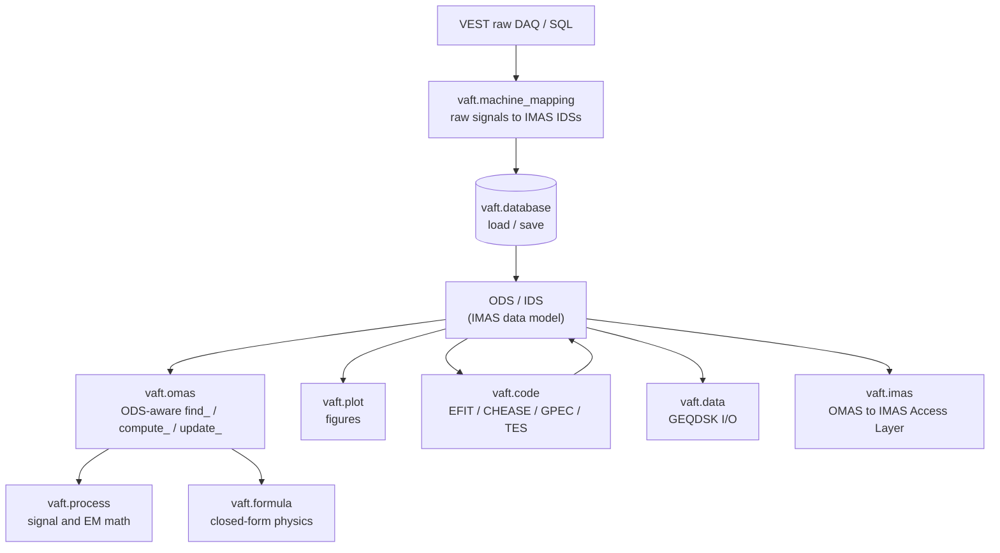

This page is the map of the `vaft` package: what each subpackage is for, the entry points you are
expected to call, and where the detailed guide for each area lives. The signatures shown here are the
real ones — copy them.

```python
import vaft

vaft.__version__          # '0.5.0' on the inspected develop baseline
```

Importing `vaft` is cheap. The top-level package exposes its subpackages **lazily** (`__getattr__`),
so `import vaft` does not drag in `omas`, `imas` or `matplotlib` until you actually touch
`vaft.omas`, `vaft.imas` or `vaft.plot`. Two compatibility shims are applied at import time —
`vaft.apply_runtime_compat_patches()` and `vaft.apply_omfit_compat_patches()` — which restore
NumPy/SciPy APIs that recent releases removed (`trapz`, `cumtrapz`, `interp2d`) so that OMFIT-derived
code keeps working. You never need to call them yourself.

# Package map



| Subpackage | Purpose | Deep dive |
| --- | --- | --- |
| `vaft.database` | Load/save VEST shots (ODS, native IDS) and reach the raw SQL DAQ archive | [Data structures]({{ site.baseurl }}/guide/Data_structures/) |
| `vaft.omas` | The ODS-aware API: `find_*`, `compute_*`, `update_*`, sample data | this page |
| `vaft.process` | Array-in / array-out signal processing, EM response, magnetics chains | [Signal processing and EM modeling]({{ site.baseurl }}/guide/Processing/) |
| `vaft.formula` | Pure physics functions: equilibrium, stability, Green's functions, constants | [Formula reference]({{ site.baseurl }}/reference/formula/) |
| `vaft.machine_mapping` | Raw VEST DAQ to IMAS IDS mapping, plus uncertainty defaults | this page |
| `vaft.plot` | Matplotlib figures straight from an ODS/ODC | this page |
| `vaft.code` | Adapters for external codes (EFIT, CHEASE, GPEC, TES) | this page |
| `vaft.data` | GEQDSK read/write and packaged sample files | this page |
| `vaft.imas` | OMAS to IMAS Access Layer bridge | [Data structures]({{ site.baseurl }}/guide/Data_structures/) |

Everything in an ODS is in **IMAS SI units**: seconds, amperes, tesla, weber, m$^{-3}$, and eV or J
where the Data Dictionary says so. The plotting layer is the only place that rescales (for example A
to kA) and it does so through an explicit `yunit` argument.

# `vaft.database`

The historical, and still the shortest, way to get a shot:

```python
import vaft

ods = vaft.database.load(39915, source="public")        # eager omas.ODS
with vaft.database.open(39915, source="public") as remote:
    times = remote["equilibrium.time"]                   # lazy, read-only
```

`load()` returns an ODS unless `representation="imas"` is requested. `paths` scopes OMAS requests to
IDS roots or leaves; native requests accept top-level IDS names:

```python
eq = vaft.database.load(
    39915, source="public", representation="imas", paths="equilibrium"
)
```

Full signatures:

```python
vaft.database.load(shot, source="public", *, representation="omas", paths=None,
                   occurrence=None, imas_version=None, cache="auto", transport="auto")
vaft.database.open(shot, *, source="public", representation="omas", paths=None,
                   occurrence=None, imas_version=None)
vaft.database.save(data, shot, *, target="public", representation=None,
                   occurrence=None, imas_version=None, derived_cache="auto")
```

For local files use `vaft.omas.load/save` or `vaft.imas.load/save`; use
`vaft.database.filedb.FileDB` to resolve canonical archive paths. Remote save access is restricted and
is never required by the documentation examples.

## Raw DAQ access

`vaft.database.raw` talks to the VEST SQL archive directly:

```python
from vaft.database import raw

time, data = raw.vest_load(39915, field=109)     # (time_array, data_array), or None on failure
time, data = raw.load_raw(39915, fields=109)     # the loader vest_load delegates to
label      = raw.name(109)                       # field code to human-readable name
shots      = raw.vest_shots("2024-08-08")        # shots taken on a date
date       = raw.vest_date(39915)
latest     = raw.last_shot()
```

Other members worth knowing: `raw.load_raw(shot, fields=None, daq_type=None, sample_opt=False)`
(`sample_opt` points it at an archived dump instead of the live DB),
`raw.vest_load_by_name(shot, name)`, `raw.get_all_field_codes_for_shot(shot)`,
`raw.dump_all_raw_signals_for_shot(shot, output_path=...)` (offline cache) and its counterpart
`raw.compare_db_and_dumped_raw_signals_for_shot(...)`. `raw.sql_loading_available()` and
`raw.raw_offline_only()` report whether the SQL driver and credentials are usable at all — this is
how the test suite decides to skip online tests. Credentials are managed by `raw.setup_raw_db()` and
`raw.configuration()` (backed by `SecureConfigManager`).

Connection and inventory helpers for the HSDS side live in `vaft.database.utils`:

```python
from vaft.database import utils

utils.is_connect()                                   # is HSDS reachable?
utils.exist_shot(username=None, shot=None, data_filter=None, sort=-1)
```

# `vaft.omas`

This is the layer you actually call to do physics on a shot. Everything here takes an `ODS` (or an
`ODC`) and reads/writes IMAS paths. It is a flat namespace: `vaft.omas.<name>` resolves into the
`general`, `process_wrapper`, `formula_wrapper`, `update` and `sample` modules.

## Sample data (works offline)

```python
ods = vaft.omas.sample_ods()    # packaged shot 39915
odc = vaft.omas.sample_odc()    # 39915, 41524, 41672
geq = vaft.omas.sample_gfile()  # packaged g-file as a GEQDSK object
```

## Shot introspection — `general`

```python
vaft.omas.find_shotnumber(ods)
vaft.omas.find_shotclass(ods, plot_opt=0)
vaft.omas.find_chamber_boundary(ods)
vaft.omas.find_breakdown_onset(ods)
vaft.omas.find_vloop_onset(ods)
vaft.omas.find_ip_onset(ods)
vaft.omas.find_pf_active_onset(ods)
vaft.omas.find_pulse_duration(ods)
vaft.omas.find_max_ip(ods)
vaft.omas.find_bt(ods)
vaft.omas.find_major_radius(ods)
vaft.omas.classify_shot(ods, pressure_threshold=0.01, halpha_threshold=0.01)
vaft.omas.print_info(ods, key_name=None)
vaft.omas.find_matching_time_indices(ods, time_slice=None, atol=1e-6)
```

Time-base bookkeeping (DAQ time versus breakdown-referenced time) and container plumbing:

```python
vaft.omas.shift_time(one_ods, time_shift)
vaft.omas.change_time_convention(odc_or_ods, convention="vloop")
vaft.omas.odc_or_ods_check(odc_or_ods)     # returns an ODC either way
vaft.omas.combine_ods(ods_list)
```

## Derived quantities — `process_wrapper`

These pull geometry and signals out of the ODS, call into `vaft.process`, and hand back arrays.

```python
# Electromagnetic response and eddy currents
vaft.omas.compute_grid_ods(ods, xvar, zvar)
vaft.omas.compute_point_response_ods(ods, rz, plasma=None)
vaft.omas.compute_grid_response_ods(ods, plasma=None)
vaft.omas.compute_impedance_matrices_ods(ods, plasma)
vaft.omas.compute_eddy_currents(ods, plasma, ip, dt_sub=...)
vaft.omas.compute_point_vacuum_fields_ods(ods, rz=[(0.4, 0.0)], plot_opt=False, mode="vacuum")
vaft.omas.compute_null_ods(ods, time)

# Equilibrium, profiles, energy
vaft.omas.compute_core_profile_psi(ods, option="n_e", time_slice=None)
vaft.omas.compute_core_profile_2d(ods, option="n_e", time_slice=None)
vaft.omas.compute_magnetic_energy(ods, time_slice=None)
vaft.omas.compute_virial_equilibrium_quantities_ods(ods, time_slice=None)
vaft.omas.compute_volume_averaged_pressure(ods, time_slice=None, option="equilibrium")
vaft.omas.compute_reconstructed_diamagnetic_flux(ods, time_index=0)
vaft.omas.compute_diamagnetic_flux_measured_vs_computed(ods, time_slice=None)
vaft.omas.compute_diamagnetism(ods, time_index=0)
vaft.omas.compute_ohmic_heating_power_from_core_profiles(
    ods, time_slice=None, Z_eff=2.0, ln_Lambda=17.0)
```

## Physics scalings — `formula_wrapper`

```python
vaft.omas.compute_tau_E_exp(ods, time_slice, Z_eff=2.0)
vaft.omas.compute_tau_E_scaling(ods, time_slice, scaling="IBP98y2", Z_eff=2.0, M=1.0,
                                eng_params=None)
vaft.omas.compute_tau_E_engineering_parameters(ods, time_slice, Z_eff=2.0, M=1.0)
vaft.omas.compute_confiment_time_paramters(ods, time_slice, Z_eff=2.0, M=1.0)
vaft.omas.compute_power_balance(ods, include_line_radiation=True, line_radiation_species=None,
                                impurity_fractions=None, Z_eff=2.0)
vaft.omas.compute_bremsstrahlung_power(ods, time_slice=None, Z_eff=2.0)
vaft.omas.compute_voltage_consumption(ods, time_slice=None)
vaft.omas.compute_magnetic_shear(ods, time_slice)
```

## In-place enrichment — `update`

`update_*` functions **mutate the ODS**: they fill IMAS fields that the reconstruction itself did not
provide. Run them once after loading, then plot.

```python
vaft.omas.update_equilibrium_profiles_1d_normalized_psi(ods, time_slice=None)
vaft.omas.update_equilibrium_profiles_1d_radial_coordinates(ods, time_slice=None, plot_opt=0)
vaft.omas.update_equilibrium_boundary(ods, time_slice=None)
vaft.omas.update_equilibrium_coordinates(ods, time_slice=None, plot_opt=0)
vaft.omas.update_equilibrium_global_quantities_q_min(ods, time_slice=None)
vaft.omas.update_equilibrium_global_quantities_volume(ods, time_slice=None)
vaft.omas.update_equilibrium_profiles_2d_j_tor(ods, time_slice=None)
vaft.omas.update_equilibrium_profiles_2d_sfl_coordinates(
    ods, time_slice=None, profiles_2d_idx=1, convention="sfl", n_theta=129, plot_opt=0)
vaft.omas.update_equilibrium_stored_energy(ods, time_slice=None)
vaft.omas.update_equilibrium_constraints_diamagnetic_flux(ods, time_slice=None)
vaft.omas.update_core_profiles_global_quantities_volume_average(ods, time_slice=None)
```

# `vaft.process` and `vaft.formula`

`vaft.process` is the numerical layer (NumPy in, NumPy out) and `vaft.formula` is the closed-form
physics layer. Neither one touches an ODS. Modules at a glance:

| Module | Contents |
| --- | --- |
| `vaft.process.signal_processing` | `smooth`, `define_baseline`, `subtract_baseline`, `signal_on_offset`, `is_signal_active`, `process_signal` |
| `vaft.process.numerical` | `time_derivative(time, data)` on a non-uniform grid |
| `vaft.process.electromagnetics` | `compute_br_bz_phi`, `calc_grid`, `compute_response_matrix`, `compute_impedance_matrices`, `solve_eddy_currents`, `compute_vacuum_fields_1d` |
| `vaft.process.magnetics` | `rogowski_coil_ip`, `flux_loop_flux`, `b_field_pol_probe_field`, `mirnov_spectrogram`, `toroidal_mode_analysis`, `toroidal_phase_fit_at_time` |
| `vaft.process.equilibrium` | `psi_to_rz`, `psi_to_rho`, `volume_average`, `shafranov_integrals`, `efit_virial_volume_integrals`, `calculate_diamagnetism` |
| `vaft.process.profile` | Thomson and charge-exchange mapping/fitting, `core_profiles`, `core_profiles_from_eq` |
| `vaft.process.statistical_analysis` | `generate_core_profiles_history_dataframe`, `perform_ols_regression`, `compute_metrics` |
| `vaft.formula.equilibrium` | flux, `q` and shear; geometry from an $(R,Z)$ boundary; virial (Shafranov) relations; power balance; confinement scalings |
| `vaft.formula.stability` | `beta_N_from_beta_a_B0_Ip`, `greenwald_density`, `greenwald_fraction`, ballooning/kink/sawtooth criteria |
| `vaft.formula.green` | `greens_function_2d`, `green_br_bz`, complete elliptic integrals |
| `vaft.formula.utils` | `gradient`, `trapz_integral`, `fit_profile`, `make_fit_function` |
| `vaft.formula.atomic` | `interpolate_adf11`, `fractional_abundances`, `line_cooling_coefficient` on OPEN-ADAS ADF11 tables |
| `vaft.formula.statistics` | residual, goodness-of-fit and convergence statistics (`rms`, `chi_squared`, `runs_test_z`, `log10_decay_rate`, ...) |
| `vaft.formula.constants` | Physical constants used by the formula layer |

Both are documented in full on the
[Signal processing and EM modeling]({{ site.baseurl }}/guide/Processing/) and
[Formula reference]({{ site.baseurl }}/reference/formula/) pages; the latter is generated per function from the standardized docstrings.

# `vaft.machine_mapping`

This is how a raw VEST shot becomes IMAS. Each time-dependent diagnostic has a canonical function
with a uniform signature — `(ods, shot, tstart, tend, dt)` — that fills the corresponding IDS in
place:

```python
import vaft
from omas import ODS

ods = ODS()
shot, tstart, tend, dt = 39915, 0.24, 0.36, 1e-4

vaft.machine_mapping.dataset_description(ods, shot)
vaft.machine_mapping.pf_active(ods, shot, tstart, tend, dt)
vaft.machine_mapping.tf(ods, shot, tstart, tend, dt)
vaft.machine_mapping.magnetics(ods, shot, tstart, tend, dt)
vaft.machine_mapping.barometry(ods, shot, tstart, tend, dt)
vaft.machine_mapping.spectrometer_uv(ods, shot, tstart, tend, dt)
```

Geometry, coupling and model IDSs take a `source` instead of a time window:

```python
vaft.machine_mapping.pf_passive(ods)            # source=None uses the packaged geometry
vaft.machine_mapping.em_coupling(ods)           # packaged mutual-inductance matrices
vaft.machine_mapping.mhd_linear(ods, source)    # source = a linear-MHD output file
vaft.machine_mapping.summary(ods, source, options)
```

Two names in this namespace are reserved but not wired up yet:
`vaft.machine_mapping.equilibrium` and `vaft.machine_mapping.pf_plasma` raise
`NotImplementedError`. Equilibria enter the ODS through `vaft.code` (EFIT/CHEASE) instead.

Kinetic and imaging diagnostics take a shot number plus an optional data root:

```python
vaft.machine_mapping.thomson_scattering(ods, shotnumber, data_root=None, mat_file=None)
vaft.machine_mapping.charge_exchange(ods, shotnumber, options="ces", data_root=None)
vaft.machine_mapping.soft_x_rays(ods, shot, daq_label, data_root=None, digitizer_file=None)
```

The `*_from_raw_database` variants — `magnetics_from_raw_database`, `pf_active_from_raw_database`,
`tf_from_raw_database`, `barometry_from_raw_database`, `filterscope_from_raw_database`,
`dataset_description_from_raw_database`, `calculate_em_coupling_from_raw_database` — are the
pipeline-facing entry points: they take an `options` dict and reach into the SQL DAQ themselves.
Per-channel entry points at that level (`flux_loop_from_raw_database`,
`b_field_pol_probe_from_raw_database`, `rogowski_coil_and_ip_from_raw_database`) exist as names but
raise `NotImplementedError` — use the IDS-level `magnetics(...)` mapping instead.

The `vfit_*` names are the legacy VEST-fit API, kept as aliases and split into
`vfit_<diag>_static` (geometry) and `vfit_<diag>_dynamic` (signals) — for example
`vfit_magnetics_static` / `vfit_magnetics_dynamic`, `vfit_pf_active_static` /
`vfit_pf_active_dynamic`, `vfit_tf_static` / `vfit_tf_dynamic`.

Uncertainties for equilibrium reconstruction are not hard-coded in the mapping; they come from a
central table:

```python
vaft.machine_mapping.DEFAULT_CONSTRAINT_UNCERTAINTIES       # dict
vaft.machine_mapping.DEFAULT_CONSTRAINT_UNCERTAINTY_VECTOR  # ordered vector

vaft.machine_mapping.apply_default_constraint_uncertainties(ods, uncertainty=None,
                                                            fl_correct_coeff=None)
vaft.machine_mapping.apply_magnetics_uncertainties(ods, ip_relative_error=None)
vaft.machine_mapping.apply_pf_active_current_uncertainties(ods, relative_error=None)
vaft.machine_mapping.apply_tf_uncertainties(ods, relative_error=None)
vaft.machine_mapping.normalize_constraint_uncertainties(uncertainty)
```

Geometry assets shipped with the package are resolved with
`vaft.machine_mapping.resolve_geometry_asset(filename, geometry_root=None)`, and DAQ field metadata
with `vaft.machine_mapping.raw_database_info(file, shot, key)` and
`vaft.machine_mapping.get_metadata(source)`.

# `vaft.plot`

Every plotting function takes an ODS or an ODC (a multi-shot container) — pass an ODC and the shots
are overlaid. The common keywords are `label` (`'shot'`, `'pulse'`, `'run'`, `'key'`, or an explicit
list), `xunit` (`'s'` or `'ms'`), `yunit`, and `xlim` (`'plasma'`, `'coil'`, `'none'`, or
`[t0, t1]`).

```python
import vaft

ods = vaft.omas.sample_ods()

vaft.plot.time_magnetics_ip(ods, yunit="kA")
vaft.plot.time_pf_active_current(ods, indices="used", yunit="kA")
vaft.plot.time_magnetics_flux_loop_flux(ods, indices="all")
vaft.plot.time_magnetics_b_field_pol_probe_field(ods)
vaft.plot.time_tf_b_field_tor(ods)
vaft.plot.time_barometry_pressure(ods)
vaft.plot.time_spectrometer_uv_intensity(ods)
```

| Group | Functions |
| --- | --- |
| Time traces | `time_magnetics_ip`, `time_magnetics_diamagnetic_flux`, `time_magnetics_flux_loop_flux`, `time_magnetics_flux_loop_voltage`, `time_magnetics_b_field_pol_probe_field`, `time_pf_active_current`, `time_pf_active_current_turns`, `time_tf_coil_current`, `time_tf_b_field_tor`, `time_tf_b_field_tor_vacuum_r`, `time_barometry_pressure`, `time_spectrometer_uv_intensity`, `time_impurity_effect`, `time_electromagnetics_current` |
| Equilibrium scalars vs. time | `time_equilibrium_plasma_current`, `time_equilibrium_li`, `time_equilibrium_beta_pol`, `time_equilibrium_beta_tor`, `time_equilibrium_beta_n`, `time_equilibrium_w_mhd`, `time_equilibrium_w_mag`, `time_equilibrium_w_tot`, `time_equilibrium_q0`, `time_equilibrium_q95`, `time_equilibrium_qa`, `time_equilibrium_major_radius` |
| Energy and power | `time_energy`, `time_beta`, `time_power_balance`, `time_voltage_consumption`, `time_virial_equilibrium_quantities` |
| Profiles (1-D) | `equilibrium_1d_radial`, `plot_onedim_profile`, `plot_onedim_profile_interactive` |
| Geometry and 2-D | `twodim_geometry_all`, `overlay_all`, `pf_passive_overlay`, `vacuum_psi_contour`, `overlay_all_with_vacuum_psi_contour`, `equilibrium_2d_profiles` |
| Kinetic diagnostics | `thomson_scattering_radial`, `thomson_scattering_time`, `thomson_scattering_radial_profiles`, `charge_exchange_radial`, `charge_exchange_time`, `charge_exchange_rho_profiles`, `plot_electron_psi_profile`, `plot_electron_2d_profile` |
| Fluctuations | `mirnov_signal`, `mirnov_spectrogram`, `toroidal_mode_spectrum`, `toroidal_phase_mode_fit` |
| Soft X-rays | `plot_soft_x_ray_los`, `plot_soft_x_ray_signal`, `plot_soft_x_ray_spectrogram`, `plot_soft_x_ray_pattern`, `plot_soft_x_ray_overview` |
| Overviews | `analysis_diagnostics`, `analysis_electromagnetics`, `time_equilibrium_analysis` |
| Multi-shot history | `plot_scaling_fit`, `plot_correlation_heatmap`, `plot_regression_summary`, `plot_tauE_exp_vs_scaling_loglog`, `plot_H_factor_distribution`, `plot_H_factor_vs_greenwald_fraction`, `confinement_time_exp_vs_scaling` |

The [Magnetics]({{ site.baseurl }}/guide/Magnetics/) page shows several of these traces rendered from
real shots.


# `vaft.code`

Adapters for the external codes that VAFT drives. They all share one shape: a `*Config` (paths,
executable, run options), an `*Inputs` object produced by `prepare_*`, a `run_*` that executes the
code, and a `collect_*` / `*Result` pair that reads the outputs back.

When a configuration does not supply an executable explicitly, adapters follow the documented
installation roots: `EFITHOME`, `CHEASEHOME`, `GPECHOME`, and `TESHOME`. Missing binaries are a
readiness state, not a failure of deterministic input preparation.

```python
from vaft.code import EFITConfig, prepare_efit_inputs, run_efit, collect_efit_outputs

cfg     = EFITConfig(...)
inputs  = prepare_efit_inputs(ods, cfg)      # k-file and constraint set
result  = run_efit(inputs, cfg)              # EFITResult
outputs = collect_efit_outputs(workdir, cfg)
```

| Code | Entry points |
| --- | --- |
| EFIT (equilibrium reconstruction) | `EFITConfig`, `EFITInputs`, `EFITResult`, `prepare_efit_inputs`, `run_efit`, `collect_efit_outputs`, `generate_kfile`, `generate_constraints_ods`, `gfile_to_omas` |
| CHEASE (fixed-boundary refinement) | `CHEASEConfig`, `CHEASEInputs`, `CHEASEResult`, `find_chease_executable`, `prepare_chease_inputs`, `run_chease`, `refine_equilibrium` |
| GPEC (perturbed equilibrium, 3-D response) | `GPECSuiteConfig`, `GPECCaseInputs`, `GPECModuleRun`, `GPECSuiteResult`, `prepare_gpec_suite_case`, `run_gpec_suite_case`, `run_gpec`, `collect_gpec_suite_outputs`, `format_gfile_header_for_gpec` |
| TES (forward equilibrium) | `TESConfig`, `TESInputs`, `TESResult`, `prepare_tes_inputs`, `run_tes`, `collect_tes_outputs`, `scan_tes`, `parse_result_scalars`, `parse_result_coils` |
| Base classes | `CodeConfig`, `CodeInputs`, `CodeResult`, `CodeRunner` |

`refine_equilibrium(source, config=None)` is the one-shot CHEASE convenience: g-file or ODS in,
refined equilibrium out. `scan_tes(ods, base_config, values, param="ip0_kA")` sweeps a single TES
parameter and collects every result. Snakemake rules should start with
`vaft.code.init_snakemake_logger(snakemake)` so that stdout and stderr land in the rule's log file.

# `vaft.data`

Portable file formats and the packaged sample files.

```python
from vaft.data import read_geqdsk, write_geqdsk, to_omas, from_omas, sample_geqdsk, data_path

geq = read_geqdsk("g039915.00319")          # GEQDSK
ods = to_omas(geq)                          # GEQDSK to ODS (equilibrium IDS)
geq = from_omas(ods, time_index=0)          # ODS to GEQDSK
write_geqdsk(geq, "g039915.00319.copy")

geq  = sample_geqdsk()                      # packaged default: efit/g039915.00319
root = data_path()                          # the packaged vaft/data directory
```

`from_imas` and `to_imas` perform the same round trip against a native IMAS entry instead of an ODS.

# `vaft.imas`

The OMAS to IMAS Access Layer bridge: `load_omas_imas`, `save_omas_imas`, `imas_open`,
`imas_open_uri`, `imas_get`, `imas_set`, plus `IMAS_DD_VERSION_CONVERSION` (the Data Dictionary
version used for conversion, overridable through the environment variable of the same name).
`vaft.database` uses this under the hood; call it directly only when you need to talk to an Access
Layer entry that is not a VEST shot. See
[Data structures]({{ site.baseurl }}/guide/Data_structures/) for worked examples.

# Notebooks and workflows

Each subpackage has at least one notebook that exercises it end to end:

| Area | Notebook |
| --- | --- |
| `vaft.database` | [`database_initialization_and_load.ipynb`](https://github.com/VEST-Tokamak/vaft/blob/{{ site.data.notebook_outputs.source_commit }}/notebooks/database_initialization_and_load.ipynb) |
| `vaft.database.raw` | [`vest_raw_signal_sql_database.ipynb`](https://github.com/VEST-Tokamak/vaft/blob/{{ site.data.notebook_outputs.source_commit }}/notebooks/vest_raw_signal_sql_database.ipynb) |
| `vaft.data`, `vaft.imas` | [`imas_omas_data_conversion.ipynb`](https://github.com/VEST-Tokamak/vaft/blob/{{ site.data.notebook_outputs.source_commit }}/notebooks/imas_omas_data_conversion.ipynb), [`read_and_convert_data_structure.ipynb`](https://github.com/VEST-Tokamak/vaft/blob/{{ site.data.notebook_outputs.source_commit }}/notebooks/read_and_convert_data_structure.ipynb) |
| `vaft.machine_mapping`, `vaft.process.magnetics` | [`magnetic_diagnostics_processing.ipynb`](https://github.com/VEST-Tokamak/vaft/blob/{{ site.data.notebook_outputs.source_commit }}/notebooks/magnetic_diagnostics_processing.ipynb) |
| `vaft.process.electromagnetics` | [`electromagnetic_response_modeling_with_efund.ipynb`](https://github.com/VEST-Tokamak/vaft/blob/{{ site.data.notebook_outputs.source_commit }}/notebooks/electromagnetic_response_modeling_with_efund.ipynb), [`eddy_current_calculation_and_startup_analysis.ipynb`](https://github.com/VEST-Tokamak/vaft/blob/{{ site.data.notebook_outputs.source_commit }}/notebooks/eddy_current_calculation_and_startup_analysis.ipynb) |
| `vaft.code` | [`magnetic_equilibrium_reconstruction_with_efit.ipynb`](https://github.com/VEST-Tokamak/vaft/blob/{{ site.data.notebook_outputs.source_commit }}/notebooks/magnetic_equilibrium_reconstruction_with_efit.ipynb), [`equilibrium_refinement_using_chease.ipynb`](https://github.com/VEST-Tokamak/vaft/blob/{{ site.data.notebook_outputs.source_commit }}/notebooks/equilibrium_refinement_using_chease.ipynb), [`perturbed_equilibrium_and_3d_response_with_gpec.ipynb`](https://github.com/VEST-Tokamak/vaft/blob/{{ site.data.notebook_outputs.source_commit }}/notebooks/perturbed_equilibrium_and_3d_response_with_gpec.ipynb), [`forward_equilibrium_using_TES.ipynb`](https://github.com/VEST-Tokamak/vaft/blob/{{ site.data.notebook_outputs.source_commit }}/notebooks/forward_equilibrium_using_TES.ipynb) |
| `vaft.formula`, `vaft.process.statistical_analysis` | [`confinement_time_scaling.ipynb`](https://github.com/VEST-Tokamak/vaft/blob/{{ site.data.notebook_outputs.source_commit }}/notebooks/confinement_time_scaling.ipynb), [`tokamak_power_balance.ipynb`](https://github.com/VEST-Tokamak/vaft/blob/{{ site.data.notebook_outputs.source_commit }}/notebooks/tokamak_power_balance.ipynb) |
| `vaft.plot` | [`plotting_sample_using_vaft_plot_module.ipynb`](https://github.com/VEST-Tokamak/vaft/blob/{{ site.data.notebook_outputs.source_commit }}/notebooks/plotting_sample_using_vaft_plot_module.ipynb) |

The Snakemake pipelines that stitch these together live under
[`workflow/`](https://github.com/VEST-Tokamak/vaft/tree/{{ site.data.notebook_outputs.source_commit }}/workflow):
`automatic_pipeline_1_routine_data_processing` (raw DAQ to diagnostics ODS to constraints to EFIT and
CHEASE), `automatic_pipeline_2_corrective_data_update` (re-run equilibrium and profile updates on
existing shots), and `automatic_pipeline_3_data_summary` (multi-shot history tables and figures).

# Source

Browse the package on GitHub: [`vaft/`](https://github.com/VEST-Tokamak/vaft/tree/{{ site.data.notebook_outputs.source_commit }}/vaft) —
[`database/`](https://github.com/VEST-Tokamak/vaft/blob/{{ site.data.notebook_outputs.source_commit }}/vaft/database/__init__.py),
[`omas/`](https://github.com/VEST-Tokamak/vaft/blob/{{ site.data.notebook_outputs.source_commit }}/vaft/omas/__init__.py),
[`process/`](https://github.com/VEST-Tokamak/vaft/blob/{{ site.data.notebook_outputs.source_commit }}/vaft/process/__init__.py),
[`formula/`](https://github.com/VEST-Tokamak/vaft/blob/{{ site.data.notebook_outputs.source_commit }}/vaft/formula/__init__.py),
[`machine_mapping/`](https://github.com/VEST-Tokamak/vaft/blob/{{ site.data.notebook_outputs.source_commit }}/vaft/machine_mapping/__init__.py),
[`plot/`](https://github.com/VEST-Tokamak/vaft/blob/{{ site.data.notebook_outputs.source_commit }}/vaft/plot/__init__.py),
[`code/`](https://github.com/VEST-Tokamak/vaft/blob/{{ site.data.notebook_outputs.source_commit }}/vaft/code/__init__.py),
[`data/`](https://github.com/VEST-Tokamak/vaft/blob/{{ site.data.notebook_outputs.source_commit }}/vaft/data/__init__.py),
[`imas/`](https://github.com/VEST-Tokamak/vaft/blob/{{ site.data.notebook_outputs.source_commit }}/vaft/imas/__init__.py).

# See also

* [Quick start guide]({{ site.baseurl }}/guide/Quick_start_guide/) — install, connect, load a shot.
* [Data structures]({{ site.baseurl }}/guide/Data_structures/) — ODS, IDS and the IMAS data model.
* [Signal processing and EM modeling]({{ site.baseurl }}/guide/Processing/) — `vaft.process` in depth.
* [Formula reference]({{ site.baseurl }}/reference/formula/) — every `vaft.formula` function with definition, units, conventions and references.
* [Magnetics]({{ site.baseurl }}/guide/Magnetics/) — plotting the magnetics IDS.
* [Examples]({{ site.baseurl }}/guide/examples/) — the notebook index.
