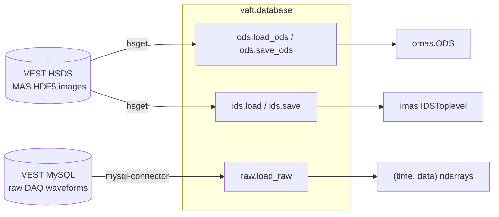

`vaft.database` is the I/O layer of VAFT. It has **two independent back-ends**, and knowing which one
you are talking to explains almost every argument on this page:

| Back-end | Module | What a shot looks like | What you get back |
| --- | --- | --- | --- |
| **HSDS** — remote IMAS HDF5 store | `vaft.database.ods`, `vaft.database.ids`, `vaft.database.utils` | a *folder* `hdf5://{directory}/{shot}/` holding `master.h5` plus one `<ids_name>.h5` per IDS | an OMAS `ODS`, or a native IMAS `IDSToplevel` |
| **Raw DAQ** — VEST MySQL database | `vaft.database.raw` | rows in `shotDataWaveform_*` addressed by integer *field code* | `(time, data)` NumPy arrays |



The IMAS/ODS data model itself is described in
[Data structures]({{ site.baseurl }}/guide/Data_structures/); this page is about *getting* the data.

## The flat namespace

`vaft/__init__.py` and `vaft/database/__init__.py` are both lazy. `import vaft` is enough — you never
need `import vaft.database`. The database package also resolves unknown attributes by scanning its
submodules in the order `ods`, `ids`, `raw`, `utils`, so helpers defined in `raw.py` or `utils.py`
are reachable flat:

```python
import vaft

vaft.database.is_connect()          # defined in database/utils.py
vaft.database.exist_shot('public')  # defined in database/utils.py
vaft.database.load_raw(39915, 102)  # defined in database/raw.py
```

The names declared in `__all__` are the four submodules (`raw`, `ods`, `ids`, `utils`) plus
`load`, `save`, `load_ids`, `save_ids`, `load_ods`, `save_ods`.

## Connecting to HSDS

`h5pyd` is the HSDS client. It is deliberately **not** a declared dependency — install it with
`--no-deps` so it cannot re-pin the numerical stack:

```bash
python -m pip install --no-deps h5pyd==0.20.0
```

Then write your credentials with `hsconfigure`:

```bash
hsconfigure
```

| Field | Value |
| --- | --- |
| Server endpoint | `http://147.46.36.244:5101` |
| Username / Password | contact [peppertonic18@snu.ac.kr](mailto:peppertonic18@snu.ac.kr) |

This writes `~/.hscfg`; `h5pyd` also picks up an `.hscfg` in the current working directory. Transfers
shell out to the **`hsget` / `hsload` command-line tools** that ship with `h5pyd`, so they must be on
your `$PATH` — a missing binary surfaces as `FileNotFoundError`, a failed transfer as
`CalledProcessError`. Check the connection from Python:

```python
import vaft

vaft.database.is_connect()   # True when the HSDS server reports state == "READY"
```

Every HSDS entry point calls an internal `h5pyd` guard first, so a missing `h5pyd` raises `ImportError`
carrying the install hint above — even for a purely local load. See
[Installation]({{ site.baseurl }}/guide/Installation/) for the full environment setup.

## Listing shots

```python
vaft.database.exist_shot()                       # numeric shot folders in /public/, newest first
vaft.database.exist_shot('public', shot=39915)   # True / False
vaft.database.exist_shot('public', sort=1)       # ascending
vaft.database.exist_shot(data_filter='ts')       # DataFrame of processed Thomson-scattering shots
```

Full signature:

```python
exist_shot(username=None, shot=None, data_filter=None, sort=-1)
```

- `username` defaults to `'public'`. Any other folder name returns that folder's raw listing.
- `sort` is `1` (ascending), `-1` (descending, the default) or `0` (unsorted).
- `data_filter='ts'` (also `'thomson_scattering'`) ignores `username`/`shot` and returns a
  `pandas.DataFrame` with columns `Index, Shot Number, Last Processed, Status`, read from the
  processed-shots file `hdf5://public_omas/processed_shots.h5` (exposed as
  `vaft.database.utils.PROCESSED_H5_PATH`). It returns `None` when nothing has been processed.
- Shot folders come back as **strings**, not ints. A connection failure prints `Connection error`
  and returns `[]` / `False`.

## Loading a shot as ODS

`vaft.database.load` is the everyday entry point, and it returns an **OMAS ODS**:

```python
import vaft

ods = vaft.database.load(39915)

time = ods['magnetics.time']
ip = ods['magnetics.ip.0.data']
```

It forwards to `vaft.database.ods.load_ods`, whose real signature is:

```python
load_ods(
    shot,                      # int or list[int]
    directory="public",
    *,
    occurrence=None,
    paths=None,
    time=None,
    imas_version=None,
    skip_uncertainties=False,
    consistency_check=True,
    verbose=False,
    path=None,
    local_dir=None,
)
```

Under the hood it `hsget`s every `*.h5` under `/{directory}/{shot}/` into a staging directory and
converts the IMAS entry to an ODS.

```python
# Only the IDSs you need — much faster than a full shot
ods = vaft.database.load(39915, paths=['magnetics'])

# Several shots at once -> list of ODS
ods_list = vaft.database.load_ods([39915, 39916, 39917])

# Read an IMAS directory that already exists locally (must contain master.h5); no HSDS traffic
ods = vaft.database.load_ods(39915, path='~/public/imasdb/VEST/3/39915/0')

# Keep the downloaded images instead of using a self-deleting temp dir
ods = vaft.database.load_ods(39915, local_dir='./staging')
```

Things worth knowing:

- The second positional argument is **`directory`**, not an IDS name: `load(39915, "public_omas")`
  selects a folder.
- `path=` combined with a list of shots raises `ValueError`.
- After loading, `dataset_description.data_entry.user`, `.pulse` and `.run` are filled in from
  `directory`, `shot` and `0` if they are not already present.
- Loading is chatty: it prints `[INFO] Downloading …` lines and
  `Successfully loaded ODS data for shot: <n>`.

## Saving ODS

```python
save_ods(ods, shot, filename=None, env="server", *,
         directory="public", path=None, occurrence=None,
         user=None, machine=None, run=None, imas_version=None, verbose=True)
```

```python
# Upload to HSDS (write access is admin-restricted)
uri = vaft.database.save_ods(ods, 39915)                        # -> "hdf5://public/39915/"
uri = vaft.database.save(ods, 39915, directory="public")        # same thing

# Write IMAS images locally only
local = vaft.database.save_ods(ods, 39915, env="local")
# -> "~/public/imasdb/VEST/3/39915/0"  (the trailing component is the run number)
```

- `filename` is a **compatibility parameter and is ignored**. IMAS-backed storage writes a folder of
  images per shot, not a single `{shot}.h5`, so `save_ods` returns the folder URI
  `hdf5://{directory}/{shot}/`.
- `directory` and everything after it are **keyword-only**. Writing `save(ods, shot, 'public')`
  silently passes `'public'` as the ignored `filename` — always spell out `directory="public"`.
- `env="server"` requires a live connection and raises `ConnectionError` otherwise. Any `env` other
  than `"server"` / `"local"` raises `ValueError`.
- `run` is taken from the `run=` argument, else from `dataset_description.data_entry.run`, else `0`.

## Native IMAS IDS objects

When you want an `IDSToplevel` from `imas` rather than an OMAS ODS, use the IDS pair. Native loading
requires the **keyword** `ids_name=` — that is what distinguishes it from a directory argument:

```python
# Both forms are equivalent
eq = vaft.database.load(shot=2, ids_name="equilibrium", dd_version="3.41.0")
eq = vaft.database.load_ids(2, "equilibrium", dd_version="3.41.0")

# A list of IDS names returns a dict {name: ids}
idss = vaft.database.load_ids(2, ["equilibrium", "pf_active"])
```

```python
ids.load(shot, ids_name, directory="public", occurrence=0, dd_version=None, local_dir=None)
ids.save(ids, shot, env="server", path=None, dd_version=None)
```

`ids.load` downloads `master.h5` **and** every `.h5` it externally links — IMAS-Core refuses to open a
data entry with a missing link, even when you ask for a single IDS — then opens the staging directory
with `imas.DBEntry("imas:hdf5?path=…", "r")` and returns `dbentry.get(ids_name, occurrence)`.

Saving a native IDS goes through `save_ids`, **not** `save`:

```python
uri = vaft.database.save_ids(eq, 2, env="server", dd_version="3.41.0")
# -> "hdf5://{username}/2/equilibrium.h5"
```

- `vaft.database.save` / `save_ods` handle **ODS only** and have no `dd_version` parameter; passing one
  raises `TypeError`. Use `save_ids` (or `vaft.database.ids.save`) for IDS objects.
- `ids.save` has **no `directory` argument**. The target folder is the logged-in HSDS username
  (remapped to `public` when that username is `admin`), and both `{ids_name}.h5` and the regenerated
  `master.h5` are uploaded. The IDS file name comes from the IDS metadata name.
- `env="local"` writes to `~/public/imasdb/VEST/3/{shot}/1` by default.

### Which `load` is which

| Call | Result |
| --- | --- |
| `vaft.database.load(39915)` | OMAS `ODS` |
| `vaft.database.load(39915, "public_omas")` | OMAS `ODS` from the `public_omas` folder |
| `vaft.database.load(2, ids_name="equilibrium")` | native IMAS IDS |
| `vaft.database.raw.load(39915, 102)` | `(time, data)` from the **raw SQL** database |

`vaft.database.raw.load` is a legacy alias for `raw.vest_load` living inside `raw.py`. It is a
different function from the package-level `vaft.database.load`; never write
`vaft.database.load(shot, field)` expecting a waveform.

## Raw DAQ signals (MySQL)

Raw signals are addressed by an integer **field code** and returned as `(time, data)` NumPy arrays,
with time in seconds.

```python
from vaft.database import raw

raw.setup_raw_db()   # interactive: prompts for hostname / username / password
raw.init_pool()      # build the MySQL connection pool

time, ip = raw.load_raw(39915, 102)      # field 102 = Plasma Current
```


Credentials are stored in `~/.vest/database_raw_info.yaml` with the password Fernet-encrypted using
`~/.vest/encryption_key.key`. `setup_raw_db()` uses `input()` prompts, so do not trigger it from an
unattended notebook — `init_pool()` and `configuration()` will call it if the YAML is missing.
`load_raw` initialises the pool automatically when it has not been built yet.

```python
load_raw(shot, fields=None, max_retries=3, daq_type=None, sample_opt=False)
```

- A single `int` field returns a **1-D** data array; a `list` of fields returns a **2-D** array of
  shape `(N, n_fields)`, column-stacked and truncated to the shortest field.
- `load_raw` never raises — it logs and returns `None` on any failure. Always check the result.

```python
loaded = raw.load_raw(39915, [102, 101, 1])
if loaded is None:
    raise RuntimeError("raw load failed")
time, data = loaded
ip = data[:, 0]     # column order follows the requested field list
```

### Finding field codes and shots

```python
raw.name(102)                             # -> (field name, remark) from the shotDataField table
raw.vest_load_by_name(39915, "Plasma Current")   # load by human name (alias: raw.vest_loadn)
raw.get_all_field_codes_for_shot(39915)   # every field code recorded for the shot
raw.last_shot()                           # highest shot number in the database
raw.date_from_shot(39915)                 # ('YYYY-MM-DD', datetime)
raw.shots_from_date('2023-06-01')         # [shot, shot, ...]
raw.plot(39915, [102, 101])               # matplotlib quick-look
```

All of these need `init_pool()` first; they print an error and return `None` / `[]` otherwise.
`vest_load_by_name` resolves names through the packaged lookup table
`vaft/data/legacy/sql_table.txt` (a JSON mapping such as `{"TF Current": 1, "Plasma Current": 102, …}`),
also exposed as `raw.SQL_TABLE_PATH`:

```python
import json
from vaft.database import raw

with open(raw.SQL_TABLE_PATH, "r", encoding="utf-8") as f:
    signal_to_field = json.load(f)
```

`get_all_field_codes_for_shot` omits `raw.EXCLUDED_FIELD_CODES = {110, 111, 112, 113}` (processed
triple-probe signals, which sit on a different time base).

### Shot-range and timing rules

Which waveform table a shot lives in depends on its number, and `load_raw` returns `None` outside
these ranges:

| Shot range | Table |
| --- | --- |
| `29349 < shot <= 42190` | `shotDataWaveform_2` |
| `shot > 42190` | `shotDataWaveform_3` |

Sampling intervals are `raw.FAST_DT = 4e-6` s and `raw.SLOW_DT = 4e-5` s, classified against
`raw.SLOW_DT_THRESHOLD = 5e-6` s. A DAQ trigger-delay correction is added to traces that start at the
digitiser origin: 0.24 s for `shot < 41446`, 0.26 s for shots 41446–41451, 0.24 s for 41452–41659, and
0.26 s from 41660 on.

## Working offline

`load_raw` can read gzipped-JSON dumps instead of MySQL, which is how the test suite and the
processing pipelines run without database access. Two environment variables control it:

| Variable | Meaning |
| --- | --- |
| `VAFT_RAW_SAMPLE_PATH` | Path **template** for the archive; `{shot}` is substituted, e.g. `vaft/data/legacy/shot_{shot}.json.gz` |
| `VAFT_RAW_OFFLINE_ONLY` | `1`/`true`/`yes`/`on` forbids any live SQL access; `load_raw` returns `None` when no archive exists |

Resolution order inside `load_raw` is: an explicit `sample_opt` string → `VAFT_RAW_SAMPLE_PATH` →
(unless offline-only) the MySQL pool. `raw.raw_offline_only()` reports the current mode, and
`raw.sql_loading_available()` reports whether the MySQL driver imported at all.

```python
import vaft
from vaft.database import raw

SAMPLE_PATH = vaft.data.data_path("legacy/shot_44740.json.gz")   # packaged archive

loaded = raw.load_raw(44740, 102, sample_opt=str(SAMPLE_PATH))
time, plasma_current = loaded
```

Produce your own archive for a shot with:

```python
raw.init_pool()
raw.dump_all_raw_signals_for_shot(shot=44740, output_path="vest_raw_44740.json.gz")
```

```python
dump_all_raw_signals_for_shot(shot, output_path=None, max_retries=3,
                              daq_type=0, slow_dt_threshold=5e-6, plot_opt=False)
```

It writes `{"shot": n, "fields": {code: {"type": "fast" | "slow", "data": [...]}}}` as gzipped JSON,
defaulting to `./vest_raw_{shot}.json.gz` (a `.gz` suffix is appended if you omit it) and returning a
bool. `plot_opt=True` also saves an overview figure. `raw.compare_db_and_dumped_raw_signals_for_shot`
overlays the database and dumped traces for QA.

The pipeline scripts use exactly this pattern —
[`generate_raw_db_dump.py`](https://github.com/VEST-Tokamak/vaft/blob/main/workflow/automatic_pipeline_1_routine_data_processing/generate_raw_db_dump.py)
creates the archive, and
[`generate_diagnostics_ods.py`](https://github.com/VEST-Tokamak/vaft/blob/main/workflow/automatic_pipeline_1_routine_data_processing/generate_diagnostics_ods.py)
sets `VAFT_RAW_SAMPLE_PATH` and `VAFT_RAW_OFFLINE_ONLY` before building the diagnostics ODS.

## Where to go next

- [Data structures]({{ site.baseurl }}/guide/Data_structures/) — what is inside the ODS you just loaded.
- [Signal processing and EM modeling]({{ site.baseurl }}/guide/Processing/) — turning raw signals into physics quantities.
- [Examples]({{ site.baseurl }}/guide/examples/) — the notebook tour.

**Notebooks**

- [`database_initialization_and_load.ipynb`](https://github.com/VEST-Tokamak/vaft/blob/main/notebooks/database_initialization_and_load.ipynb) — connect, list, load and save shots.
- [`vest_raw_signal_sql_database.ipynb`](https://github.com/VEST-Tokamak/vaft/blob/main/notebooks/vest_raw_signal_sql_database.ipynb) — raw SQL signals and the offline archive path.
- [`vest_experimental_data_list.ipynb`](https://github.com/VEST-Tokamak/vaft/blob/main/notebooks/vest_experimental_data_list.ipynb) — surveying what exists in the database.

**Source**

- [`vaft/database/ods.py`](https://github.com/VEST-Tokamak/vaft/blob/main/vaft/database/ods.py)
- [`vaft/database/ids.py`](https://github.com/VEST-Tokamak/vaft/blob/main/vaft/database/ids.py)
- [`vaft/database/raw.py`](https://github.com/VEST-Tokamak/vaft/blob/main/vaft/database/raw.py)
- [`vaft/database/utils.py`](https://github.com/VEST-Tokamak/vaft/blob/main/vaft/database/utils.py)
