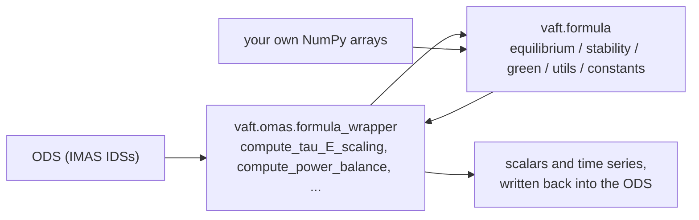

`vaft.formula` is the **physics layer** of VAFT: closed-form expressions, empirical scalings and
Green's functions, written as pure functions of NumPy arrays and scalars. Nothing in it touches an
ODS, reads a file, or plots. To evaluate the same physics directly on a VEST shot, use the ODS-aware
wrappers in `vaft.omas.formula_wrapper` (the `vaft.omas.compute_*` functions), which pull the inputs
out of the IDSs and hand them to these functions.



| Submodule | Contents |
| --- | --- |
| `vaft.formula.constants` | $\mu_0$, $\epsilon_0$, $e$, $m_e$, $m_p$, fusion/transport coefficients, and the confinement-scaling coefficient table |
| `vaft.formula.utils` | Gradients, trapezoidal integrals, normalisation, volume averaging, 1-D profile fitting |
| `vaft.formula.equilibrium` | Flux, safety factor, shear, current, geometry, energy, virial/Shafranov relations, power balance, dimensionless parameters, confinement scalings |
| `vaft.formula.stability` | Beta conversions, ballooning/kink/sawtooth criteria, Greenwald limit, transport speeds |
| `vaft.formula.green` | Axisymmetric Green's functions for $\psi$, $B_R$, $B_Z$ and the elliptic integrals behind them |
| `vaft/formula/fittings.py` | Empty placeholder file. It is **not** star-imported and **not** registered in `_SUBMODULES`, so `vaft.formula.fittings` raises `AttributeError` on attribute access. Nothing is lost — the file defines no symbols. |

`vaft/formula/__init__.py` star-imports the five importable submodules above (`constants`, `utils`,
`equilibrium`, `stability`, `green`), so each public symbol they define is reachable three ways:

```python
import vaft                                             # lazy: vaft.formula loads on first access
from vaft.formula import greenwald_density              # flat namespace
from vaft.formula.equilibrium import q_from_phi         # explicit submodule
```

Function names encode their inputs — `confinement_time_from_engineering_parameters`,
`beta_N_from_beta_a_B0_Ip`, `rho_star_from_M_T_B_R_epsilon`. Where two conventions exist for the same
quantity, they are two functions, not a flag.

> **Read the units before you call anything.** This module deliberately mixes SI functions with
> published engineering-unit regressions, because those regressions are only valid in the units their
> authors used. Every unit trap on this page is collected again in
> [Unit traps at a glance](#unit-traps-at-a-glance) at the end.

---

# Constants

```python
from vaft.formula.constants import MU0, EPS0, QE, ME, MI_P, E_ALPHA
```

| Name | Value | Meaning |
| --- | --- | --- |
| `MU0` | $4\pi \times 10^{-7}$ | Vacuum permeability [H/m] |
| `EPS0` | $8.8541878128 \times 10^{-12}$ | Vacuum permittivity [F/m] |
| `QE` | $1.602176634 \times 10^{-19}$ | Elementary charge [C] |
| `ME` | $9.10938356 \times 10^{-31}$ | Electron mass [kg] |
| `MI_P` | $1.67262192 \times 10^{-27}$ | Proton mass [kg] |
| `E_ALPHA` | $3.5\,\mathrm{MeV} \times$ `QE` | Alpha particle energy [J] |
| `SIGMA_V_COEF` | $1.1 \times 10^{-24}$ | Fusion cross-section coefficient [m³/s] |
| `SPITZER_RESISTIVITY_COEF` | $5.2 \times 10^{-5}$ | Spitzer resistivity prefactor [Ω·m] |
| `COLLISIONALITY_COEF` | $6.921 \times 10^{-18}$ | Collisionality coefficient, declared dimensionless [-] in the source; its only consumer is `collisionality_from_n_T_B_R` |

The same module also holds `_SCALING_COEFS`, the private confinement-scaling coefficient table read by
`confinement_time_from_engineering_parameters` — see
[Confinement time and scalings](#confinement-time-and-scalings) below.

---

# Flux, safety factor, shear

```python
import numpy as np
import vaft

psi  = vaft.formula.psi_from_RBtheta(R, B_theta, l, psi_axis=0.0)   # psi = int R B_theta dl + psi_a
psiN = vaft.formula.psi_normalised(psi, psi_axis, psi_boundary)     # psi_N = (psi-psi_a)/(psi_b-psi_a)

phi  = vaft.formula.phi_from_Bphi(B_phi, dA)                        # Phi = int B_phi dA
rhoN = vaft.formula.rhoN_from_phi(phi, phi_boundary)                # rho_N = sqrt(Phi/Phi_b)

q    = vaft.formula.q_from_phi(psi, phi)                            # q = dPhi/dpsi
rhoN = vaft.formula.rhoN_from_qpsiN(psiN, q)                        # rho_N from the q integral
s    = vaft.formula.shear_from_r_q(r, q)                            # s = (r/q) dq/dr
```

$$ q = \frac{d\Phi}{d\psi}, \qquad s = \frac{r}{q}\frac{dq}{dr}, \qquad
   \rho_N = \sqrt{\frac{\int_0^{\psi_N} q\, d\psi_N'}{\int_0^{1} q\, d\psi_N'}} $$

`q_from_rhoN(psiN, rhoN, C=1.0)` goes the other way, with `C` a user-supplied prefactor.
`magnetic_shear` is a live alias of `shear_from_r_q`; `normalize_psi` is a **deprecated** alias of
`psi_normalised` and emits a `DeprecationWarning`.

Fields and current density from the flux map:

```python
B_r = vaft.formula.radial_magnetic_field_from_psi(psi, R, Z)      # B_r = -(1/R) dpsi/dZ
B_z = vaft.formula.vertical_magnetic_field_from_psi(psi, R, Z)    # B_z = +(1/R) dpsi/dR
j   = vaft.formula.current_density_from_psi(psi, R)               # j = -(1/(mu0 R)) dpsi/dR
```

All of these differentiate with `np.gradient` along a single axis, so they expect **1-D slices**, not
a 2-D $(R, Z)$ map.

## From an ODS

```python
ods = vaft.omas.sample_ods()                       # packaged VEST shot
s   = vaft.omas.compute_magnetic_shear(ods, 0)     # equilibrium.time_slice[0].profiles_1d -> shear
```

`compute_magnetic_shear(ods, time_slice)` reads the radial coordinate and `q` from
`equilibrium.time_slice[i].profiles_1d` and calls `magnetic_shear` for you.

---

# Geometry and derived scalars

```python
V     = vaft.formula.volume_from_RZ_boundary(R_bdry, Z_bdry)              # 2 pi A_poly R_bar
kappa = vaft.formula.elongation_from_RZ_boundary(R_bdry, Z_bdry)          # kappa = (Zmax-Zmin)/(2a)
delta = vaft.formula.triangularity_from_RZ_boundary(R_bdry, Z_bdry, R0)   # delta = (R0 - R_sep)/a
eK    = vaft.formula.eK_from_K(kappa)                                     # eK = (k^2-1)/(k^2+1)
eps   = vaft.formula.inverse_aspect_ratio_from_a_R(a, R)                  # epsilon = a/R
A     = vaft.formula.aspect_ratio_from_a_R(a, R)                          # A = R/a
PF    = vaft.formula.peaking_factor(x_central, x_volume_avg)              # PF = X(0)/<X>
```

`volume_from_RZ_boundary` multiplies the shoelace polygon area by $2\pi \bar{R}$, with $\bar{R}$ the
**arithmetic** mean of the boundary points — an approximation, not the exact Pappus centroid.
`calc_inverse_aspect_ratio(a_m, R_geo_m)` is the validated variant (it rejects non-positive input)
used by the dimensionless-parameter chain.

Energy and resistivity:

```python
W   = vaft.formula.stored_energy_from_p_V(p, V)                # W = p V
W   = vaft.formula.stored_energy_from_beta_V(beta, B0, V)      # W = beta B0^2 V / (2 mu0)
eta = vaft.formula.spitzer_resistivity_from_T_e_Z_eff_ln_Lambda(T_e, Z_eff=2.0, ln_Lambda=17.0)
```

$$ \eta = 5.2\times10^{-5}\,\frac{Z_{\rm eff}\ln\Lambda}{T_e^{3/2}}\ [\Omega\,\mathrm{m}],
   \qquad T_e\ \text{in eV} $$

For a self-consistent $\ln\Lambda$ instead of the 17.0 default:

```python
ln_lambda = vaft.formula.coulomb_logarithm_from_n_T(n_m3=4e19, T_eV=200.0)   # 30.9 - ln(sqrt(n)/T)
```

---

# Beta, current and power limits

```python
beta_N = vaft.formula.beta_N_from_beta_a_B0_Ip(beta, a, B0, I_p)
beta_p = vaft.formula.beta_pol_from_beta_tor(beta_tor, q_95)      # beta_p = beta_t q95^2
beta_t = vaft.formula.beta_tor_from_beta_pol(beta_pol, q_95)

I_max  = vaft.formula.current_limit_from_q(q_95, a, B0)           # I_p = 2 pi a^2 B0 / (mu0 q95)
P_max  = vaft.formula.power_limit_from_beta(beta_N, B0, V)
P_max  = vaft.formula.power_limit_from_q(q_95, I_p, R0)
```

`beta_N_from_beta_a_B0_Ip` evaluates $\beta\, a\, B_0 / I_p$ literally, and its docstring annotates
`I_p` as [A]. The community definition of $\beta_N$ is quoted in **%·m·T/MA**, so decide which
convention you are working in and feed the function consistently — it will not rescale for you.

Kink safety factor, with three geometry models:

```python
q_kink, q_min, beta_max, beta_crit, ip_max = vaft.formula.kink_safety_factor(
    R, a, kappa, Ip, Bt, 'ST')       # 'circular' | 'conventional' | 'ST'
```

Only the `'conventional'` and `'ST'` branches return `beta_max` / `beta_crit`; `'circular'` returns
`None` for both. Any other string raises `ValueError`. The ST branch uses

$$ q_{\rm kink} = \frac{2\pi a^2 B_t}{\mu_0 I_p R}\left(1 + \frac{\kappa^2}{2}\right) $$

Normalised plasma current (Phys. Plasmas **23**, 072508):

```python
Ip_star = vaft.formula.normalized_plasma_current(Ip, R, a, Bt)   # I_p [A] in, MA/(m T) out
```

---

# Stability limits

```python
from vaft.formula import (
    greenwald_density, greenwald_fraction,
    ballooning_alpha_from_p_B_R, ballooning_stability_criterion,
    kink_stability_criterion, sawtooth_stability_criterion,
    beta_stability_boundary, plasma_stability_margins,
)

n_G = greenwald_density(I_p=0.1, a=0.4)        # I_p in MA  ->  n_G in 1e19 m^-3
f_G = greenwald_fraction(n_e=1.5, n_G=n_G)     # same units and definition on both arguments
```

$$ n_G\,[10^{20}\,\mathrm{m^{-3}}] = \frac{I_p\,[\mathrm{MA}]}{\pi a^2}, \qquad f_G = n_e / n_G $$

The implementation returns $n_G$ in units of $10^{19}\ \mathrm{m^{-3}}$ (that is, $10 I_p / \pi a^2$),
and the Greenwald fraction is conventionally evaluated with the **line-averaged** density — pair them
accordingly.

The local and global criteria all return a `(margin, critical_value)` pair, so the sign of the first
element is the answer:

```python
alpha        = ballooning_alpha_from_p_B_R(p, B, R)          # alpha = -2 mu0 R (dp/dR) / B^2
d_alpha, a_c = ballooning_stability_criterion(alpha, s)      # alpha_crit = 0.6 s
d_beta, b_c  = kink_stability_criterion(q_95, beta_N)        # beta_N_crit = 2.8 q95
d_bp,   bp_c = sawtooth_stability_criterion(q_0, beta_pol)   # beta_p_crit = 0.3 (1 - q0)
d_bN,   bN_c = beta_stability_boundary(beta_N, q_95)         # beta_N_crit = 0.028 q95

beta_margin, q_margin, density_margin = plasma_stability_margins(beta_N, q_95, n_e, n_G)
```

`kink_stability_criterion` and `beta_stability_boundary` use **different** critical-$\beta_N$
coefficients (2.8 versus 0.028) — the same Troyon-type relation written in two unit conventions
(%·m·T/MA versus the dimensionless fraction). `plasma_stability_margins` is built on
`beta_stability_boundary`, so it lives in the 0.028 convention; its `q_margin` is simply $q_{95} - 2$.

Empirical $(q_a, l_i)$ operational boundary from the JET disruption survey
(Wesson *et al.*, Nucl. Fusion **29**, 1989):

```python
qa_ref, li_ref = vaft.formula.empirical_li_qa()          # 18 surveyed points
li             = vaft.formula.li_from_qa_empirical(qa)   # piecewise-linear interpolation
```

Characteristic speeds and collisionality:

```python
v_A     = vaft.formula.v_alfven_from_B_n_mi(B, n)            # n in m^-3; m_i defaults to the proton mass
c_s     = vaft.formula.c_s_from_Te_Ti_mi(T_e_keV, T_i_keV)   # keV in, m/s out
nu_star = vaft.formula.collisionality_from_n_T_B_R(n_e, T_e_keV, B_t, R0)
```

$$ \nu_* = C_\nu\,\frac{n_e R_0}{T_e^2 B_t}, \qquad C_\nu = \texttt{COLLISIONALITY\_COEF} = 6.921\times10^{-18} $$

`collisionality_from_n_T_B_R` takes $n_e$ in $10^{19}\ \mathrm{m^{-3}}$, $T_e$ in keV, $B_t$ in T and
$R_0$ in m — note that `v_alfven_from_B_n_mi` on the line above wants $n$ in $\mathrm{m^{-3}}$, so the
two density arguments are **not** interchangeable.

---

# Confinement time and scalings

The measured confinement time is a one-liner; the fitted one goes through the scaling evaluator:

```python
tau_exp = vaft.formula.confinement_time_from_P_loss_W_th(P_loss, W_th)   # tau = W_th / P_loss

tau_iter89p = vaft.formula.confinement_time_from_engineering_parameters(
    I_p=1.0e5,        # [A]    -> MA internally
    B_t=0.18,         # [T]
    P_loss=3.0e5,     # [W]    -> MW internally
    n_e=2.0e19,       # [m^-3] -> 1e19 m^-3 internally
    M=1.0,            # [amu]
    R=0.4,            # [m]
    epsilon=0.75,     # a/R [-]
    kappa=1.6,        # [-]
    scaling="ITER89P",             # default
    input_density_definition="line_avg",
    line_to_volume_factor=None,    # required only when definitions differ
)

H = vaft.formula.confinement_factor_ITER89P(tau_exp, tau_iter89p)   # H = tau_exp / tau_ITER89P
```

$$ \tau_{E,\rm th}^{\rm fit} = C \prod_i x_i^{\alpha_i} $$

with the product running **only** over the variables the selected scaling actually declares. Five
`scaling` names are accepted; anything else raises `ValueError` listing the available keys.

| `scaling` | $C$ | Variables in the product | Reference stored in the table |
| --- | --- | --- | --- |
| `"ITER89P"` (default) | 0.038 | `Ip_MA`, `R`, `epsilon`, `kappa`, `n_19`, `Bt`, `Mi`, `P_MW` | ITER Physics Basis 1989 L-mode scaling |
| `"H98y2"` | 0.0562 | `Ip_MA`, `R`, `epsilon`, `kappa`, `n_19`, `Bt`, `Mi`, `P_MW` | IPB98(y,2) ELMy H-mode scaling |
| `"NSTX2006H"` | 0.0715 | `Ip_MA`, `Bt`, `n_19`, `P_MW` | Kaye *et al.*, Nucl. Fusion **46**, 848 (2006), H-mode thermal |
| `"NSTX2006L"` | 0.141 | `Ip_MA`, `Bt`, `n_19`, `P_MW` | Kaye *et al.*, Nucl. Fusion **46**, 848 (2006), L-mode global |
| `"Kurskiev2022"` | 0.066 | `Ip_MA`, `Bt`, `n_19`, `P_MW`, `R`, `kappa` | Kurskiev *et al.*, Nucl. Fusion **62**, 016011 (2022), ST multi-machine H-mode |

The two NSTX entries omit `R`, `epsilon`, `kappa` and `Mi` on purpose: only the dependencies the paper
publishes are implemented, and unspecified ones are not assumed. The signature is the same for every
scaling, so you still have to supply those arguments — they are simply not raised to any power, and
not even range-checked, when the selected scaling ignores them.

Things the evaluator does for you, and things it does not:

- **It converts SI to engineering units.** `I_p` A → MA, `P_loss` W → MW, `n_e` m⁻³ → $10^{19}$ m⁻³.
  `B_t`, `R`, `epsilon`, `kappa`, `M` pass through unchanged. Do not pre-scale.
- **The prefactor $C$ is unit-dependent, not universal.** The NSTX coefficients were converted from the
  papers' SI-like form into this common convention, so the stored $C$ is only correct with the inputs above.
- **Every variable used by the selected scaling must be finite and strictly positive**, or you get a
  `ValueError` naming the offending argument.
- **Density definitions are explicit.** Each table entry declares a `density_definition`; all five
  currently declare `"line_avg"`. If your `input_density_definition` differs from the entry's target,
  you must also pass `line_to_volume_factor` — the evaluator refuses to guess and raises `ValueError`.

## From an ODS

```python
ods  = vaft.omas.sample_ods()

eng  = vaft.omas.compute_tau_E_engineering_parameters(ods, 0)   # dict: I_p, B_t, P_loss,
                                                                # n_e_line_avg, n_e_vol_avg,
                                                                # R, epsilon, kappa, M
tau_fit = vaft.omas.compute_tau_E_scaling(ods, 0, scaling="H98y2")
tau_exp = vaft.omas.compute_tau_E_exp(ods, 0)

(tau_ITER89P, tau_H98y2, tau_NSTX2006H, tau_NSTX2006L,
 tau_Kurskiev2022, H_factor, tau_exp) = vaft.omas.compute_confiment_time_paramters(ods, 0)
```

`compute_tau_E_scaling` picks the line- or volume-averaged density out of `eng` to match whatever the
requested scaling declares, so you never pass `input_density_definition` at the ODS level.

> **Pass `scaling=` explicitly.** The default value of that argument in `compute_tau_E_scaling` is the
> misspelled `"IBP98y2"`, which is not a key of the coefficient table. The wrappers are skip-tolerant:
> instead of raising, they log a warning and return `NaN` for that time slice — a silent column of NaNs
> is the symptom.

---

# Unit traps at a glance

Everything on this page that will silently give you a wrong number if you feed it the wrong convention:

| Symbol | Trap |
| --- | --- |
| `radial_magnetic_field_from_psi`, `vertical_magnetic_field_from_psi`, `current_density_from_psi` | Differentiate along a single axis with `np.gradient` — pass **1-D slices**, not a 2-D $(R,Z)$ map. |
| `volume_from_RZ_boundary` | Shoelace area $\times\ 2\pi\bar{R}$ with $\bar{R}$ the arithmetic mean of the boundary points — an approximation, not the exact Pappus centroid. |
| `spitzer_resistivity_from_T_e_Z_eff_ln_Lambda` | $T_e$ in **eV**, not keV; $\ln\Lambda$ defaults to 17.0. Use `coulomb_logarithm_from_n_T` for a self-consistent value. |
| `beta_N_from_beta_a_B0_Ip` | Evaluates $\beta a B_0 / I_p$ literally with `I_p` documented in [A]; the community $\beta_N$ is quoted in %·m·T/MA. Pick a convention and stay in it. |
| `normalized_plasma_current` | `Ip` in [A] on the way in, MA/(m·T) on the way out. |
| `greenwald_density` / `greenwald_fraction` | $I_p$ in **MA**, and $n_G$ comes back in $10^{19}\ \mathrm{m^{-3}}$. Compare against the **line-averaged** density in the same units. |
| `kink_stability_criterion` vs `beta_stability_boundary` | Critical-$\beta_N$ coefficients 2.8 and 0.028 — the same Troyon-type relation in two unit conventions. `plasma_stability_margins` lives in the 0.028 one. |
| `kink_safety_factor` | `'circular'` returns `None` for `beta_max` / `beta_crit`; only `'conventional'` and `'ST'` fill them in. |
| `c_s_from_Te_Ti_mi` | Temperatures in **keV**. |
| `v_alfven_from_B_n_mi` vs `collisionality_from_n_T_B_R` | $n$ in $\mathrm{m^{-3}}$ for the Alfvén speed, but $n_e$ in $10^{19}\ \mathrm{m^{-3}}$ for $\nu_*$. |
| `confinement_time_from_engineering_parameters` | Strict **SI in** (A, W, m⁻³); the conversion to MA/MW/$10^{19}$ m⁻³ happens inside. Pre-scaled inputs are wrong by many orders of magnitude. |
| `vaft.omas.compute_tau_E_scaling` | Default `scaling="IBP98y2"` is not a valid key → warning + `NaN`. |

---
