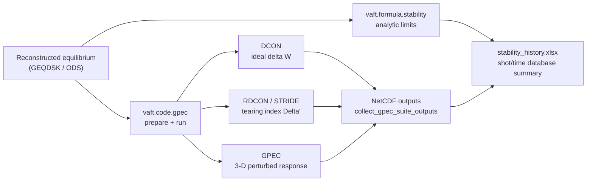

VAFT answers stability questions at two levels of fidelity, and they are meant to be used in that
order.

1. **Analytic and empirical criteria** — `vaft.formula.stability`. Closed-form limits (Greenwald,
   Troyon-type $\beta_N$, ballooning, kink, sawtooth) evaluated on scalars or NumPy arrays. Cheap
   enough to run on every time slice of every shot, so it is what the database summary uses to screen
   an operational space.
2. **Linear MHD codes** — `vaft.code.gpec`. VAFT prepares inputs for and drives the GPEC suite
   (**DCON**, **RDCON**, **STRIDE**, **GPEC**) from a reconstructed equilibrium, then collects the
   NetCDF products. This is where an actual $\delta W$ or $\Delta'$ comes from.



The closed-form criteria are catalogued with their exact signatures and unit traps on the
[Physics formulas]({{ site.baseurl }}/guide/Formula/) page. This page covers what to do with them and
how to run the codes.

---

# Screening an equilibrium

The stability functions are pure — they never touch an ODS — so pull the global quantities out
yourself and hand them over.

```python
import vaft

ods = vaft.omas.sample_ods()
eq  = ods['equilibrium']['time_slice'][0]['global_quantities']

beta_N = eq['beta_normal']
q_95   = eq['q_95']

d_beta, beta_N_crit = vaft.formula.kink_stability_criterion(q_95, beta_N)
d_bN,   bN_crit     = vaft.formula.beta_stability_boundary(beta_N, q_95)
```

Every criterion returns a `(margin, critical_value)` pair, and the margin is literally
`value - critical`. A **positive** margin therefore means the plasma sits **above** the boundary:

```python
alpha        = vaft.formula.ballooning_alpha_from_p_B_R(p, B, R)   # alpha = -2 mu0 R (dp/dR) / B^2
s            = vaft.formula.shear_from_r_q(r, q)                   # s = (r/q) dq/dr
d_alpha, a_c = vaft.formula.ballooning_stability_criterion(alpha, s)   # alpha_crit = 0.6 s

unstable = d_alpha > 0        # alpha has crossed the ideal ballooning boundary
```

$$ \alpha = -\frac{2\mu_0 R}{B^2}\frac{dp}{dR}, \qquad \alpha_{\rm crit} = 0.6\,s, \qquad
   s = \frac{r}{q}\frac{dq}{dr} $$

## Density limit

```python
n_G = vaft.formula.greenwald_density(I_p=0.1, a=0.4)   # I_p in MA -> n_G in 1e19 m^-3
f_G = vaft.formula.greenwald_fraction(n_e=1.5, n_G=n_G)
```

`greenwald_density` takes $I_p$ in **MA** and returns $n_G$ in $10^{19}\ \mathrm{m^{-3}}$, and $f_G$
is conventionally formed with the **line-averaged** electron density. Both arguments to
`greenwald_fraction` must use the same density definition and units — it just divides.

## The combined margin helper, and its one trap

```python
beta_margin, q_margin, density_margin = vaft.formula.plasma_stability_margins(
    beta_N, q_95, n_e, n_G
)
```

The three returned numbers are **not** the same kind of quantity:

| Element | Definition | Reading |
| --- | --- | --- |
| `beta_margin` | $\beta_N - 0.028\,q_{95}$ | $>0$ is above the beta boundary |
| `q_margin` | $q_{95} - 2$ | $>0$ is above the minimum $q_{95}$ |
| `density_margin` | $n_e / n_G$ | a **ratio**, not a difference — it is the Greenwald fraction |

Note also that `plasma_stability_margins` is built on `beta_stability_boundary`, so it inherits the
$0.028\,q_{95}$ convention, while `kink_stability_criterion` uses $2.8\,q_{95}$ — the same
Troyon-type relation expressed in two different unit conventions. Do not mix the two in one plot.

## Operational-space traces

The equilibrium IDS already carries $\beta_N$ and $q_{95}$ per time slice, so the whole-discharge view
needs no formula call:

```python
ods = vaft.database.load_ods(39915, directory="public")

vaft.plot.time_equilibrium_beta_n(ods)
vaft.plot.time_equilibrium_q95(ods)
vaft.plot.time_equilibrium_beta_pol(ods)
vaft.plot.time_equilibrium_beta_tor(ods)
```

`vaft.plot.time_equilibrium_analysis(ods)` packs $I_p$, $V_{\rm loop}$ and $\beta_N$ against
$H_\alpha$, $B_z$ and $R_{\rm major}$ into one 3×2 figure — the fastest way to see whether a beta
excursion coincides with a disruption.

The empirical $(q_a, l_i)$ disruption boundary from the JET survey (Wesson *et al.*, Nucl. Fusion
**29**, 1989) is available for overlaying on that space:

```python
qa_ref, li_ref = vaft.formula.empirical_li_qa()          # 18 surveyed points
li             = vaft.formula.li_from_qa_empirical(qa)   # piecewise-linear interpolation
```

---

# Running the GPEC suite

`vaft.code.gpec` drives four external programs from one reconstructed GEQDSK. VAFT does **not** ship
them: it writes their namelists, lays out the run directories, invokes the executables and collects
the products.

| Module | Physics | Key output |
| --- | --- | --- |
| `dcon` | Ideal linear MHD energy principle | $\delta W$ eigenvalue, `dcon_output_n{n}.nc` |
| `rdcon` | Resistive inner-layer matching | tearing index $\Delta'$, `rdcon_output_n{n}.nc` |
| `stride` | Independent $\Delta'$ via parallel shooting | `stride_output_n{n}.nc` |
| `gpec` | Perturbed equilibrium / 3-D field response | `gpec_control_output_n{n}.nc`, profile and cylindrical outputs |

The installation root is read from the **`GPECHOME`** environment variable unless you set `gpec_home`
(or `executable_dir`) explicitly.

## Configure, prepare, run

```python
from pathlib import Path
from vaft.code import GPECCaseInputs, GPECSuiteConfig, run_gpec_suite_case

inputs = GPECCaseInputs(
    shot=39915,
    time_ms=340,
    geqdsk=Path("/srv/vest.filedb/public/39915/efit/g039915.00340"),
    workdir=Path("/srv/vest.filedb/public/39915/linear_stability"),
)

config = GPECSuiteConfig(
    modules=("dcon", "rdcon"),   # default: dcon, rdcon, stride, gpec
    modes=(1, 2),                # toroidal mode numbers n
    psilow=1e-2,
    psihigh=0.994,
    run_mode="run_if_available",
)

result = run_gpec_suite_case(inputs, config)
print(result.ok)
```

`GPECSuiteConfig` also exposes the DCON edge controls `dcon_sas_flag` (default `False`),
`dcon_qhigh` (`20.2`) and `dcon_psiedge` (`1.0`), plus a per-module `timeout` (1200 s) and an `env`
mapping merged into the subprocess environment.

`run_mode` selects what happens when the executables are not installed:

| `run_mode` | Behaviour |
| --- | --- |
| `"run_if_available"` (default) | Prepare, then run whatever is installed; missing executables are recorded as `skipped` |
| `"prepare_only"` | Write the input decks and stop |
| `"strict"` | A missing or failing executable is an error |

To stage the inputs without executing anything — useful when the run itself is dispatched by a
scheduler — call `prepare_gpec_suite_case(inputs, config)` directly. `run_gpec(inputs, config)` is a
compatibility entry point that forwards to `run_gpec_suite_case`.

## Directory layout and outputs

A prepared case materialises one directory per module and mode:

```text
<workdir>/<time_label>/<module>/nn=<n>/
```

so the DCON $n=1$ run of the case above lands in `.../linear_stability/00340/dcon/nn=1/`. Collect the
products of a whole case with:

```python
from vaft.code import collect_gpec_suite_outputs

outputs = collect_gpec_suite_outputs("/srv/vest.filedb/public/39915/linear_stability")
for path in outputs["dcon"]:
    print(path)
```

The result is a dict keyed by module name (`dcon`, `rdcon`, `stride`, `gpec`).

`GPECSuiteResult.records` is a tuple of `GPECModuleRun`, one per module/mode, each carrying `status`
(`prepared`, `completed`, `failed`, `skipped`), `returncode`, `reason`, `logs` and `outputs`. The
`ok` property is true only when `status == "completed"` **and** `returncode == 0`, so inspect it per
module rather than trusting the suite-level return code alone:

```python
for record in result.records:
    print(record.module, record.mode, record.status, record.ok, record.reason)
```

## GEQDSK headers

GPEC's EFIT reader is fixed-column and rejects headers that EFIT itself will happily write. If a case
fails at the file-reading stage, normalise the header first:

```python
from vaft.code import format_gfile_header_for_gpec

header = format_gfile_header_for_gpec(header_line, shot=39915, time_ms=340)
```

It recovers the shot and time from the existing header when you do not pass them.

---

# Batch runs and the stability database

Running one case at a time is only useful for debugging. Two Snakemake workflows do the real work.

**Sweeping shots and times** —
[`workflow/running_linear_stability/`](https://github.com/VEST-Tokamak/vaft/blob/main/workflow/running_linear_stability/Snakefile)
discovers the reconstructed g-files under `BASE_DIR` (`/srv/vest.filedb/public` by default, set in
`config.yaml`) and fans out the codes over the mode scans: $n = 1\ldots6$ for the ideal (DCON) scan
and $n = 1, 2$ for the resistive (RDCON/STRIDE) scan.

```bash
cd workflow/running_linear_stability
snakemake --cores 16
```

**Mining the results into a table** —
[`gen_stability_history.py`](https://github.com/VEST-Tokamak/vaft/blob/main/workflow/automatic_pipeline_3_data_summary/gen_stability_history.py)
walks `{shot}/linear_stability/{time}/{dcon,rdcon,stride}/nn={n}/`, reads the NetCDF products and
emits `stability_history.xlsx`, one row per (shot, time):

| Column group | Content |
| --- | --- |
| `shot`, `time [ms]` | Case identity |
| `ideal_stability`, `delta_w_n1` … `delta_w_n6` | DCON `W_t_eigenvalue` per $n$, plus the verdict |
| `resistive_stability`, `tearing_index_rdcon_n{1,2}`, `tearing_index_stride_n{1,2}` | $\Delta'$ per code and $n$, plus the verdict |
| `ballooning_stability`, `ballooning_unstable_index` | Ballooning verdict and the $\psi$ where it first goes unstable |
| `qlim`, `qa` | Limiting and edge safety factor |

The verdicts follow the standard linear-MHD reading, with a guard against numerical blow-ups:

- **Ideal**: `"Stable"` when $\delta W > 0$ for *every* scanned $n$; `"Unstable"` if any $n$ has
  $\delta W < 0$. If any $|\delta W| \geq 100$ the row is flagged `"Error"` rather than trusted.
- **Resistive**: `"Stable"` when *no* scanned $\Delta'$ is positive; `"Unstable"` as soon as one is.
  Any $|\Delta'| \geq 1000$ flags the row `"Error"`.

Because a single bad eigenvalue poisons the verdict, always filter on `ideal_stability != "Error"`
before drawing conclusions from the sheet.

Companion scripts in the same directory join the stability table to the CHEASE equilibrium history
(`join_chease_stability_history.py`, merging on `shot` + `time [ms]`), plot the resulting history
(`plot_stability_history.py`), and draw the operational-limit diagram
(`plot_stability_limit.py`). See
[Signal processing and EM modeling]({{ site.baseurl }}/guide/Processing/) for how these pipelines fit
together with the rest of the automatic processing.

---

# Notebooks

Three notebooks in the repository frame the stability workflow. They are currently **outlines** —
they define the inputs, configuration conventions and expected products for each code rather than
executing them, so read them as specifications, not as runnable examples.

- [`linear_ideal_stability_analysis_with_dcon.ipynb`](https://github.com/VEST-Tokamak/vaft/blob/main/notebooks/linear_ideal_stability_analysis_with_dcon.ipynb)
- [`linear_resistive_stability_analysis_with_rdcon.ipynb`](https://github.com/VEST-Tokamak/vaft/blob/main/notebooks/linear_resistive_stability_analysis_with_rdcon.ipynb)
- [`perturbed_equilibrium_and_3d_response_with_gpec.ipynb`](https://github.com/VEST-Tokamak/vaft/blob/main/notebooks/perturbed_equilibrium_and_3d_response_with_gpec.ipynb)

For equilibria that actually run end to end today, start from
[`mhd_equilibrium_analysis.ipynb`](https://github.com/VEST-Tokamak/vaft/blob/main/notebooks/mhd_equilibrium_analysis.ipynb)
and [`equilibrium_refinement_using_chease.ipynb`](https://github.com/VEST-Tokamak/vaft/blob/main/notebooks/equilibrium_refinement_using_chease.ipynb),
which produce the refined equilibria the GPEC suite consumes — see the
[Examples]({{ site.baseurl }}/guide/examples/) page.

---

# See also

- [Physics formulas]({{ site.baseurl }}/guide/Formula/) — full signature reference for
  `vaft.formula.stability`, including the beta conversions, characteristic speeds and unit traps.
- [Equilibrium]({{ site.baseurl }}/guide/Equilibrium/) — producing the equilibrium the codes consume.
- [Data structures (ODS, IDS, IMAS)]({{ site.baseurl }}/guide/Data_structures/) — where `beta_normal`,
  `q_95` and the rest of `equilibrium.time_slice[:].global_quantities` live.
- Source: [`vaft/formula/stability.py`](https://github.com/VEST-Tokamak/vaft/blob/main/vaft/formula/stability.py)
  and [`vaft/code/gpec.py`](https://github.com/VEST-Tokamak/vaft/blob/main/vaft/code/gpec.py).
