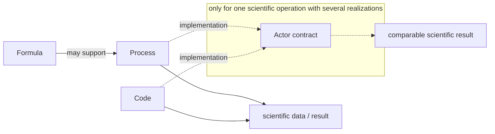

VAFT computes in three layers that are each useful on their own: **Formula**, **Process** and
**Code**. An optional fourth notion, the **Actor**, is a contract for comparing several realizations
of the *same* scientific operation. Most VAFT calculations do not need one. This page fixes the
vocabulary (issue #1078, under the umbrella #1077) so that contributors put new work in the right
place.

## Terminology

| Term | Meaning |
| --- | --- |
| **Formula** | An explicit mathematical relation or a compact analytic/semi-analytic kernel, used as a lower-level scientific building block (`vaft.formula`) |
| **Process** | A reusable VAFT-native scientific computation (`vaft.process`). Reduced, approximate, lightweight numerical, analytic-assisted and surrogate realizations belong here when they can reasonably live inside VAFT |
| **Code** | An adapter to an independent scientific code or solver package (`vaft.code`), typically for higher-fidelity or computationally advanced calculations |
| **Actor** | An *optional*, implementation-independent contract that groups several Process and/or Code realizations, **only when they implement the same scientific operation** |
| **Implementation** | One Process or Code realization that participates in an Actor |
| **Run** | One coherent, persistent simulation case (one simulation data dictionary) |
| **Study** | One reproducible scientific analysis over data, Runs, results, methods and selections |

There is no VAFT `Workflow` abstraction, and none is planned. The repository's `workflow/`
directory holds concrete scripts, pipelines and studies ([Pipelines]({{ '/workflows/automated-pipelines/' | relative_url }}));
it is not a public object model, and there is no `vaft.workflow` package.

## How the layers relate

A direct call is the normal case: a Process or a Code produces its result without any Actor. An
Actor is off the mandatory execution path. It becomes relevant only when several implementations
genuinely perform the same operation and comparing or substituting them has concrete value.

## Boundaries

**Formula.** A Formula is a lower-level relation that a Process may use. It is not normally an Actor
implementation: the chain is Formula → Process implementation → scientific operation result.

**Process.** A Process may own several VAFT-native implementations of its computation: an analytic
approximation, a reduced numerical model, a surrogate, an alternative lightweight algorithm. These
are Process implementations, not Actors. Do not create an Actor merely to dispatch among
implementations that already belong naturally to one Process API.

**Code.** Independent solvers stay under `vaft.code` (EFIT, CHEASE, TokaMaker, NICE, GPEC with DCON
and RDCON, NUBEAM, GACODE-family solvers; further codes join as they are integrated). A Code is usable on
its own and needs no Actor. Several Codes in one physics domain do not by themselves justify an
Actor; they *can* form one when they implement the same operation and a common contract makes
benchmarking or comparison meaningful.

Follow computational ownership, not prestige: a reduced or VAFT-native model is a Process even when
a more advanced Code exists, and an external Code is not wrapped in an Actor merely because its
capability can be named.

These boundaries say where code *should* live. To see which modules of each layer import which
today, generated from the source, explore the current implementation in the
[VAFT dependency explorer]({{ site.baseurl }}/reference/dependency-graph/).

## When an Actor is justified

Create an Actor only when **all** of the following hold:

1. a stable scientific operation can be stated independently of any one implementation;
2. at least two real implementations perform that operation, whether they are Processes, Codes or a mixture;
3. scientifically comparable inputs and outputs can be identified without erasing important differences;
4. comparison, substitution, verification, validation or fidelity selection gains concrete value from the common contract.

Semantic discovery, GUI presentation or AI tooling alone are not reasons to create an Actor. If the
contract becomes artificial or too lossy, keep the computation Process-centric or Code-centric.

**Granularity.** Broad physics domains (equilibrium, stability, transport, heating, 3-D physics) are
too coarse to be Actors. An Actor names a concrete operation for which several realizations
correspond. Method-level distinctions stay implementation metadata: energy-principle versus
ballooning formulation, truncation or Monte-Carlo sensitivity, solver continuation, kinetic options,
numerical resolution. VAFT does not aim at a detailed ontology of fusion calculations.

## Example: equilibrium reconstruction

The canonical illustration is one operation with several realizations:

| `equilibrium_reconstruction` (Actor) | Layer | In VAFT today |
| --- | --- | --- |
| reduced reconstruction | Process | not implemented |
| EFIT | Code | integrated (`vaft.code.efit`) |
| TokaMaker reconstruction | Code | the adapter covers free-boundary forward, time-evolution and stability solves; reconstruction mode is not wired |
| VFIT | Code | legacy MATLAB framework; not wired as an adapter (some VFIT constraint rules are ported into the EFIT k-file builder) |
| NICE | Code | adapter exists, experimental (`vaft.code.nice`); no VEST reference slice reconstructs yet |

The Actor would define only the scientifically defensible common contract. Each implementation keeps
its own input requirements, configuration, native results, assumptions and validity, and any extra
outputs the others cannot produce. These differences are not normalized away.

## Actor, Run and Study

An Actor does not own persistence or scientific organization:

- an **Actor** is an optional contract over implementations of one operation;
- a **Run** is persistent simulation state;
- a **Study** is a reproducible analysis, comparison or interpretation.

A Run can be created or extended without any Actor, and a Study can compare Process-native and
Code-native results without one. Actor provenance is attached only when an Actor contract is actually
used or explicitly referenced.

## Where this fits: ownership and maturation

This page is the zoomed view of one band of a larger picture (#1645). That picture is drawn by
`vaft.diagram.scientific_ownership_architecture()` and described in
[Diagrams]({{ '/reference/diagrams/' | relative_url }}). It separates five things:

- **computational implementation**: Formula, Process, Code and learned models, with data and the
  database, all producing results and evidence;
- **validation**, which interprets that evidence and is not part of the computation;
- **use policy** (accept, review, warn, reject, rerun, fallback), optional and downstream of validation;
- **workflow maturation**: a workflow or notebook composes computation and incubates new logic;
- **Study and Research organization**: a Study records one reproducible analysis, Research groups Studies
  by membership, and neither executes anything.

Logic leaves a workflow when it is reused or copied elsewhere, needs its own tests, defines a stable
operation, or enters routine production (#1642). It is then promoted by what it means. A pure relation goes
to Formula, a native transformation to Process and a solver operation to Code. A scientific assessment goes
to validation, retrieval and persistence to the database, and a learned task to its owning domain with a
learned implementation. Study-specific orchestration stays in the workflow.

## Status

This page is the vocabulary only. No Actor protocol, implementation registry, scheduler, workflow
engine, persistence, or Run/Study API exists yet, and no existing Code adapter is being migrated.
The follow-up issues are #1079 (a minimal Actor protocol and implementation registry), #1080 (optional
shared inputs/outputs and the provenance, assumptions and validity metadata), and two prototypes
in scientifically different domains, #1081 (`equilibrium_reconstruction`) and #1082 (`plasma_response`).
Code-centric and Process-centric use stay normal and supported throughout.

This page says *where* a computation lives. What physical model it represents -- which equations, which ordering,
what "kinetic" means for it -- is on [Plasma models, orderings, and scales]({{ '/reference/plasma-models/' | relative_url }}).
