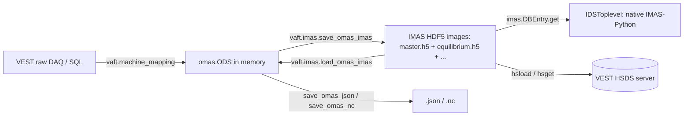

VAFT stores **every** VEST shot — raw diagnostics, processed signals, equilibria, kinetic profiles — in the
[IMAS](https://imas.iter.org/) data model. There is no VEST-specific container format: if you know the IMAS
Data Dictionary, you already know how to read VEST data.

Two libraries are involved, and it is worth keeping them straight.

| | **IMAS** | **OMAS** |
|---|---|---|
| What it is | ITER's Integrated Modelling & Analysis Suite: the **Data Dictionary** (which defines the IDSs) plus the **Access Layer** (which reads and writes them) | A Python library that keeps data *always compliant* with the IMAS data model without requiring an IMAS installation |
| In-memory object | `IDSToplevel` — one IDS (e.g. `equilibrium`), minted by an `IDSFactory` | `ODS` — a dict-like tree keyed by paths; one ODS holds **many** IDSs |
| On-disk handle | `imas.DBEntry(uri, mode)` | backend-agnostic (`json`, `nc`, `imas`, …) |
| Used in VAFT for | the storage format on the HSDS server (HDF5 images), and native-IDS workflows | the working object that every `vaft.process`, `vaft.formula` and `vaft.plot` function consumes |

In practice: **you work with an ODS, and IMAS is the format it is persisted in.** `vaft.imas` is the bridge
between the two.



Anchor notebooks for this page:

* [`read_and_convert_data_structure.ipynb`](https://github.com/VEST-Tokamak/vaft/blob/main/notebooks/read_and_convert_data_structure.ipynb) — walking an ODS tree.
* [`imas_omas_data_conversion.ipynb`](https://github.com/VEST-Tokamak/vaft/blob/main/notebooks/imas_omas_data_conversion.ipynb) — ODS ↔ IMAS AL5 round-trips.

---

# IDSs available in the VEST database

A VEST shot is a *set* of IDSs. Which ones exist depends on whether the quantity was measured or computed.

**Experimental**

`dataset_description` · `magnetics` · `tf` · `pf_active` · `barometry` · `spectrometer_uv` ·
`thomson_scattering` · `charge_exchange`

**Modelling**

`wall` · `em_coupling` · `pf_passive` · `equilibrium` (EFIT/CHEASE) · `core_profiles` ·
`mhd_linear` (DCON/RDCON)

Not every shot carries every IDS. Check before you index:

```python
import vaft

ods = vaft.database.load(39915)
print(list(ods.keys()))
# ['coils_non_axisymmetric', 'dataset_description', 'em_coupling', 'equilibrium',
#  'magnetics', 'pf_active', 'pf_passive', 'spectrometer_uv', 'tf', 'wall']

if 'thomson_scattering' in ods:
    n_e = ods['thomson_scattering.channel.0.n_e.data']
```

---

# Navigating IMAS paths in an ODS

An ODS is addressed by **path strings** — the IMAS DD path, with array indices written as plain integers.
These three forms are equivalent:

```python
ods['magnetics.ip.0.data']          # flat path string (idiomatic)
ods['magnetics']['ip'][0]['data']   # step by step
ods['magnetics.ip'][0]['data']      # mixed
```

The essential moves, all taken from
[`read_and_convert_data_structure.ipynb`](https://github.com/VEST-Tokamak/vaft/blob/main/notebooks/read_and_convert_data_structure.ipynb):

```python
import vaft

ods = vaft.omas.sample_ods()           # packaged shot 39915 — no server needed

list(ods.keys())                       # which IDSs are present
list(ods['equilibrium'].keys())        # what is inside one IDS
ods['equilibrium.time']                # the IDS time base (ndarray)
len(ods['equilibrium.time_slice'])     # number of reconstructed slices
list(ods['equilibrium.time_slice.0'].keys())
ods['equilibrium.time_slice.0.profiles_1d.volume'][-1]     # plasma volume at the boundary
ods['equilibrium.time_slice.0.global_quantities.ip']
```

`ODS.paths()` returns every filled leaf as a list of path components. It is the workhorse for programmatic
traversal, and it is what `vaft.omas.shift_time` and `vaft.imas.save_omas_imas` iterate over internally:

```python
for path in ods.paths():
    if path[0] == 'magnetics' and path[-1] == 'data':
        print('.'.join(str(p) for p in path))
# magnetics.flux_loop.0.flux.data
# magnetics.b_field_pol_probe.0.field.data
# magnetics.ip.0.data
# ...
```

To dump the whole tree, use the recursive helper from the notebook:

```python
def print_hierarchy(d, prefix=""):
    try:
        keys = d.keys()
    except AttributeError:
        return
    for k in keys:
        new_prefix = f"{prefix}.{k}" if prefix else k
        print(new_prefix)
        try:
            print_hierarchy(d[k], new_prefix)
        except Exception:
            pass

print_hierarchy(ods)
```

## Time bases

Each IDS carries its own time base. `ODS.time(<ids>)` resolves it for you, which matters because different
diagnostics are digitised at different rates:

```python
t_mag  = ods.time('magnetics')        # DAQ base of the magnetics IDS
t_spec = ods.time('spectrometer_uv')
ip     = ods['magnetics.ip.0.data']   # same length as t_mag
```

Never assume two IDSs share a grid. Interpolate, or use
`vaft.omas.find_matching_time_indices(ods, time_slice=...)`, which returns `(cp_idx, equil_idx, time)` after
verifying that the selected `core_profiles` slice and the matched `equilibrium` slice refer to the same
instant. It raises `ValueError` when the closest equilibrium time is farther away than `atol` (default
1 µs) — a deliberate refusal to silently pair kinetic profiles with the wrong equilibrium.

---

# Shot metadata (`dataset_description`)

Provenance lives in the `dataset_description` IDS.

| Path | Meaning |
|---|---|
| `dataset_description.data_entry.machine` | `"VEST"` |
| `dataset_description.data_entry.pulse` | the shot number |
| `dataset_description.data_entry.run` | run / revision index (`0` for the primary entry) |
| `dataset_description.data_entry.user` | owner; `vaft.database.load_ods` sets this to the HSDS folder (`"public"`) |
| `dataset_description.data_entry.pulse_type` | e.g. `"pulse"` |
| `dataset_description.imas_version` | DD version the ODS was written against |

```python
import vaft

ods = vaft.omas.sample_ods()
vaft.omas.find_shotnumber(ods)            # -> 39915  (reads data_entry.pulse)
vaft.omas.print_info(ods)                 # metadata header, then one line per IDS with its sub-keys
vaft.omas.print_info(ods, 'magnetics')    # channel counts inside one IDS
```

`vaft.omas.classify_shot(ods)` labels a shot `'Plasma'`, `'BD failure'` or `'Vacuum'` from the
barometry, H-alpha and Ip signals. It needs a `barometry` IDS; on the packaged sample (shot 39915)
it returns `'Plasma'`. Its `pressure_threshold` and `halpha_threshold` are the variance-ratio
thresholds of the primitive below; an IDS it cannot find is caught and reported as `'Vacuum'`,
so guard the IDSs yourself when that default is not what you want.

The underlying primitive is scale-free: it compares the trace's variance and its mean |Δx|, both
divided by the trace's mean absolute level, against relative thresholds, so it needs no knowledge
of the signal's units. A trace held at any non-zero level with noise far below that level is
inactive; the converse caveat is that a zero-mean noise trace has no level to be small against
and reads active at any amplitude, so apply a known noise floor before asking (issue #463).

```python
import vaft

ods = vaft.omas.sample_ods()

halpha = ods['spectrometer_uv.channel.0.processed_line.0.intensity.data']
vaft.process.is_signal_active(halpha, verbose=True)   # -> True  (H-alpha fired: breakdown occurred)
# Variance ratio: 2.918e+00 (thresh=1.000e-02)
# Mean |Δx| ratio: 2.276e-01 (thresh=1.000e-02)
```

Compose your own classifier on top of it, guarding each IDS before you index it:

```python
import numpy as np
import vaft

def classify(ods, var_thresh=1e-2, change_thresh=1e-2):
    def active(path):
        if path.split('.')[0] not in ods:
            return None                       # IDS absent — undecidable
        return vaft.process.is_signal_active(
            ods[path], var_ratio_thresh=var_thresh, change_ratio_thresh=change_thresh)

    if active('barometry.gauge.0.pressure.data') is False:
        return 'Vacuum'
    if not active('spectrometer_uv.channel.0.processed_line.0.intensity.data'):
        return 'BD failure'
    if 'magnetics' in ods and np.max(ods['magnetics.ip.0.data']) <= 0:
        return 'BD failure'
    return 'Plasma'

classify(vaft.omas.sample_ods())     # -> 'Plasma'
```

When you build an ODS yourself (for example from the raw DAQ), populate the metadata with the canonical
builder rather than by hand:

```python
from omas import ODS
import vaft

ods = ODS()
vaft.machine_mapping.vfit_dataset_description(ods, shot=39915, run=0,
                                              machine="VEST", pulse_type="pulse")
```

`vaft.database.load_ods` back-fills `user`, `pulse` and `run` with `setdefault` after a download, so a shot
loaded from HSDS always carries at least those three.

---

# Sample ODS / ODC data (works offline)

VAFT ships real VEST shots inside the package, so the snippets on this page run without HSDS credentials —
with the caveat that the packaged shots do not carry *every* IDS. Shot 39915 holds:

```python
['coils_non_axisymmetric', 'dataset_description', 'em_coupling', 'equilibrium',
 'magnetics', 'pf_active', 'pf_passive', 'spectrometer_uv', 'tf', 'wall']
```

There is no `barometry`, `thomson_scattering` or `core_profiles` in it, so anything keyed on those IDSs needs a
shot pulled from the database.

```python
import vaft

ods = vaft.omas.sample_ods()    # ODS  — shot 39915
odc = vaft.omas.sample_odc()    # ODC  — shots 39915, 41524, 41672 under keys '0', '1', '2'
gf  = vaft.omas.sample_gfile()  # GEQDSK — packaged EFIT g-file for shot 39915
```

An **ODC** (OMAS Data Collection) is a dict of ODSs — the natural container for a multi-shot study:

```python
for key, one_ods in odc.items():
    print(key, vaft.omas.find_shotnumber(one_ods), len(one_ods['magnetics.time']))
```

`vaft.omas.odc_or_ods_check(x)` normalises either input to an ODC (a bare ODS is wrapped under key `'0'`).
That is how the multi-shot helpers accept both types.

Packaged files are reached through `vaft.data.resources.data_path()`. Paths are **category-prefixed**; flat
calls such as `data_path("39915.json")` are intentionally unsupported.

| Call | Content |
|---|---|
| `data_path("omas/39915.json")` | ODS sample (also `omas/41524.json`, `omas/41672.json`) |
| `data_path("omas/thomson_scattering.json")` | Thomson-scattering contract-test payload |
| `data_path("imas/vest_imas_3.40.1.nc")` | IMAS NetCDF sample container |
| `data_path("efit/g039915.00319")` | GEQDSK sample |
| `data_path("legacy/shot_44740.json.gz")` | gzipped raw-DAQ dump used by the offline loader |

Loading a JSON ODS explicitly — this is what `sample_ods()` does under the hood:

```python
from omas import ODS
from vaft.data.resources import data_path

ods = ODS().load(str(data_path("omas/39915.json")), consistency_check=False)
```

`consistency_check=False` is deliberate: the packaged files predate the current DD and would otherwise be
rejected on load.

---

# ODS ↔ IMAS-Python (AL5)

`vaft.imas` is a hardened fork of OMAS's `omas_imas` module. It exists because stock OMAS targets the **AL4**
stack, whereas the open-source IMAS distribution (IMAS-Python + `imas_core`) is **AL5**:

* AL4 addressed a data entry by `user / machine / pulse / run` under a fixed backend root.
  AL5 addresses it by **URI** — `imas:hdf5?path=/any/directory` — with a mode (`'r'`, `'w'`, `'x'`, `'a'`).
* AL4's `DBEntry.create()` returned a tuple; AL5's returns `None`.
* `imasdef` moved from the `imas` package into `imas_core`.

`vaft.imas` handles all three, and pins the DD version used for conversion:

```python
from vaft.imas import IMAS_DD_VERSION_CONVERSION
print(IMAS_DD_VERSION_CONVERSION)   # '3.41.0'
```

Override it with the `IMAS_DD_VERSION_CONVERSION` environment variable if you must, but 3.41.0 is the version
OMAS is validated against and the version the VEST HSDS images are written with. Note that
`dataset_description` was **removed** in newer DD releases — `vaft.imas.IMAS_REMOVED_IDS` records that — so
round-trip checks use `equilibrium` (or `summary`), never `dataset_description`.

## Write an ODS to an AL5 HDF5 entry

```python
import tempfile
from omas import ODS
from vaft.imas import save_omas_imas, load_omas_imas

ods = ODS()
ods['equilibrium.ids_properties.homogeneous_time'] = 2
ods['equilibrium.ids_properties.comment'] = 'testing'
ods['equilibrium.time'] = [0.01]

entry_dir = tempfile.mkdtemp(prefix='imas_step1_')
uri = 'imas:hdf5?path=' + entry_dir

paths_written = save_omas_imas(ods, uri=uri, new=True, verbose=True)
print('Paths written:', paths_written[:5])
```

`save_omas_imas` returns the list of paths it actually wrote — each a list of components, e.g.
`['equilibrium', 'time']`. Keep it; you need it on the way back.

Key arguments:

| Argument | Effect |
|---|---|
| `uri` | AL5 URI. When set, `user` / `machine` / `pulse` / `run` / `backend` are **not** used to open the entry. |
| `new` | `True` → mode `'x'` (create, fail if it exists); `False` → mode `'a'` (append). Point `new=True` at a fresh directory, otherwise IMAS-Core complains that `master.h5` already exists. |
| `occurrence` | dict giving the occurrence index per IDS. |
| `imas_version` | DD version to save against. When `None`, it defaults to **the ODS's own** `ods.imas_version` — *not* to `IMAS_DD_VERSION_CONVERSION`. The constant only steps in as a fallback: the value handed to `imas_open_uri` / `imas_open` is `imas_version or IMAS_DD_VERSION_CONVERSION`, so the pin applies solely when the ODS carries no version of its own. (`load_omas_imas` is the other way round — there `imas_version=None` *does* resolve to `IMAS_DD_VERSION_CONVERSION`.) |

If you need the write pinned to the conversion DD, pass it explicitly rather than relying on the default:

```python
from vaft.imas import save_omas_imas, IMAS_DD_VERSION_CONVERSION

paths = save_omas_imas(ods, uri=uri, new=True,
                       imas_version=IMAS_DD_VERSION_CONVERSION)
```

Without `uri`, the legacy coordinates still work, and they default to what the ODS already knows
(`dataset_description.data_entry.user` / `.machine` / `.pulse` / `.run`):

```python
save_omas_imas(ods, user='test_user', machine='VEST', pulse=39915, run=0,
               new=True, backend='HDF5')
```

## Read it back

```python
ods_loaded = load_omas_imas(uri=uri, paths=paths_written, verbose=True)
print(ods_loaded['equilibrium.time'])     # [0.01]
```

Passing `paths=` is not merely an optimisation. With `paths=None`, `load_omas_imas` asks the entry for *every*
IDS in the DD, so IDSs that were never written (`amns_data`, …) get probed and skipped one at a time.
Restricting to the paths you wrote keeps the load fast and the log readable.

`load_omas_imas` also accepts `time=<seconds>` for a single-slice `getSlice`, `skip_uncertainties=True` to
drop the `*_error_upper` companions, and `consistency_check=False` for non-compliant legacy entries.

## Converting a real VEST shot

The full flow, from
[`imas_omas_data_conversion.ipynb`](https://github.com/VEST-Tokamak/vaft/blob/main/notebooks/imas_omas_data_conversion.ipynb):

```python
import tempfile
import vaft
from vaft.imas import save_omas_imas, load_omas_imas

ods_from_legacy = vaft.omas.sample_ods()          # shot 39915

# Legacy files can carry coordinate-inconsistent IDSs: drop them before conversion
for drop_ids in ['em_coupling', 'magnetics']:
    if drop_ids in ods_from_legacy:
        del ods_from_legacy[drop_ids]

entry_dir = tempfile.mkdtemp(prefix='imas_step3_')
uri = 'imas:hdf5?path=' + entry_dir

paths = save_omas_imas(ods_from_legacy, uri=uri, new=True, verbose=True)
ods_round_trip = load_omas_imas(uri=uri, paths=paths, verbose=True)

print('Saved IDSs:', sorted(set(p[0] for p in paths)))
print('Loaded IDSs:', list(ods_round_trip.keys()))
```

Now look at what landed on disk. This *is* the layout the VEST HSDS server stores per shot:

```text
<entry_dir>/
    master.h5
    equilibrium.h5
    wall.h5
    pf_active.h5
    ...
```

`master.h5` is the aggregator: it externally links every `<ids>.h5`. IMAS-Core refuses to open the entry when
a linked file is missing, which is why `vaft.database.ids.load` always downloads `master.h5` **plus** every
file it links, even for a single-IDS request.

## Verify with the native IMAS-Python API

An OMAS round-trip only proves that OMAS can read what OMAS wrote. To prove the entry is genuinely valid
IMAS, open it with the Access Layer directly:

```python
import imas
from vaft.imas import IMAS_DD_VERSION_CONVERSION

with imas.DBEntry(uri, 'r', dd_version=IMAS_DD_VERSION_CONVERSION) as dbentry:
    eq = dbentry.get('equilibrium', 0)          # -> IDSToplevel
    print(eq.ids_properties.homogeneous_time)
    print(len(eq.time), eq.time[0])
```

Pass the **same** `dd_version` you saved with, or `get()` cannot interpret the layout.

Creating an IDS from scratch, with no OMAS involved at all:

```python
import imas

factory = imas.IDSFactory()
equilibrium = factory.equilibrium()
equilibrium.ids_properties.homogeneous_time = imas.ids_defs.IDS_TIME_MODE_HOMOGENEOUS
equilibrium.ids_properties.comment = "testing"
equilibrium.time = [0.01]

with imas.DBEntry("imas:hdf5?path=/tmp/my_entry", "w") as dbentry:
    dbentry.put(equilibrium)
```

`IDSFactory` knows the DD and mints empty IDSs; `DBEntry` is the I/O handle for one entry; one `DBEntry` holds
many IDSs, each identified by name and occurrence. That is the whole IMAS object model.

---

# NetCDF export

The HDF5 backend needs `imas_core`. The **NetCDF** backend does not — IMAS-Python writes it natively, which
makes `.nc` the format of choice for shipping a self-contained entry to a collaborator:

```python
import imas

with imas.DBEntry("/tmp/vest_39915.nc", "w") as dbentry:
    dbentry.put(equilibrium)
```

The packaged `data_path("imas/vest_imas_3.40.1.nc")` is exactly such a container.

If you are staying inside OMAS, its own NetCDF backend serialises a whole ODS (all IDSs at once):

```python
from omas import save_omas_nc

save_omas_nc(ods, 'ods_39915.nc')
```

---

# Round-tripping through the VEST database

The database layer wraps the conversion above: `vaft.database.load_ods` downloads a shot's IMAS images from
HSDS and hands you an ODS; `vaft.database.save_ods` does the reverse.

```python
import vaft

ods = vaft.database.load(39915)                             # ODS, directory="public"
ods = vaft.database.load_ods(39915, paths=['magnetics'])    # only one IDS
ods = vaft.database.load_ods(39915, time=0.325)             # single time slice
ods_list = vaft.database.load_ods([39915, 41524, 41672])    # list in, list out
```

If the IMAS images are already on disk — for instance the `entry_dir` you just wrote — skip HSDS entirely:

```python
ods = vaft.database.load_ods(39915, path=entry_dir)   # directory must contain master.h5
```

For native IDS objects instead of an ODS, `ids_name` must be passed **by keyword**: the second positional
argument of `vaft.database.load` is `directory`, not an IDS name.

```python
equilibrium = vaft.database.load(shot=2, ids_name="equilibrium", dd_version="3.41.0")
# equivalently: vaft.database.load_ids(2, "equilibrium", dd_version="3.41.0")
```

Symmetrically, `vaft.database.save` / `save_ods` take an **ODS only**; a native `IDSToplevel` must go through
`vaft.database.save_ids`. Writing to the shared server is admin-restricted, but `env="local"` writes the IMAS
images to disk and returns the local directory:

```python
local_dir = vaft.database.save_ods(ods, 39915, env="local")
```

See the [Quick start guide]({{ site.baseurl }}/guide/Quick_start_guide/) for HSDS credentials and the
`h5pyd` / `hsget` / `hsload` prerequisites.

---

# Time-convention handling

VEST diagnostics are digitised on a DAQ clock whose $t=0$ is the trigger, not any physics event. Comparing
shots on that clock is meaningless: breakdown happens tens of milliseconds later, and *when* it happens varies
from shot to shot. VAFT therefore lets you re-reference an entire ODS to a physical event.

Four conventions are defined.

| `convention` | $t=0$ at |
|---|---|
| `'daq'` | the DAQ trigger (as stored) |
| `'vloop'` | loop-voltage onset — the time of maximum `magnetics.flux_loop.0.flux.data` |
| `'ip'` | plasma-current onset (`magnetics.ip.0.data` crosses threshold) |
| `'breakdown'` | H-alpha onset (`spectrometer_uv.channel.0.processed_line.0.intensity.data`) |

```python
import vaft

odc = vaft.omas.sample_odc()                                  # 39915, 41524, 41672
vaft.omas.change_time_convention(odc, convention='breakdown')
# [0] shift -0.3069 s  (daq → breakdown)
# [1] shift -0.31484 s  (daq → breakdown)
# [2] shift -0.31476 s  (daq → breakdown)
```

The shifts differ from shot to shot — breakdown lands at a different point on the DAQ clock every time — which
is exactly why the raw clock is useless for comparing shots.

`change_time_convention(odc_or_ods, convention='vloop')` accepts an ODS or an ODC (a bare ODS is wrapped
internally, and an ODC is returned). On the first call it records the reference times under
`summary.code.parameters`:

```python
params = odc['0']['summary.code.parameters']
params['time_convention']    # 'breakdown'
params['vloop_onset']        # seconds, on the ORIGINAL daq clock
params['ip_onset']
params['breakdown_onset']
```

Because the onsets are stored, conversions are **composable and reversible**: call it again with a different
convention and the shift is computed from the recorded originals, not re-derived from already-shifted data.

```python
vaft.omas.change_time_convention(odc, convention='ip')     # breakdown → ip
vaft.omas.change_time_convention(odc, convention='daq')    # back to the raw clock
```

The underlying primitive is `vaft.omas.shift_time(one_ods, time_shift)`. It is deliberately conservative: it
walks `ods.paths()` and shifts a leaf **only** when the last component of the path is exactly `time`, `onset`
or `offset`, and it never touches anything under `summary.code.parameters`. That narrowness is the point — a
looser rule corrupts data by shifting fields such as `magnetics.ip.0.data` whose *path* merely contains a
time-like word.

Individual onsets are available directly:

```python
vaft.omas.find_vloop_onset(ods)
vaft.omas.find_ip_onset(ods)
vaft.omas.find_breakdown_onset(ods)
vaft.omas.find_pulse_duration(ods)     # H-alpha offset - onset
vaft.omas.find_max_ip(ods)             # median-filtered peak Ip
vaft.omas.find_bt(ods)                 # mean toroidal field during the plasma phase
```

**Fix the time convention before you compare shots or overlay traces.** Mixing an ODS on the `daq` clock with
one on the `breakdown` clock in the same figure is the easiest way to produce a wrong result that still looks
plausible.

---

# Combining ODSs

A shot is assembled piecewise by the pipeline — diagnostics mapped first, equilibrium reconstructed later,
kinetic profiles fitted last — and the pieces have to end up in one ODS before it can be written back as a
single IMAS entry.

`vaft.omas.combine_ods(ods_list)` is the function nominally for this, but **it does not merge more than one
ODS.** Its loop calls `combined_ods.update(ods)` and then `break`s on the first success, so only
`ods_list[0]` ever lands:

```python
merged = vaft.omas.combine_ods([ods_equilibrium, ods_magnetics, ods_wall])
list(merged.keys())
# ['equilibrium']          <- magnetics and wall silently dropped
```

Its error-recovery branch is dead code too: on an IMAS-validity failure it increments an `attempt_count` that
is never initialised (`NameError`) and `continue`s to the *next* ODS rather than retrying the current one.

Merge with `ODS.update()` directly instead — that is the primitive `combine_ods` was built on, and in a plain
loop it does the whole job:

```python
from omas import ODS

merged = ODS()
for one in [ods_equilibrium, ods_magnetics, ods_wall]:
    merged.update(one)

list(merged.keys())
# ['equilibrium', 'magnetics', 'wall']
```

If a source ODS carries a coordinate-inconsistent IDS, drop it before the update (the same guard the
conversion example above uses) rather than relying on `combine_ods` to recover:

```python
for drop_ids in ['em_coupling', 'magnetics']:
    if drop_ids in one:
        del one[drop_ids]
```

---

# Reference

| Symbol | Purpose |
|---|---|
| `vaft.imas.save_omas_imas(ods, uri=..., new=...)` | ODS → IMAS entry (AL5 URI, or legacy user/machine/pulse/run); returns the written paths |
| `vaft.imas.load_omas_imas(uri=..., paths=..., time=...)` | IMAS entry → ODS |
| `vaft.imas.imas_open_uri(uri, mode='r', dd_version=...)` | Open an AL5 `DBEntry` by URI, wrapped for OMAS |
| `vaft.imas.imas_open(user, machine, pulse, run, backend=..., new=...)` | Open by legacy data-entry coordinates (AL4 or AL5) |
| `vaft.imas.imas_get(ids, path)` / `vaft.imas.imas_set(ids, path, value)` | Leaf-level read / write on an open IDS |
| `vaft.imas.IMAS_DD_VERSION_CONVERSION` | DD version used for conversion (`'3.41.0'`) |
| `vaft.imas.IMAS_REMOVED_IDS` | IDSs dropped by newer DD releases (`dataset_description`) |
| `vaft.omas.sample_ods()` / `sample_odc()` / `sample_gfile()` | Packaged VEST samples |
| `vaft.omas.find_shotnumber(ods)` / `print_info(ods)` | Shot metadata |
| `vaft.omas.classify_shot(ods)` | Shot class — **broken on `main`**: returns `'Vacuum'` unconditionally (see above) |
| `vaft.process.is_signal_active(data, var_ratio_thresh=..., change_ratio_thresh=...)` | Scale-invariant "is this channel live?" test |
| `vaft.omas.change_time_convention(odc_or_ods, convention=...)` / `shift_time(ods, dt)` | Time-convention handling |
| `vaft.omas.find_matching_time_indices(ods, time_slice=...)` | Align `core_profiles` and `equilibrium` slices |
| `vaft.omas.odc_or_ods_check(x)` | Normalise ODS → ODC |
| `vaft.omas.combine_ods(ods_list)` | Merge ODSs — **only merges `ods_list[0]`**; use `ODS.update()` in a loop |
| `vaft.data.resources.data_path(name)` | Absolute path to a packaged data file |
| `vaft.machine_mapping.vfit_dataset_description(ods, shot, run, ...)` | Populate `dataset_description` |
| `vaft.database.load_ods` / `save_ods` / `load_ids` / `save_ids` | HSDS I/O |

Source:
[`vaft/imas/omas_imas.py`](https://github.com/VEST-Tokamak/vaft/blob/main/vaft/imas/omas_imas.py) ·
[`vaft/omas/general.py`](https://github.com/VEST-Tokamak/vaft/blob/main/vaft/omas/general.py) ·
[`vaft/omas/sample.py`](https://github.com/VEST-Tokamak/vaft/blob/main/vaft/omas/sample.py) ·
[`vaft/process/signal_processing.py`](https://github.com/VEST-Tokamak/vaft/blob/main/vaft/process/signal_processing.py) ·
[`vaft/database/ods.py`](https://github.com/VEST-Tokamak/vaft/blob/main/vaft/database/ods.py) ·
[`vaft/database/ids.py`](https://github.com/VEST-Tokamak/vaft/blob/main/vaft/database/ids.py)

More runnable examples: [Examples]({{ site.baseurl }}/guide/examples/).
