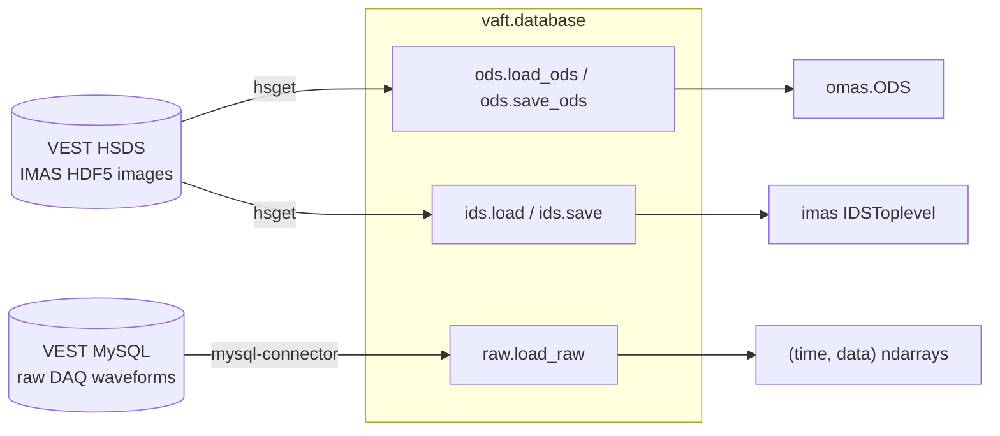

`vaft.database` is the I/O layer of VAFT. It has **two independent back-ends**, and knowing which one
you are talking to explains almost every argument on this page:

| Back-end | Module | What a shot looks like | What you get back |
| --- | --- | --- | --- |
| **HSDS** — remote IMAS HDF5 store | `vaft.database.ods`, `vaft.database.ids`, `vaft.database.utils` | a *folder* `hdf5://{directory}/{shot}/` holding `master.h5` plus one `<ids_name>.h5` per IDS | an OMAS `ODS`, or a native IMAS `IDSToplevel` |
| **Raw DAQ** — VEST MySQL database | `vaft.database.raw` | rows in `shotDataWaveform_*` addressed by integer *field code* | `(time, data)` NumPy arrays |



The IMAS/ODS data model itself is described in
[Data structures]({{ site.baseurl }}/guide/Data_structures/); this page is about *getting* the data.

## The flat namespace

`vaft/__init__.py` and `vaft/database/__init__.py` are both lazy. `import vaft` is enough — you never
need `import vaft.database`. The database package also resolves unknown attributes by scanning its
submodules in the order `ods`, `ids`, `raw`, `utils`, so helpers defined in `raw.py` or `utils.py`
are reachable flat:

<!-- docs-snippet: skip needs-raw-source (reads raw DAQ signals) -->
```python
import vaft

vaft.database.is_connect()          # defined in database/utils.py
vaft.database.exist_shot('public')  # defined in database/utils.py
vaft.database.load_raw(39915, 102)  # defined in database/raw.py
```

The supported high-level remote API is `load`, `open`, and `save`. The `raw`, `filedb`, `ods`,
`ids`, and `utils` modules remain available for specialized and compatibility workflows.

## Connecting to HSDS

`h5pyd` is a declared VAFT dependency on `develop`; a normal `pip install .` installs the compatible
client and its `hsconfigure` command. Do not install a separately pinned `--no-deps` copy.

Then write your credentials with `hsconfigure`:

```bash
hsconfigure
```

| Field | Value |
| --- | --- |
| Server endpoint | `http://147.46.36.244:5101` |
| Username / Password | `reader` / `test` (read-only public account) |

This writes `~/.hscfg`; `h5pyd` also recognizes a project-local `.hscfg`. Never commit that file.
Check the connection from Python:

<!-- docs-snippet: skip needs-database (talks to a VEST database source) -->
```python
import vaft

vaft.database.is_connect()   # True when the HSDS server reports state == "READY"
```

Local OMAS and IMAS operations do not require HSDS at all; use `vaft.omas.load/save` or
`vaft.imas.load/save` for those paths. See [Start here]({{ site.baseurl }}/workflows/start-here/) for
the full environment setup.

## Listing shots

<!-- docs-snippet: skip needs-database (talks to a VEST database source) -->
```python
vaft.database.exist_shot()                       # numeric shot folders in /public/, newest first
vaft.database.exist_shot('public', shot=39915)   # True / False
vaft.database.exist_shot('public', sort=1)       # ascending
vaft.database.exist_shot(data_filter='ts')       # DataFrame of processed Thomson-scattering shots
```

Full signature:

<!-- docs-snippet: skip needs-database (talks to a VEST database source) -->
```python
exist_shot(username=None, shot=None, data_filter=None, sort=-1)
```

- `username` defaults to `'public'`. Any other folder name returns that folder's raw listing.
- `sort` is `1` (ascending), `-1` (descending, the default) or `0` (unsorted).
- `data_filter='ts'` (also `'thomson_scattering'`) ignores `username`/`shot` and returns a
  `pandas.DataFrame` with columns `Index, Shot Number, Last Processed, Status`, read from the
  processed-shots registry `processed_shots.h5` of the named source (its URI is
  `vaft.database.utils.processed_registry_uri(source)`). It returns `None` when nothing has been processed.
- Shot folders come back as **strings**, not ints. A connection failure prints `Connection error`
  and returns `[]` / `False`.

## Eager and lazy HSDS access

`vaft.database.load` materializes data before returning it. The default representation is an
**OMAS ODS**:

<!-- docs-snippet: skip needs-database (talks to a VEST database source) -->
```python
import vaft

ods = vaft.database.load(39915, source="public", paths="magnetics")

time = ods['magnetics.time']
ip = ods['magnetics.ip.0.data']
```

The current high-level signature is:

<!-- docs-snippet: skip signature (signature listing or pseudo-code, not a program) -->
```python
load(shot, source=None, *, representation="omas", paths=None,
     occurrence=None, imas_version=None, cache="auto", transport="auto")
```

`source=None` resolves to the default source, `main`; pass `source="public"` for the legacy public
lineage the worked examples on this site read.

Set `representation="imas"` for native IDS objects. OMAS `paths` may point at an IDS root or leaf;
native IMAS requests accept top-level IDS names only.

<!-- docs-snippet: skip needs-database (talks to a VEST database source) -->
```python
# Several shots at once -> list of ODS
ods_list = vaft.database.load([39915, 39916, 39917], paths="magnetics")

# Native IDS materialization
equilibrium = vaft.database.load(
    39915, representation="imas", paths="equilibrium"
)

# Lazy, read-only access: data is fetched only when a path is touched
with vaft.database.open(39915, source="public", paths="equilibrium") as remote:
    times = remote["equilibrium.time"]
```

`open()` returns a context-managed lazy OMAS or native-IMAS adapter and never exposes a write
operation. Lazy native IMAS access does not convert Data Dictionary versions; use eager `load()`
when conversion is required.

## Local OMAS, IMAS, and FileDB paths

Local artifact I/O belongs to the representation modules:

```python
import vaft

ods = vaft.omas.sample_ods()
vaft.omas.save(ods, "shot.json.gz")
restored = vaft.omas.load("shot.json.gz")

# A native IMAS HDF5 entry is a directory (master.h5 plus one image per IDS)
vaft.imas.save(ods, "imas-entry")
restored = vaft.imas.load("imas-entry")
```

`vaft.database.filedb.FileDB` resolves canonical, OMAS-first archive locations without writing:

<!-- docs-snippet: skip needs-raw-source (reads raw DAQ signals) -->
```python
from vaft.database.filedb import FileDB

db = FileDB.from_config({"filedb": {"root": "/srv/vest.filedb"}})
path = db.path("omas", shot=39915)
```

Set `VAFT_FILEDB_DIR` when the configuration uses that environment reference. The audit helpers are
read-only and propose legacy-to-canonical mappings without moving data.

## Exporting a shot as local files

A shot on HSDS is a folder (`master.h5` plus one image per IDS), so `hsget` cannot fetch it whole.
`vaft export` stages the shot once and writes every requested format from that one copy:

```bash
vaft export --shot 41672 --source public --backend imas-nc omas-json geqdsk
```

<!-- docs-snippet: skip needs-database (talks to a VEST database source) -->
```python
vaft.database.export(41672, source="public", backend=["imas-nc", "omas-json", "geqdsk"])
```

| backend | written as | format |
| --- | --- | --- |
| `imas-hdf5` | `imas_<shot>_hdf5/` | native IMAS HDF5 Data Entry, copied as stored |
| `imas-nc` | `imas_<shot>.nc` | IMAS netCDF convention (IMAS-Python) |
| `omas-json` | `omas_<shot>.json` | OMAS JSON |
| `omas-hdf5` | `omas_<shot>.h5` | OMAS single-file HDF5, not an IMAS Data Entry |
| `omas-nc` | `omas_<shot>.nc` | OMAS flat netCDF, not the IMAS convention |
| `geqdsk` | `geqdsk_<shot>/` | one g-file per equilibrium time slice |

Artifacts go directly under `--output` (default: the current directory). Existing ones are refused
unless `--overwrite` is given, and a backend that fails leaves nothing behind. The converted backends
read occurrence 0 and refuse a shot that stores other occurrences; `imas-hdf5` keeps them all.
Export reads the DD version the IDS were stored with (the newest one when stages wrote different
minor versions) and never converts across a major version: a shot mixing DD 3 and DD 4 IDS is
refused, and `geqdsk` needs a DD 3 shot, because DD 4 flips the psi sign convention (COCOS 17).
Both netCDF backends need the `netCDF4` package.

## Saving to HSDS

<!-- docs-snippet: skip signature (signature listing or pseudo-code, not a program) -->
```python
save(data, shot, *, source=None, representation=None, occurrence=None,
     imas_version=None, derived_cache="auto")
```

<!-- docs-snippet: skip needs-database (talks to a VEST database source) -->
```python
# Remote writes are admin-restricted; ordinary documentation and analysis are read-only.
uri = vaft.database.save(ods, 39915, source="my-authorized-namespace")
```

`source` must be a bare HSDS namespace, never an `hdf5://` URI. It defaults to `None`, which resolves
to `main`; the legacy `public` source is read-only, so `save(..., source="public")` raises
`ReadOnlySourceError`. `target=` and `directory=` are deprecated aliases for `source=` and warn. VAFT infers OMAS versus native IMAS
from the supplied object and rejects a conflicting explicit `representation`.

## Native IMAS IDS objects

When you want an `IDSToplevel` from `imas` rather than an OMAS ODS, use the IDS pair. These live on the
`vaft.database.ids` submodule; there is no `vaft.database.load_ids` / `save_ids` at package level.

<!-- docs-snippet: skip needs-database (talks to a VEST database source) -->
```python
eq = vaft.database.ids.load(2, "equilibrium", dd_version="3.41.0")

# A list of IDS names returns a dict {name: ids}
idss = vaft.database.ids.load(2, ["equilibrium", "pf_active"])
```

For a whole shot as native IMAS rather than one IDS, `vaft.database.load` takes
`representation="imas"`.

<!-- docs-snippet: skip signature (signature listing or pseudo-code, not a program) -->
```python
ids.load(shot, ids_name, source=None, occurrence=0, dd_version=None, local_dir=None,
         cache="auto", transport="auto", *, directory=None)
ids.save(ids, shot, source=None, dd_version=None, *, directory=None, derived_cache="auto")
```

`ids.load` downloads `master.h5` **and** every `.h5` it externally links — IMAS-Core refuses to open a
data entry with a missing link, even when you ask for a single IDS — then opens the staging directory
with `imas.DBEntry("imas:hdf5?path=…", "r")` and returns `dbentry.get(ids_name, occurrence)`.

Saving a native IDS goes through `ids.save`, **not** `vaft.database.save`:

<!-- docs-snippet: skip needs-database (talks to a VEST database source) -->
```python
uri = vaft.database.ids.save(eq, 2, dd_version="3.41.0")
# -> "hdf5://{username}/2/equilibrium.h5"
```

- `vaft.database.save` / `save_ods` handle **ODS only** and have no `dd_version` parameter; passing one
  raises `TypeError`. Use `vaft.database.ids.save` for IDS objects.
- `ids.save` publishes into a named HSDS `source`, defaulting to `main`; the read-only legacy `public`
  source is refused. `directory` is a deprecated alias for `source`. Both `{ids_name}.h5` and the
  regenerated `master.h5` are uploaded, and the IDS file name comes from the IDS metadata name.
- A native IDS carries no `dataset_description`, so unlike `save_ods` this path records no source
  provenance inside the payload.

### Which `load` is which

| Call | Result |
| --- | --- |
| `vaft.database.load(39915)` | OMAS `ODS` |
| `vaft.database.load(39915, "public_omas")` | OMAS `ODS` from the `public_omas` folder |
| `vaft.database.load(2, representation="imas")` | the shot as native IMAS |
| `vaft.database.ids.load(2, "equilibrium")` | one native IMAS IDS |
| `vaft.database.raw.load(39915, 102)` | `(time, data)` from the **raw SQL** database |

`vaft.database.raw.load` is a legacy alias for `raw.vest_load` living inside `raw.py`. It is a
different function from the package-level `vaft.database.load`; never write
`vaft.database.load(shot, field)` expecting a waveform.

## Raw DAQ signals (MySQL)

Raw signals are addressed by an integer **field code** and returned as `(time, data)` NumPy arrays,
with time in seconds.

<!-- docs-snippet: skip needs-raw-source (reads raw DAQ signals) -->
```python
from vaft.database import raw

raw.setup_raw_db()   # interactive: prompts for hostname / username / password
raw.init_pool()      # build the MySQL connection pool

time, ip = raw.load_raw(39915, 102)      # field 102 = Plasma Current
```


Credentials are stored in `~/.vest/database_raw_info.yaml` with the password Fernet-encrypted using
`~/.vest/encryption_key.key`. `setup_raw_db()` uses `input()` prompts, so do not trigger it from an
unattended notebook — `init_pool()` and `configuration()` will call it if the YAML is missing.
`load_raw` initialises the pool automatically when it has not been built yet.

<!-- docs-snippet: skip needs-raw-source (reads raw DAQ signals) -->
```python
load_raw(shot, fields=None, max_retries=3, daq_type=None, sample_opt=False)
```

- A single `int` field returns a **1-D** data array; a `list` of fields returns a **2-D** array of
  shape `(N, n_fields)`, column-stacked and truncated to the shortest field.
- `load_raw` never raises — it logs and returns `None` on any failure. Always check the result.

<!-- docs-snippet: skip needs-raw-source (reads raw DAQ signals) -->
```python
loaded = raw.load_raw(39915, [102, 101, 1])
if loaded is None:
    raise RuntimeError("raw load failed")
time, data = loaded
ip = data[:, 0]     # column order follows the requested field list
```

### Finding field codes and shots

<!-- docs-snippet: skip fragment (placeholder name raw is never defined on the page) -->
```python
raw.name(102)                             # -> (field name, remark) from the shotDataField table
raw.vest_load_by_name(39915, "Plasma Current")   # load by human name (alias: raw.vest_loadn)
raw.get_all_field_codes_for_shot(39915)   # every field code recorded for the shot
raw.last_shot()                           # highest shot number in the database
raw.date_from_shot(39915)                 # ('YYYY-MM-DD', datetime)
raw.shots_from_date('2023-06-01')         # [shot, shot, ...]
raw.plot(39915, [102, 101])               # matplotlib quick-look
```

All of these need `init_pool()` first; they print an error and return `None` / `[]` otherwise.
`vest_load_by_name` resolves names through the packaged lookup table
`vaft/data/legacy/sql_table.txt` (a JSON mapping such as `{"TF Current": 1, "Plasma Current": 102, …}`),
also exposed as `raw.SQL_TABLE_PATH`:

<!-- docs-snippet: skip needs-database (talks to a VEST database source) -->
```python
import json
from vaft.database import raw

with open(raw.SQL_TABLE_PATH, "r", encoding="utf-8") as f:
    signal_to_field = json.load(f)
```

`get_all_field_codes_for_shot` omits `raw.EXCLUDED_FIELD_CODES = {110, 111, 112, 113}` (processed
triple-probe signals, which sit on a different time base).

### Shot-range and timing rules

Which waveform table a shot lives in depends on its number, and `load_raw` returns `None` outside
these ranges:

| Shot range | Table |
| --- | --- |
| `29349 < shot <= 42190` | `shotDataWaveform_2` |
| `shot > 42190` | `shotDataWaveform_3` |

Sampling intervals are `raw.FAST_DT = 4e-6` s and `raw.SLOW_DT = 4e-5` s, classified against
`raw.SLOW_DT_THRESHOLD = 5e-6` s. A DAQ trigger-delay correction is added to traces that start at the
digitiser origin: 0.24 s for `shot < 41446`, 0.26 s for shots 41446–41451, 0.24 s for 41452–41659, and
0.26 s from 41660 on.

## Working offline

`load_raw` can read gzipped-JSON dumps instead of MySQL, which is how the test suite and the
processing pipelines run without database access. Two environment variables control it:

| Variable | Meaning |
| --- | --- |
| `VAFT_RAW_SAMPLE_PATH` | Path **template** for the archive; `{shot}` is substituted, e.g. `vaft/data/legacy/shot_{shot}.json.gz` |
| `VAFT_RAW_OFFLINE_ONLY` | `1`/`true`/`yes`/`on` forbids any live SQL access; `load_raw` returns `None` when no archive exists |

Resolution order inside `load_raw` is: an explicit `sample_opt` string → `VAFT_RAW_SAMPLE_PATH` →
(unless offline-only) the MySQL pool. `raw.raw_offline_only()` reports the current mode, and
`raw.sql_loading_available()` reports whether the MySQL driver imported at all.

<!-- docs-snippet: skip needs-raw-source (reads raw DAQ signals) -->
```python
import vaft
from vaft.database import raw

SAMPLE_PATH = vaft.data.data_path("legacy/shot_44740.json.gz")   # packaged archive

loaded = raw.load_raw(44740, 102, sample_opt=str(SAMPLE_PATH))
time, plasma_current = loaded
```

Produce your own archive for a shot with:

<!-- docs-snippet: skip fragment (placeholder name raw is never defined on the page) -->
```python
raw.init_pool()
raw.dump_all_raw_signals_for_shot(shot=44740, output_path="vest_raw_44740.json.gz")
```

<!-- docs-snippet: skip fragment (placeholder name dump_all_raw_signals_for_shot is never defined on the page) -->
```python
dump_all_raw_signals_for_shot(shot, output_path=None, max_retries=3,
                              daq_type=0, slow_dt_threshold=5e-6, plot_opt=False)
```

It writes `{"shot": n, "fields": {code: {"type": "fast" | "slow", "data": [...]}}}` as gzipped JSON,
defaulting to `./vest_raw_{shot}.json.gz` (a `.gz` suffix is appended if you omit it) and returning a
bool. `plot_opt=True` also saves an overview figure. `raw.compare_db_and_dumped_raw_signals_for_shot`
overlays the database and dumped traces for QA.

The pipeline scripts use exactly this pattern —
[`generate_raw_db_dump.py`](https://github.com/VEST-Tokamak/vaft/blob/main/workflow/automatic_pipeline_1_routine_data_processing/generate_raw_db_dump.py)
creates the archive, and
[`generate_diagnostics_ods.py`](https://github.com/VEST-Tokamak/vaft/blob/main/workflow/automatic_pipeline_1_routine_data_processing/generate_diagnostics_ods.py)
sets `VAFT_RAW_SAMPLE_PATH` and `VAFT_RAW_OFFLINE_ONLY` before building the diagnostics ODS.

## Where to go next

- [Data structures]({{ site.baseurl }}/guide/Data_structures/) — what is inside the ODS you just loaded.
- [Signal processing and EM modeling]({{ site.baseurl }}/guide/Processing/) — turning raw signals into physics quantities.
- [Examples]({{ site.baseurl }}/guide/examples/) — the notebook tour.

**Notebooks**

- [`database_initialization_and_load.ipynb`](https://github.com/VEST-Tokamak/vaft/blob/main/notebooks/database_initialization_and_load.ipynb) — connect, list, load and save shots.
- [`vest_raw_signal_sql_database.ipynb`](https://github.com/VEST-Tokamak/vaft/blob/main/notebooks/vest_raw_signal_sql_database.ipynb) — raw SQL signals and the offline archive path.
- [`vest_experimental_data_list.ipynb`](https://github.com/VEST-Tokamak/vaft/blob/main/notebooks/vest_experimental_data_list.ipynb) — surveying what exists in the database.

**Source**

- [`vaft/database/ods.py`](https://github.com/VEST-Tokamak/vaft/blob/main/vaft/database/ods.py)
- [`vaft/database/ids.py`](https://github.com/VEST-Tokamak/vaft/blob/main/vaft/database/ids.py)
- [`vaft/database/raw.py`](https://github.com/VEST-Tokamak/vaft/blob/main/vaft/database/raw.py)
- [`vaft/database/utils.py`](https://github.com/VEST-Tokamak/vaft/blob/main/vaft/database/utils.py)
