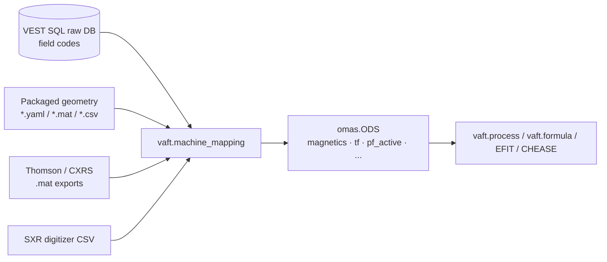

`vaft.machine_mapping` is the layer that turns **VEST machine reality** — DAQ field codes, coil geometry
tables, digitizer CSVs, MATLAB exports — into an **IMAS-compliant ODS**. It is the only place in VAFT that
knows about VEST-specific things like "field code 102 is the Rogowski coil" or "PF2 changed height in 2025".
Everything downstream ([`vaft.process`]({{ site.baseurl }}/guide/Processing/),
[`vaft.formula`]({{ site.baseurl }}/guide/Formula/), `vaft.plot`) consumes the ODS and never touches the raw
database.



If you only want to *read* already-mapped shots, you do not need this page — see
[Data structures]({{ site.baseurl }}/guide/Data_structures/). Read this page when you are mapping a **new
shot**, adding a **new diagnostic**, or debugging why a mapped signal looks wrong.

---

# The two-layer API

Every diagnostic module follows the same shape.

**1. The canonical IDS entry point** — named exactly after the IDS it fills. This is what you should call.

```python
from vaft.machine_mapping.magnetics import magnetics
from vaft.machine_mapping.tf import tf

magnetics(ods, shot, tstart, tend, dt)   # fills ods['magnetics']
tf(ods, shot, tstart, tend, dt)          # fills ods['tf']
```

**2. The `vfit_*` builders** — the static/dynamic split underneath. `*_static` writes geometry and metadata
that do not depend on time; `*_dynamic` writes the time-dependent signals. The canonical entry point simply
calls both. Reach for these when you want geometry without touching the database, or want to re-map only the
waveforms.

```python
from vaft.machine_mapping.tf import vfit_tf_static, vfit_tf_dynamic

vfit_tf_static(ods)                                  # tf.r0, ids_properties — no DB access
vfit_tf_dynamic(ods, shot, tstart, tend, dt)         # tf.coil.0.current, tf.b_field_tor_vacuum_r
```

All names are also re-exported lazily from the package root, so `vaft.machine_mapping.vfit_md(...)` works
without importing the submodule. The explicit `from vaft.machine_mapping.<module> import <name>` form used
above is what the production pipeline uses, and it is unambiguous — prefer it in scripts.

---

# Coverage: which IDS, which module

| IDS | Module | Canonical entry point |
|---|---|---|
| `magnetics` | `magnetics.py` | `magnetics(ods, shot, tstart, tend, dt, processing_config=None)` |
| `tf` | `tf.py` | `tf(ods, shot, tstart, tend, dt)` |
| `pf_active` | `pf_active.py` | `pf_active(ods, shot, tstart, tend, dt, geometry_root=None)` |
| `barometry` | `barometry.py` | `barometry(ods, shot, tstart, tend, dt)` |
| `spectrometer_uv` | `spectrometer_uv.py` | `spectrometer_uv(ods, shot, t_start, t_end, dt)` |
| `thomson_scattering` | `thomson_scattering.py` | `thomson_scattering(ods, shotnumber, data_root=None, mat_file=None)` |
| `charge_exchange` | `charge_exchange.py` | `charge_exchange(ods, shotnumber, options='ces', data_root=None, mat_file=None)` |
| `soft_x_rays` | `soft_x_rays.py` | `soft_x_rays(ods, shot, daq_label, **kwargs)` |
| `dataset_description` | `dataset_description.py` | `dataset_description(ods, source, options=None)` |
| `pf_passive` | `pf_passive.py` | `pf_passive(ods, source=None, options=None)` |
| `em_coupling` | `em_coupling.py` | `em_coupling(ods, source=None, options=None)` |
| `summary` | `summary.py` | `summary(ods, source, options=None)` |
| `mhd_linear` | `mhd_linear.py` | `mhd_linear(ods, source, options=None)` |

Note the argument shapes differ, and deliberately so — they follow the data source:

* **Raw-DAQ diagnostics** (`magnetics`, `tf`, `pf_active`, `barometry`, `spectrometer_uv`) take
  `(ods, shot, tstart, tend, dt)`: they resample DAQ traces onto a uniform window you choose.
* **File-backed diagnostics** (`thomson_scattering`, `charge_exchange`, `soft_x_rays`) take a shot plus a
  file/root override: their timebase comes from the exported file, not from you.
* **Reference-ODS diagnostics** (`pf_passive`, `em_coupling`) take a `source` path to a reference ODS.

`equilibrium` and `pf_plasma` exist as modules but their mapping functions raise `NotImplementedError` —
equilibria are produced by EFIT/CHEASE, not by machine mapping. See
[Equilibrium]({{ site.baseurl }}/guide/Equilibrium/).

Source: [`vaft/machine_mapping/`](https://github.com/VEST-Tokamak/vaft/blob/main/vaft/machine_mapping/__init__.py)

---

# Mapping a shot end to end

This is the real production recipe, condensed from
[`generate_diagnostics_ods.py`](https://github.com/VEST-Tokamak/vaft/blob/main/workflow/automatic_pipeline_1_routine_data_processing/generate_diagnostics_ods.py).

```python
from omas import ODS, save_omas_json

from vaft.machine_mapping.dataset_description import dataset_description
from vaft.machine_mapping.magnetics import magnetics
from vaft.machine_mapping.pf_active import pf_active
from vaft.machine_mapping.spectrometer_uv import spectrometer_uv
from vaft.machine_mapping.barometry import barometry
from vaft.machine_mapping.tf import tf

shot, tstart, tend, dt = 39915, 0.26, 0.36, 4e-5

ods = ODS()
dataset_description(ods, shot, {"source_type": "shot", "run": 1, "machine": "VEST"})
pf_active(ods, shot, tstart, tend, dt)
spectrometer_uv(ods, shot, tstart, tend, dt)
barometry(ods, shot, tstart, tend, dt)
tf(ods, shot, tstart, tend, dt)
magnetics(ods, shot, tstart, tend, dt)

save_omas_json(ods, "39915_diagnostics.json")
```

Order matters only for `dataset_description` (it stamps the pulse/run identity). The rest are independent and
each writes into its own IDS.

`dt = 4e-5` (25 kHz) matches the native DAQ rate — asking for a finer grid does not create information, it
just interpolates.

---

# Per-diagnostic detail

## magnetics

The heaviest module, and the one you are most likely to need to reason about.

`vfit_magnetics_static(ods)` writes probe and loop geometry from packaged YAML: `position.r`, `position.z`,
a probe `length` of 0.01 m, `poloidal_angle` of $3\pi/2$, and `type.index = 2` (Mirnov). It also appends four
**toroidal reference Mirnov channels** at $r = 0.796$ m, $z = 0.02$ m spaced at
$\phi = 0,\ 2\pi/3,\ \pi,\ 4\pi/3$ — these are what make toroidal mode-number analysis possible.

`vfit_magnetics_dynamic(ods, shot, tstart, tend, dt, processing_config=None)` fills:

| Node | Notes |
|---|---|
| `magnetics.flux_loop.:.flux.data` | integrated loop signal, multiplied by $2\pi$ to give poloidal flux in Wb |
| `magnetics.b_field_pol_probe.:.field.data` | integrated probe signal, T |
| `magnetics.b_field_pol_probe.:.voltage.data` | **raw** un-integrated Mirnov voltage at native DAQ timebase |
| `magnetics.ip.0.data` | plasma current, A |
| `magnetics.diamagnetic_flux.0.data` | diamagnetic flux, Wb |

The raw voltage traces are written by `vfit_mirnov_raw_dynamic(ods, shot)` and kept on the **acquisition**
timebase, not the resampled one — fluctuation analysis needs the full bandwidth. See
[`fluctuation_diagnostics_analysis.ipynb`](https://github.com/VEST-Tokamak/vaft/blob/main/notebooks/fluctuation_diagnostics_analysis.ipynb).

Two lower-level helpers are worth knowing:

```python
from vaft.machine_mapping.magnetics import detect_plasma_window, vfit_md, vfit_plasma_current, vest_diamagnetic_flux

time, flux_loops, probes = vfit_md(39915)          # -> (ndarray, list[ndarray], list[ndarray])
time, ip = vfit_plasma_current(39915)              # -> (ndarray, ndarray), amps
window = detect_plasma_window(39915, time, ip)     # the plasma window, with its source
time, dia = vest_diamagnetic_flux(39915, window.start, window.end)
```

**Plasma current is not just the Rogowski trace.** The bare Rogowski signal picks up the vacuum-vessel and
coil contribution, so `vfit_plasma_current` subtracts a flux-loop-derived reference scaled by a mutual
inductance, then removes a linear baseline fitted on a pre-plasma window. The mutual inductance value and the
overall sign are both **shot-range dependent** (VEST rewired and re-polarised its diagnostics over the years),
which is exactly the kind of machine trivia this module exists to hide. If a historical shot's $I_p$ comes out
inverted, that switch is the first thing to check.


### Plasma timing policy

Where the plasma is in a discharge is decided once, in the `plasma_timing` block of `vest.yaml`, and read by
every consumer (issue #409). Its `window` names a `diagnostics_time_policies` window — `plasma_analysis`,
0.28–0.36 s, which no diagnostic maps onto and the stage's `tstart`/`tend` never retune — and `baseline_lead_s`
the stretch before it, `[tstart − lead, tstart)`, whose samples are the **baseline** the detectors measure
their noise on. The block then carries the detector recipes, keyed by the signal they were tuned on: `h_alpha`
(median filter, threshold `max(2 % peak, 5 σ)`, 0.5 ms persistence, width, prominence and integral floors),
`ip` (zero-phase low-pass, principal pulse, pickup floor, 10 % end threshold, collapse fallback), per-line
`lines` for impurity lines with their own morphology, the H-alpha `usability` floors (rail level, quantized
baseline, validity) and the `agreement` tolerances between light and current. Every rule is validated against
`vaft.process.onset.active_window`'s signature when the policy is loaded:

```python
from vaft.machine_mapping.utils import resolve_plasma_timing_policy

policy = resolve_plasma_timing_policy()
policy.window.tstart, policy.window.tend, policy.baseline_start   # 0.28, 0.36, 0.26
policy.h_alpha, policy.ip                                          # keyword arguments of active_window
```

Two readers consume it. `vaft.omas.plasma_timing.plasma_timing(ods)` works on a mapped product: it finds the
H-alpha line **by label**, checks it is usable, takes the slow line as authoritative for onset and offset, the
validated fast line as first fallback and the plasma-current principal pulse as final fallback and cross-check,
and returns a `PlasmaTiming` with the window, its `source`, the `agreement` (`consistent`, `ip_before_halpha`,
`halpha_leads_ip_large`, `halpha_only`, `ip_only`, `none`), the usability of every candidate and a
`fallback_reason` — a missing filterscope is a normal state, and no plasma is `found = False`, never the range.
`vaft.machine_mapping.magnetics.detect_plasma_window(shot, ip_time, ip)` applies the same rules to the raw
records this layer already reads (the slow H-alpha field, negated, then the current) and returns a
`PlasmaWindowChoice` whose `source` is `h_alpha_raw`, `ip` or `analysis_range`; the last is the whole range,
flagged `analysis_range_fallback`. The diamagnetic-flux mapping anchors its reconstruction to that window and
records it in `magnetics.diamagnetic_flux[0].method_name` (`…; plasma window 0.3065-0.3308 s from h_alpha_raw`),
and the EFIT constraint script cuts its time slices from the range intersected with the ODS-side window.

Signal conditioning (integration, drift removal, smoothing) is delegated to `vaft.process` and is tunable
through `processing_config`, a `VestMagneticsProcessingConfig`:

```python
from vaft.process.magnetics import VestMagneticsProcessingConfig
from vaft.machine_mapping.magnetics import magnetics

magnetics(ods, 39915, 0.26, 0.36, 4e-5,
          processing_config=VestMagneticsProcessingConfig())
```

See [Signal processing]({{ site.baseurl }}/guide/Processing/) for what those knobs do, and
[Magnetics]({{ site.baseurl }}/guide/Magnetics/) for plotting the result.

### Discharge timing policy

The actuator events are a separate concept from the plasma window and sit in their own `discharge_timing`
block of `vest.yaml`, read by `vaft.omas.discharge_timing.discharge_timing(ods)` (issue #409). It shares the
`plasma_analysis` window and `baseline_lead_s` with the plasma policy, names the `ohmic_coil` (`PF1`) whose
onset anchors the loop-voltage excursion, selects the loop (`loop_voltage.selection: inboard_midplane` —
the `inboard_flux_loop` family member nearest the midplane, Flux Loop #10 on VEST — with a stored
`voltage.data` preferred to $-d\Phi/dt$), and carries two rules: `coil` (keyword arguments of
`vaft.process.onset.active_window`, run on `|I - baseline|` so an idle coil yields no onset) and `vloop`
(keyword arguments of `vaft.process.onset.zero_crossing_after_excursion`: the sustained `|V|` run starting
within `anchor_tolerance_s` of the ohmic onset is the solenoid excursion, the event is the first sign change
after its extremum, and a decay that comes within `approach_fraction` of zero and climbs back before crossing
is flagged `approached_without_crossing`). These are measured onsets, never triggers; EC power and gas
injection have no mapped actuator signal and are reported as `not_present`. The events never enter the
plasma hierarchy as fallbacks.

```python
from vaft.omas.discharge_timing import discharge_timing

events = discharge_timing(ods)
events.oh_onset, events.vloop.zero_crossing, events.vloop.flags
{coil.name: coil.time for coil in events.pf_onsets}      # None for a coil that did not fire
```

## tf

`tf` reconstructs the toroidal field from a **Hall probe**, not from a coil current shunt. The raw signal is
scaled by a Hall gain, baselined against the first samples, low-pass filtered and smoothed, then converted:

$$ B_{t} R = \frac{\mu_0 N_{TF} I_{TF}}{2\pi}, \qquad N_{TF} = 24 $$

which is written to `tf.b_field_tor_vacuum_r` (units T·m). The VEST reference radius `tf.r0` is 0.4 m, so
$B_t$ on axis is `tf.b_field_tor_vacuum_r / tf.r0`. The reconstructed coil current also lands in
`tf.coil.0.current`.

```python
from vaft.machine_mapping.tf import vfit_tf_current, vfit_tf_bt_r

time, i_tf = vfit_tf_current(39915)   # A
time, bt_r = vfit_tf_bt_r(39915)      # T·m
```

## pf_active

Ten PF coils. `vfit_pf_active_static` loads a **discretized coil geometry** MATLAB table and writes each coil
as a set of rectangular elements (`geometry.geometry_type = 2`) with `turns_with_sign` and `area`. Coil
resistance is computed from copper resistivity as

$$ R = \frac{2\pi \rho R_{coil}}{A_{coil}} $$

Crucially, **which geometry file is loaded depends on the shot number** — VEST's PF set was modified, so
coil heights differ between the older and newer builds. Passing a `shot` to `vfit_pf_active_static` is what
selects the right one; the canonical `pf_active(...)` does this for you. You can point at a different asset
tree with `geometry_root`, and resolve a packaged asset directly:

```python
from vaft.machine_mapping.pf_active import resolve_geometry_asset, vfit_pf

path = resolve_geometry_asset("VEST_DiscretizedCoilGeometry_Full_ver_2507.mat")
time, currents = vfit_pf(39915)   # currents: list of 10 arrays, A
```

Per-coil gains and noise reduction are applied while building the waveforms, so `vfit_pf` output is already
calibrated.

## soft_x_rays

SXR does not come from the SQL DAQ — it comes from **digitizer CSV files** named
`digitizer_{daq_label}_{shot}.csv`. The mapper builds the timebase itself from a sample rate
(125 MHz / 128 by default) and a trigger offset, so `daq_label` is a required argument: it selects which
physical array the digitizer channels belong to.

```python
from vaft.machine_mapping.soft_x_rays import soft_x_rays, soft_x_rays_from_digitizer_csv

soft_x_rays(ods, shot=39915, daq_label="22577", data_root="/path/to/sxr")

# or build a fresh ODS in one call
ods_sxr = soft_x_rays_from_digitizer_csv(39915, "22577", data_root="/path/to/sxr")
```

Line-of-sight geometry (`channel.:.line_of_sight.first_point` / `.second_point`) is filled from a packaged
endpoint table, and the default energy band is 0–20 keV. Channels the geometry table does not know about are
**still stored as brightness traces**, just without LOS metadata — so an unmapped channel degrades gracefully
rather than failing the run. Override the channel assignment with `channel_map`, and flip a mis-wired array
with `polarity=-1.0`.

Worked example:
[`soft_x_ray_signal_analysis.ipynb`](https://github.com/VEST-Tokamak/vaft/blob/main/notebooks/soft_x_ray_signal_analysis.ipynb).

## thomson_scattering and charge_exchange

Both read MATLAB exports rather than the DAQ, so they take a `shotnumber` and an optional `data_root` /
`mat_file`. Both write **uncertainties** alongside values when the export provides errors.

```python
from vaft.machine_mapping.thomson_scattering import thomson_scattering
from vaft.machine_mapping.charge_exchange import charge_exchange

thomson_scattering(ods, 39915)                    # -> thomson_scattering.channel.:.{t_e, n_e}
charge_exchange(ods, 39915, options="ces")        # 'ces' or Doppler modes
```

`charge_exchange` supports more than one instrument: `options` selects between the CES export and the ion
Doppler spectroscopy exports, and `read_doppler_single` / `read_doppler_profile` are available if you want to
load Doppler data directly. These two IDSs are the kinetic input to profile fitting —
[`profile_fitting_using_equilibrium_and_kinetic_diagnostics.ipynb`](https://github.com/VEST-Tokamak/vaft/blob/main/notebooks/profile_fitting_using_equilibrium_and_kinetic_diagnostics.ipynb).

## pf_passive and em_coupling

These two are **not measured** — they are machine constants. Both are copied from a packaged reference ODS
that ships with VAFT:

```python
from vaft.machine_mapping.pf_passive import pf_passive
from vaft.machine_mapping.em_coupling import em_coupling

pf_passive(ods)     # vessel/passive-loop geometry
em_coupling(ods)    # mutual inductance matrices
```

`pf_passive` deliberately **deletes the loop currents and the time axis** from the reference while keeping the
geometry. That is not a bug: the reference ODS contains one historical shot's eddy currents, and you want the
geometry so you can compute *your* shot's eddy currents fresh. Pass `source` (or `options['reference_ods']`)
to substitute your own reference.

`em_coupling` supplies the mutual inductances that eddy-current reconstruction needs; see
[Signal processing and EM modeling]({{ site.baseurl }}/guide/Processing/).

## dataset_description

Stamps pulse identity. `vfit_dataset_description` is the explicit form:

```python
from vaft.machine_mapping.dataset_description import vfit_dataset_description

vfit_dataset_description(ods, shot=39915, run=0, machine="VEST", pulse_type="pulse")
# -> dataset_description.data_entry.{machine, pulse, pulse_type, run, user}
```

---

# Static assets and the channel table

Machine mapping is only as good as its geometry tables. They live under `vaft/data/geometry/` and are resolved
through `resolve_data_root()`:

| Asset | Used for |
|---|---|
| `VEST_MagneticsGeometry_Full_ver_2302.yaml` | probe / flux-loop positions, and the inboard–side–outboard grouping |
| `MD.yaml` | magnetic-diagnostic channel list used by `vfit_md` |
| `table.yaml` | field code → channel name lookup |
| `VEST_DiscretizedCoilGeometry_Full_ver_1906.mat`, `..._ver_2507.mat` | PF coil elements (shot-dependent) |
| `line_of_sight_endpoints.csv` | SXR lines of sight |

A separate `vest.yaml` shipped inside `vaft/machine_mapping/` carries per-shot DAQ channel metadata (label,
field code, gain). It is keyed by shot, with a `0` block holding defaults that shot-specific blocks are
deep-merged over — so a recalibrated channel is a small YAML override, not a code change. Query it with:

```python
from vaft.machine_mapping.utils import raw_database_info

info = raw_database_info("vest.yaml", 39915, "b_field_pol_probe")
info["labels"], info["fields"], info["gains"]   # dicts keyed by channel index
```

Probes and loops are grouped by position — inboard, side, outboard — and that grouping is what drives
per-group uncertainties below.

---

# Uncertainties for equilibrium reconstruction

EFIT needs an error bar on every constraint. `machine_mapping` attaches them, because the *machine* is what
determines them: an outboard Mirnov is not as trustworthy as a Rogowski coil.

```python
from vaft.machine_mapping.utils import (
    DEFAULT_CONSTRAINT_UNCERTAINTIES,
    apply_default_constraint_uncertainties,
)

apply_default_constraint_uncertainties(ods)   # annotates pf_active, tf and magnetics in one call
```

The defaults are **relative** errors:

| Constraint key | Default |
|---|---|
| `pf_active_current` | 1e-4 |
| `tf_b_field_tor_vacuum_r` | 1e-4 |
| `magnetics_ip` | 5e-2 |
| `magnetics_diamagnetic_flux` | 3e-2 |
| `magnetics_bpol_inboard` | 1e-2 |
| `magnetics_bpol_side` | 1e-1 |
| `magnetics_bpol_outboard` | 1e-2 |
| `magnetics_flux_loop_inboard` | 1e-1 |
| `magnetics_flux_loop_outboard` | 1e-2 |

The pattern is physical: coil currents are known to a part in $10^4$ because they are driven and metered,
while the **side** probes and **inboard** flux loops get 10% — they sit where the field is weakest and the
pickup worst, so down-weighting them is what keeps a reconstruction stable.

Override selectively with a mapping (unknown keys raise), or wholesale with a 9-element vector in the table's
order:

```python
apply_default_constraint_uncertainties(ods, {"magnetics_ip": 0.02})
apply_default_constraint_uncertainties(ods, [1e-4, 1e-4, 2e-2, 3e-2, 1e-2, 1e-1, 1e-2, 1e-1, 1e-2])
```

Finer control is available per subsystem — `apply_pf_active_current_uncertainties`,
`apply_tf_uncertainties`, and `apply_magnetics_uncertainties` (which additionally accepts
`fl_correct_coeff` to divide out per-loop calibration coefficients). `normalize_constraint_uncertainties`
turns either input form into the canonical dict if you want to inspect it first.

---

# Offline mapping and reproducibility

Live SQL access is not always available or desirable — CI, archived reprocessing, and anyone outside the VEST
network need to work from a dump. Two environment variables control this, and the production pipeline sets
both:

```python
import os

os.environ["VAFT_RAW_SAMPLE_PATH"] = "/data/raw_dumps/39915.json.gz"
os.environ["VAFT_RAW_OFFLINE_ONLY"] = "1"     # never attempt a live SQL connection

# ... mapping calls now read from the dump
```

`VAFT_RAW_SAMPLE_PATH` accepts a `{shot}` placeholder, so one template serves a whole reprocessing campaign.
With `VAFT_RAW_OFFLINE_ONLY` set, a missing channel yields a **zero waveform on a default timebase** instead
of an exception — mapping completes and the gap is visible in the data rather than as a crash. When you see an
identically-zero trace in an offline run, suspect a missing channel in the dump before you suspect the machine.

Database access itself is documented in
[`vest_raw_signal_sql_database.ipynb`](https://github.com/VEST-Tokamak/vaft/blob/main/notebooks/vest_raw_signal_sql_database.ipynb).

---

# Adding a new diagnostic

The contract to satisfy, in order:

1. Create `vaft/machine_mapping/<ids_name>.py`, named after the **IMAS IDS**, not the instrument.
2. Write `vfit_<ids>_static(ods, ...)` for geometry/metadata and `vfit_<ids>_dynamic(ods, shot, ...)` for
   signals. Use `set_path` from `.utils` rather than assigning into the ODS directly — it keeps path handling
   uniform.
3. Write the canonical `<ids_name>(ods, shot, tstart, tend, dt)` that calls both.
4. Put geometry in `vaft/data/geometry/` as YAML or CSV. Do not hardcode positions in Python.
5. Register the public names in `_EXPORT_MAP` and `__all__` in
   [`__init__.py`](https://github.com/VEST-Tokamak/vaft/blob/main/vaft/machine_mapping/__init__.py) so they
   are reachable from the package root.
6. Degrade gracefully when a channel is absent — return an empty or zero signal, do not raise.

---

# Related pages

* [Quick start guide]({{ site.baseurl }}/guide/Quick_start_guide/) — load an already-mapped shot in five lines.
* [Data structures]({{ site.baseurl }}/guide/Data_structures/) — what an ODS/IDS is, and which IDSs VEST carries.
* [Signal processing and EM modeling]({{ site.baseurl }}/guide/Processing/) — the `vaft.process` routines that machine mapping calls into.
* [Magnetics]({{ site.baseurl }}/guide/Magnetics/) — plotting the mapped magnetics IDS.
* [Examples]({{ site.baseurl }}/guide/examples/) — the full notebook index.
