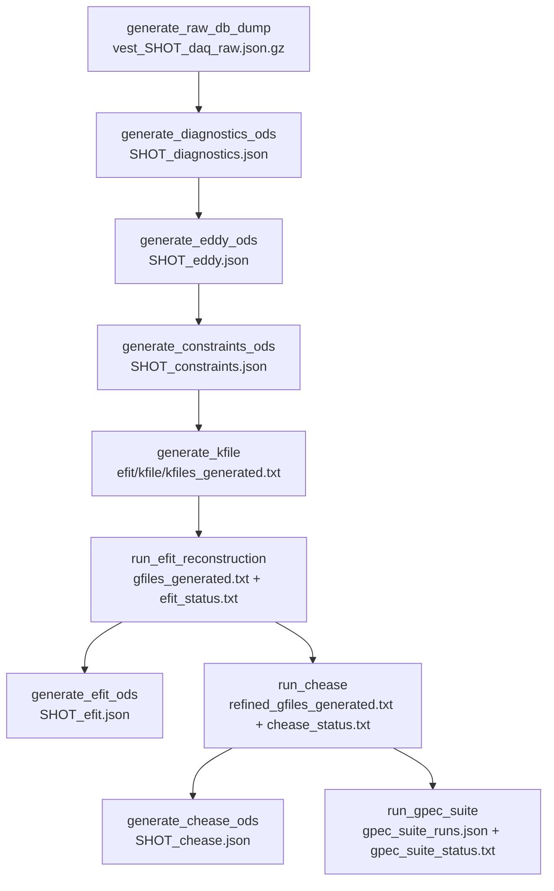

The `workflow/` directory of the repository holds the batch pipelines that turn a raw VEST shot into
reconstructed equilibria, refined equilibria, stability results and cross-shot summary sheets. They are the
production counterpart of the interactive notebooks: the same `vaft` library calls, driven by
[Snakemake](https://snakemake.readthedocs.io/) over hundreds of shots instead of one.

> **These are scripts, not a package.** `workflow/` contains no `__init__.py`; nothing in it is importable as
> `vaft.workflow.*`. Each directory is self-contained and is meant to be run **from inside itself**, because
> several scripts resolve output paths relative to the working directory. Only the `vaft.*` calls they make
> are library API.

| Pipeline | Orchestration | Purpose |
|---|---|---|
| `automatic_pipeline_1_routine_data_processing` | Snakemake DAG (10 rules) + `Makefile` | Per shot: raw DAQ dump → diagnostics/eddy/constraints ODS → EFIT → CHEASE → GPEC suite |
| `automatic_pipeline_2_corrective_data_update` | none (long-running daemon) | Back-fills Thomson scattering and fitted core profiles into already-stored shots |
| `automatic_pipeline_3_data_summary` | partial Snakefile (2 rules) + manual scripts | Mines the file database into cross-shot `.xlsx` history sheets and plots |
| `running_linear_stability` | Snakemake DAG (1 rule, fanned out) | Runs DCON / RDCON / STRIDE per (shot, time, n-mode) on refined equilibria |

All four share one on-disk convention, rooted at `base_dir` (`/srv/vest.filedb/public` in every shipped config):

```text
{base_dir}/{shot}/
├── diagnostics/          vest_{shot}_daq_raw.json.gz, Thomson *.mat
├── omas/                 {shot}_diagnostics.json, _eddy.json, _constraints.json,
│                         _efit.json, _chease.json
├── efit/                 kfile/ gfile/ afile/ mfile/  + efit_status.txt
├── chease/               refined g-files (flat), work/, plots/{time}.png
├── linear_stability/     {time}/{dcon,rdcon,stride}/nn={n}/
└── logs/
```

---

## Pipeline 1 — routine data processing

### Running it

```bash
cd workflow/automatic_pipeline_1_routine_data_processing
make run          # snakemake --cores 30 --configfile config.yaml, tee'd into logs/
make clean        # snakemake --delete-all-output
```

`make run` hardcodes **30 cores** in the `Makefile`; the `cores:` key in `config.yaml` is never read by the
`Snakefile`. You can equally invoke Snakemake yourself:

```bash
snakemake --cores 8 --configfile config.yaml
```

Two things to know before the first run. `make run` deletes `.snakemake/` when it finishes, so there is no
incremental DAG state between runs — re-execution is decided purely from output-file timestamps. And although
every rule carries a `conda:` directive, it names a bare environment (`vaft`) rather than an environment file
and the `Makefile` does not pass `--use-conda`; **activate the `vaft` environment yourself**.

### The DAG



Stages do **not** hand individual g-/k-files to each other as Snakemake outputs. Each stage writes a
**manifest** — a text file with one absolute path per line — and the next stage reads it. `run_gpec_suite`
instead emits a JSON payload. Alongside each manifest is a one-line status file, e.g.

```text
completed: returncode=0; gfiles=12
skipped: efit.run=false; kfiles=40
partial: refined_gfiles=8; failed=2
```

| Rule | Script | Key `vaft` calls |
|---|---|---|
| `generate_raw_db_dump` | `generate_raw_db_dump.py` | `vaft.database.init_pool`, `vaft.database.dump_all_raw_signals_for_shot` |
| `generate_diagnostics_ods` | `generate_diagnostics_ods.py` | `vaft.machine_mapping.dataset_description`, `pf_active`, `spectrometer_uv`, `barometry`, `tf`, `magnetics` |
| `select_impa_shots` (checkpoint) | `select_impa_shots.py` | `vaft.machine_mapping.impa.impa_expected_fields` |
| `generate_impa_ods` | `generate_impa_ods.py` | `vaft.omas.vest_upstream.build_impa_ods` → `vaft.machine_mapping.impa.impa` |
| `generate_eddy_ods` | `generate_eddy_ods.py` | `vaft.machine_mapping.pf_passive`, `em_coupling`, `vaft.omas.process_wrapper.compute_eddy_currents` |
| `generate_constraints_ods` | `generate_constraints_ods.py` | `vaft.code.efit.correct_flux_loop`, `vaft.code.efit.generate_constraints_ods` |
| `generate_kfile` | `generate_kfile.py` | `vaft.code.efit.generate_kfile` |
| `run_efit_reconstruction` | `run_efit_reconstruction.py` | `vaft.code.efit.run_efit` with `EFITInputs` / `EFITConfig` |
| `generate_efit_ods` | `generate_efit_ods.py` | `vaft.code.efit.collect_efit_outputs` |
| `run_chease` | `run_chease_refinement.py` | `vaft.code.chease.find_chease_executable`, `prepare_chease_inputs`, `run_chease` |
| `generate_chease_ods` | `generate_chease_ods.py` | `vaft.data.eqdsk.read_geqdsk` → `.to_omas(ods=ods, time_index=...)` |
| `run_gpec_suite` | `run_gpec_suite.py` | `vaft.code.gpec.run_gpec_suite_case` with `GPECCaseInputs` / `GPECSuiteConfig` |

Note the one rule whose name differs from its script: rule `run_chease` runs `run_chease_refinement.py`.

`generate_impa_ods` is the one optional branch. IMPA is an insertable,
campaign-dependent diagnostic, so it is off by default (`impa.enable: false`),
it is never an input to a baseline stage, and it records a failure in its own
manifest instead of raising one -- a broken IMPA branch cannot change the exit
state of a run whose baseline stages succeeded. Its product is published into
the sparse `impa` HSDS source rather than into `main`, and a shot missing from
that source means only that no IMPA product was published for it (issue #305).
Analysis that wants the array alongside the baseline composes the two
explicitly with `vaft.database.compose(shot)`.

### The library calls, verbatim

Each script is a thin CLI around a handful of `vaft` calls. These are the load-bearing ones:

```python
from vaft.code.efit import EFITConfig, EFITInputs, run_efit, collect_efit_outputs
from vaft.code.chease import CHEASEConfig, find_chease_executable, prepare_chease_inputs, run_chease
from vaft.code.gpec import GPECCaseInputs, GPECSuiteConfig, run_gpec_suite_case
from vaft.data.eqdsk import read_geqdsk

# EFIT: run, then collect whatever landed in the workdir
result = run_efit(EFITInputs(workdir=workdir, kfiles=kfiles),
                  EFITConfig(executable=exe, workdir=workdir, shot=shot,
                             args=("129",), timeout=600))
result = collect_efit_outputs(workdir, EFITConfig(workdir=workdir, shot=shot))

# CHEASE: resolve the binary (falls back to $PATH), prepare, run
config = CHEASEConfig(executable=exe, timeout=600, target_psin=0.993, nideal=6, nw=513)
result = run_chease(prepare_chease_inputs(gfile, config), config)

# GPEC suite: one case per refined g-file
result = run_gpec_suite_case(
    GPECCaseInputs(shot=shot, time_ms=time_label, geqdsk=gfile, workdir=workdir),
    GPECSuiteConfig(gpec_home=gpec_home, modules=("dcon", "rdcon", "stride", "gpec"),
                    modes=(1, 2), psilow=0.01, psihigh=0.994, timeout=1200.0))

# CHEASE ODS: accumulate refined g-files as time slices
ods = read_geqdsk(gfile).to_omas(ods=ods, time_index=time_index)
```

`GPECSuiteConfig.gpec_home` defaults to `None`, in which case the installation root is read from the
**`$GPECHOME`** environment variable.

The diagnostics stage forces the machine-mapping layer offline by setting `VAFT_RAW_SAMPLE_PATH` and
`VAFT_RAW_OFFLINE_ONLY=1` before it maps anything, so the whole pipeline can be replayed from an archived raw
dump with no SQL server in reach. Magnetics processing parameters travel as a
`vaft.process.magnetics.VestMagneticsProcessingConfig`, built from the `vest.magnetics.processing` block of
`config.yaml` and passed to `vaft.machine_mapping.magnetics(..., processing_config=...)`. See
[Signal processing and EM modeling]({{ site.baseurl }}/guide/Processing/) for what those knobs mean.

### Configuration

`config.yaml` is organised by stage: `raw` (`mode: sql | archive`), `diagnostics` (`tstart`, `tend`, `dt`,
`run`), `vest.magnetics.processing`, `wall.reference_ods`, `eddy.filament` (`r`, `z`, `fraction`, `dt_sub`),
`constraints`, `efit`, `chease` and `gpec`. Three points repeatedly bite newcomers:

* **The shipped `config.yaml` is a template, not a working config.** `efit.executable`, `efit.table_dir`,
  `chease.executable`, `gpec.home`, `wall.reference_ods` and `raw.archive_template` all point into one
  developer's home directory, while `base_dir` points at the Linux data server. Repoint them before running.
* **Dead keys.** `cores`, `raw.offline_only` and `gpec.coil.source` appear in `config.yaml` but are never read
  by the `Snakefile`.
* **`constraints.detect_broken` is accepted and then ignored** — the script logs a warning and uses only the
  explicit `constraints.broken` list of 1-based channel indices.

Constraint time selection is worth spelling out, because `timeset: auto` is the default and it is not
obvious. The base window is $[\max(0.28,\ t_0),\ \min(0.38,\ t_{-1})]$ seconds; within it the script keeps
only samples where $I_p > 20\ \mathrm{kA}$, falling back to the full window and then to all times if that
selection is empty. Start and end are snapped to the `tstep` grid. With `timeset: manual` you get exactly
`np.arange(tstart, tend, tstep)` and both bounds become mandatory.

### Failure semantics — a green run does not mean everything ran

The runners deliberately disagree about what counts as failure, so **always read the `*_status.txt` files
rather than the exit code**:

* `run_efit_reconstruction` and `generate_efit_ods` **exit 0 even when EFIT is absent or produced nothing**.
  A minimal stub ODS is written instead, carrying
  `equilibrium.ids_properties.comment = "EFIT output unavailable: ..."`. Check that comment to detect a stub.
* EFIT failure is detected by **string-sniffing stdout and stderr** for `Invalid line in namelist`,
  `Fortran runtime error` and `Error termination` — EFIT is known to exit 0 on namelist errors, so the
  return code alone is not trustworthy.
* `run_chease_refinement` exits **1** if CHEASE ran but refined zero g-files (though 0 if it was skipped
  outright), and `run_gpec_suite` exits **1** if any case failed.

`run_chease_refinement.py` also writes `chease/chease_runs.json` and the per-time comparison plots in
`chease/plots/`, neither of which is declared as a Snakemake output — `snakemake --delete-all-output` will
leave them behind.

---

## Pipeline 2 — corrective data update

This pipeline back-fills data that arrives *after* a shot has already been processed. It consists of one
polling daemon (`update_thomson_scattering_and_core_profile.py`); the sibling `update_equilibrium.py` is an
empty placeholder with no behavior.

```bash
cd workflow/automatic_pipeline_2_corrective_data_update
nohup python3 update_thomson_scattering_and_core_profile.py \
    > thomson_scattering_update_fitting.log 2>&1 &
```

There are no command-line flags; the paths are module constants (`WATCH_DIAG = /srv/vest.diagnostic`,
`PUBLIC_BASE = /srv/vest.filedb/public`, `CHECK_INTERVAL = 10` seconds). Despite what its docstring says, the
daemon does **not** use `watchdog` — `main()` is a `while True:` loop that re-lists the watch directory every
ten seconds.

Each cycle it scans for new Thomson `*.mat` files, parses the shot number (both `Shot40330_v10.mat` and
`40330_NeTe.mat` spellings are accepted), skips files whose mtime it has already recorded, copies the file
into the shot's `diagnostics/` directory, and then:

```python
from vaft import database, machine_mapping, process

ods = database.load(shotnumber, 'public')
machine_mapping.thomson_scattering(ods, shotnumber, filepath)
database.save(ods, shotnumber)

# and, when a refined equilibrium exists for that shot, per time slice:
mapped_rho = process.equilibrium_mapping_thomson_scattering(ods, geq)
n_e_fn, T_e_fn, *_ = process.profile_fitting_thomson_scattering(
    ods, time_ms, mapped_rho, Te_order=2, Ne_order=2,
    fitting_function_te='polynomial', fitting_function_ne='exponential')
ods = process.core_profiles(ods, time_ms, mapped_rho, n_e_fn, T_e_fn)
```

The equilibrium it maps against is the CHEASE-refined g-file at
`{base}/{shot}/chease/g0{shot}.00{ms:03d}`, so profile fitting only happens for shots pipeline 1 has already
refined. Shots with Thomson data but no refined equilibrium get the raw Thomson IDS and nothing more.

### The registry

Progress is recorded in an HSDS-backed registry, `hdf5://public/processed_shots.h5`, keyed by shot with a
timestamp and one of three statuses:

| Status | Meaning |
|---|---|
| `core_profile` | Thomson stored **and** profile fits succeeded |
| `thomson_only` | Thomson stored, no fits (usually: no refined equilibrium yet) |
| `invalid` | load or parse failed |

An existing `core_profile` / `thomson_only` entry is never downgraded to `invalid`. **This registry is the
input to pipeline 3** — three of its generators take their shot list from it, so if this daemon has never
run, those sheets come out empty no matter how much data sits on disk. The module also contains a registry
reset routine that wipes the H5 file and strips `thomson_scattering` / `core_profiles` back out of every ODS.
It is commented out in `__main__`, it is destructive, and its default branch iterates the wrong keys. Do not
run it.

---

## Pipeline 3 — data summary

Cross-shot mining. The `Snakefile` here wires up only two of the ten-odd scripts (with `BASE_PATH` hardcoded,
not read from a config — `config.yaml` and `README.md` are both empty files); everything else is run by hand.

```bash
cd workflow/automatic_pipeline_3_data_summary
snakemake --cores 8                                   # chease_history.xlsx + efit_history.xlsx
python gen_omas_history.py     --base-path /srv/vest.filedb/public
python gen_stability_history.py --base_path /srv/vest.filedb/public   # underscore!
python gen_core_profiles_history.py --directory public --Z-eff 2.0 --save-every 10
python gen_equilibrium_global_history.py --directory public --rebuild
python gen_volume_averaged_parameter_sheet.py --max-shots 50 --directory public
```

| Script | Sheet | Contents |
|---|---|---|
| `gen_chease_history.py` | `chease_history.xlsx` | Global quantities per (shot, time) from refined g-files |
| `gen_efit_history.py` | `efit_history.xlsx` | Same columns from EFIT g-files (key column is `shot_number`, not `shot`) |
| `gen_omas_history.py` | `omas_history_new.xlsx` | One row per shot: onset, pulse duration, peak $I_p$, $B_t$, file-existence flags |
| `gen_stability_history.py` | `stability_history.xlsx` | Ideal/resistive/ballooning classification per (shot, time) |
| `gen_core_profiles_history.py` | `core_profiles_history.xlsx` | $\tau_E$ and confinement scalings per time slice |
| `gen_equilibrium_global_history.py` | `equilibrium_global_history.xlsx` | 50+ columns: globals, geometry, diamagnetic flux, virial/Shafranov block |
| `gen_volume_averaged_parameter_sheet.py` | `volume_averaged_parameters.xlsx` | $\langle n_e \rangle$, $\langle T_e \rangle$, $\langle P_e \rangle$ vs. $\langle P_{eq} \rangle$ |
| `join_chease_stability_history.py` | `chease_stability_history.xlsx` | Inner-join of the CHEASE and stability sheets on `['shot', 'time [ms]']` |
| `plot_stability_limit.py` | `stability_limit.png`, `histograms.png`, `corr/*.png` | Stability-limit scatter, histograms, pairwise correlations |

The equilibrium and profile generators lean on the ODS-aware layer described in
[Data structures]({{ site.baseurl }}/guide/Data_structures/), calling `vaft.omas.update_equilibrium_boundary`,
`update_equilibrium_global_quantities_q_min`, `update_equilibrium_global_quantities_volume`,
`update_equilibrium_stored_energy` and `update_equilibrium_constraints_diamagnetic_flux` to fill any gaps,
then `vaft.omas.compute_virial_equilibrium_quantities_ods` and
`vaft.omas.compute_diamagnetic_flux_measured_vs_computed` for the derived blocks. Confinement times come from
`vaft.omas.formula_wrapper.compute_tau_E_engineering_parameters` together with
`vaft.omas.general.find_matching_time_indices`, which pairs a `core_profiles` slice with the nearest
`equilibrium` slice. Volume averages use `vaft.omas.update_core_profiles_global_quantities_volume_average` and
`vaft.omas.compute_volume_averaged_pressure(ods, time_slice=None, option="equilibrium")`.

`gen_core_profiles_history.py`, `gen_equilibrium_global_history.py` and
`gen_volume_averaged_parameter_sheet.py` share an incremental-upsert engine: they reload the existing sheet,
reprocess any shot that is **missing or defective** (any required column NaN or non-finite), upsert on the key
columns, and checkpoint every `--save-every` shots. `--rebuild` ignores the existing sheet entirely. The other
generators rebuild from scratch and overwrite.

### Reading these sheets correctly

* **The stability classifications are heuristics with magic thresholds.** `ideal_stability` is `"Error"` if any
  $|\delta W| \ge 100$, else `"Stable"` only if **every** $\delta W > 0$ (scanned over $n = 1 \ldots 6$).
  `resistive_stability` is `"Error"` if any $|\Delta'| \ge 1000$, else `"Stable"` if **no** $\Delta' > 0$
  ($n = 1, 2$). `ballooning_stability` is `"Unstable"` if $c_{a1} < 0$ anywhere with $\psi_N > 0.5$.
  The `sas_flag` values are parsed from the code input files but **dropped** from the final sheet.
* **`chease_history.xlsx` is indexed by PNG files, not g-files.** Discovery enumerates `chease/plots/*.png` and
  derives the time from the stem. Set `chease.create_plot: false` in pipeline 1 and this sheet comes out
  **empty** even with hundreds of valid refined g-files present.
* **There is no canonical schema across sheets.** The key column is variously `shot`, `shot_number` or
  `shotnumber`, and the time column `time [ms]`, `time`, `time_s` or `time_ms`. That is why
  `join_chease_stability_history.py` can join the CHEASE sheet but not the EFIT one.
* `gen_chease_history.py` applies `abs()` to $I_p$; `gen_efit_history.py` does not, so EFIT currents can come
  out negative.
* **The filename chains do not compose.** `gen_omas_history.py` writes `omas_history_new.xlsx` but
  `plot_omas_history.py` reads `omas_history.xlsx`; `join_chease_stability_history.py` writes
  `chease_stability_history.xlsx` but `plot_stability_limit.py` reads `chease_dcon_history.xlsx`. Rename or
  copy by hand between steps.
* Despite their names, `plot_chease_history.py` and `plot_efit_history.py` **do not plot**. Both are older
  generators; `plot_chease_history.py` in particular overwrites `chease_history.xlsx` with an incompatible
  schema that can no longer be joined. Do not run it. `plot_stability_history.py` is an empty file.
* `gen_efit_reliability.py` currently emits only diamagnetic-flux rows — the append calls in its magnetic-probe
  and flux-loop branches are unreachable — so do not read its output as per-probe reliability data.

### Known breakage on `main`

The three incremental generators listed above resolve their shot list from pipeline 2's registry, and load each
shot, by calling two helpers on `vaft.database.ods` that the module **does not define on `main`** — it exposes
`load_ods` and `save_ods`. As committed they will raise `AttributeError` before doing any work. The equivalent
supported entry points are:

```python
import vaft
ods = vaft.database.load(shot, directory="public")   # -> ODS
vaft.database.save(ods, shot)
```

See [Data structures]({{ site.baseurl }}/guide/Data_structures/) for the loader's semantics.

---

## `running_linear_stability`

Pipeline 1's `run_gpec_suite` rule runs the GPEC suite through the `vaft.code.gpec` API. This separate
pipeline is the older, coarser alternative: a fan-out that launches DCON, RDCON and STRIDE directly, one
Snakemake job per (shot, time, code, n-mode). For what these codes compute and how to read their output, see
[Stability]({{ site.baseurl }}/guide/Stability/).

```bash
cd workflow/running_linear_stability
./snakemake_worker.sh          # snakemake --cores 28
```

Targets are discovered by `find_plotted_gfiles.py`, which the `Snakefile` shells out to at parse time. It
walks `{BASE_DIR}/{5-digit shot}/chease/plots/*.png`, takes each PNG stem as a 5-digit time, and emits the
matching `chease/g{shot:06d}.{time}` — **the same PNG-as-index coupling as `gen_chease_history.py`**, so
CHEASE comparison plots must exist or this pipeline finds nothing to do. You can run the discovery step alone:

```bash
python find_plotted_gfiles.py --base-path /srv/vest.filedb/public
```

The single rule `run_stability_code_for_mode` fans out over $n = 1 \ldots 6$ for DCON and $n = 1, 2$ for RDCON
and STRIDE, writing a `completed.txt` marker to
`{BASE_DIR}/{shot}/linear_stability/{time}/{code}/nn={n}/` and a log to
`{BASE_DIR}/{shot}/logs/linear_stability/{time}/{code}_nn{n}.log`. That directory layout is exactly what
`gen_stability_history.py` in pipeline 3 later reads.

Two caveats. The rule loads GPEC through environment modules (`module use /home/user1/GPEC/module; module load
GPEC-dev`), and the runner it invokes is an **absolute path to a script outside this repository**
(`RUN_PARALLEL_DCON_SCRIPT` at the top of the `Snakefile`). Both must be repointed for the pipeline to run
anywhere else. `config.yaml` holds a single key, `BASE_DIR`.

To wipe stability outputs and start over — inspect first, it is a recursive delete:

```bash
python cleanup_stability_outputs.py --base-path /srv/vest.filedb/public --dry-run
python cleanup_stability_outputs.py --base-path /srv/vest.filedb/public
```

It removes `{shot}/linear_stability/` and `{shot}/logs/linear_stability/` for **every** shot under the base
path.

---

## Related

Each pipeline stage has an interactive notebook counterpart — read those first if you want to understand what
a stage does before running it at scale:

* [`magnetic_diagnostics_processing.ipynb`](https://github.com/VEST-Tokamak/vaft/blob/main/notebooks/magnetic_diagnostics_processing.ipynb) and [`eddy_current_calculation_and_startup_analysis.ipynb`](https://github.com/VEST-Tokamak/vaft/blob/main/notebooks/eddy_current_calculation_and_startup_analysis.ipynb) — pipeline 1, diagnostics and eddy stages
* [`magnetic_equilibrium_reconstruction_with_efit.ipynb`](https://github.com/VEST-Tokamak/vaft/blob/main/notebooks/magnetic_equilibrium_reconstruction_with_efit.ipynb) and [`equilibrium_refinement_using_chease.ipynb`](https://github.com/VEST-Tokamak/vaft/blob/main/notebooks/equilibrium_refinement_using_chease.ipynb) — the EFIT and CHEASE stages
* [`linear_ideal_stability_analysis_with_dcon.ipynb`](https://github.com/VEST-Tokamak/vaft/blob/main/notebooks/linear_ideal_stability_analysis_with_dcon.ipynb), [`linear_resistive_stability_analysis_with_rdcon.ipynb`](https://github.com/VEST-Tokamak/vaft/blob/main/notebooks/linear_resistive_stability_analysis_with_rdcon.ipynb) and [`perturbed_equilibrium_and_3d_response_with_gpec.ipynb`](https://github.com/VEST-Tokamak/vaft/blob/main/notebooks/perturbed_equilibrium_and_3d_response_with_gpec.ipynb) — the stability codes
* [`profile_fitting_using_equilibrium_and_kinetic_diagnostics.ipynb`](https://github.com/VEST-Tokamak/vaft/blob/main/notebooks/profile_fitting_using_equilibrium_and_kinetic_diagnostics.ipynb) and [`confinement_time_scaling.ipynb`](https://github.com/VEST-Tokamak/vaft/blob/main/notebooks/confinement_time_scaling.ipynb) — pipelines 2 and 3

Guide pages: [Installation]({{ site.baseurl }}/guide/Installation/) ·
[Database]({{ site.baseurl }}/guide/Database/) ·
[Data structures]({{ site.baseurl }}/guide/Data_structures/) ·
[Machine mapping]({{ site.baseurl }}/guide/Machine_mapping/) ·
[Signal processing and EM modeling]({{ site.baseurl }}/guide/Processing/) ·
[Equilibrium]({{ site.baseurl }}/guide/Equilibrium/) ·
[Stability]({{ site.baseurl }}/guide/Stability/) ·
[Physics formulas]({{ site.baseurl }}/guide/Formula/) ·
[Examples]({{ site.baseurl }}/guide/examples/)

Pipeline sources:
[`workflow/`](https://github.com/VEST-Tokamak/vaft/tree/main/workflow) ·
[`vaft/code/efit.py`](https://github.com/VEST-Tokamak/vaft/blob/main/vaft/code/efit.py) ·
[`vaft/code/chease.py`](https://github.com/VEST-Tokamak/vaft/blob/main/vaft/code/chease.py) ·
[`vaft/code/gpec.py`](https://github.com/VEST-Tokamak/vaft/blob/main/vaft/code/gpec.py)
