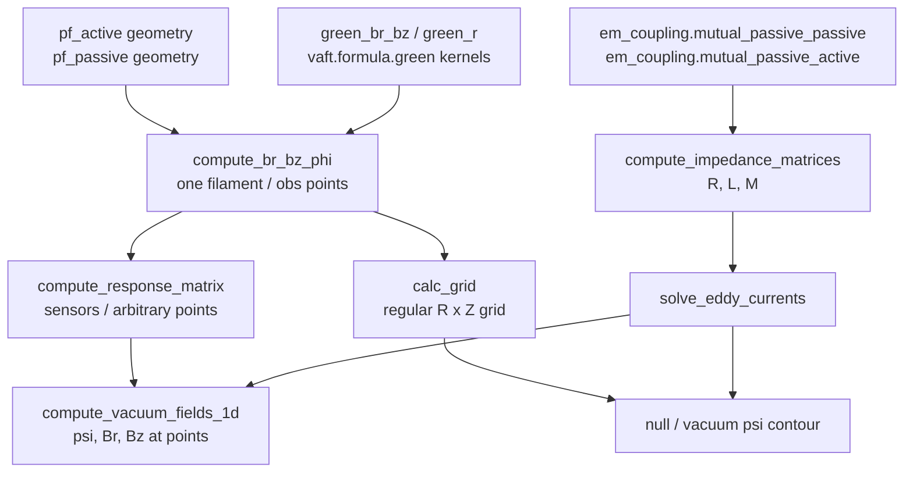

`vaft.process` is the **computation layer** of VAFT. Almost every function in it takes plain NumPy
arrays and scalars and returns arrays, tuples or dataclasses — it does not read or write ODS. The
ODS-aware layer lives in `vaft.omas` (mainly `vaft.omas.process_wrapper`), which pulls geometry and
signals out of an ODS, calls into `vaft.process`, and writes the results back.

> Rule of thumb: **`vaft.process` is the math, `vaft.omas.compute_*` is the API you usually call.**

Every public function in `vaft.process` is documented under one contract -- inputs and outputs
with units, processing steps, defaults and where they came from, machine scope, limitations and
provenance -- and the [process reference]({{ site.baseurl }}/reference/process/) is generated from
those docstrings.  This page is the *workflow*: how the pieces are used together for
electromagnetic modelling.  For what any one function does, its parameters and its provenance,
use the reference, or `vaft.process.describe("<name>")` at a prompt.

Submodules are imported on demand, so every public symbol is reachable both as
`vaft.process.<name>` and as `vaft.process.<module>.<name>`, and importing one submodule costs
only that submodule.  All of these work:

```python
import vaft                                    # lazy: vaft.process is imported on first attribute access
from vaft.process import smooth
from vaft.process.magnetics import mirnov_spectrogram
```

---

# Signal conditioning

## Smoothing and de-spiking

```python
import numpy as np
import vaft

ods = vaft.omas.sample_ods()                   # packaged VEST shot 39915
t   = np.asarray(ods['magnetics.time'])
ip  = np.asarray(ods['magnetics.ip.0.data'])

ip_s = vaft.process.smooth(ip, 10)             # MATLAB-style moving average, edge-tapered
```

`smooth(array, span)` reproduces MATLAB's `smooth`: the window narrows towards the two ends instead of
padding, an even `span` is decremented to the nearest odd value, and `span <= 1` returns a copy. It is
**1-D only** and raises `ValueError` on anything else. It is the workhorse of the machine mapping layer
(`pf_active`, `tf`, `magnetics` all call it).

For PF coil-current traces there is a dedicated single-sample spike remover:

```python
clean = vaft.process.vest_coil_current_noise_reduction(raw_coil_current)
```

It replaces sample $i$ with sample $i-1$ whenever $\lvert x_i \rvert - \lvert (x_{i+1}+x_{i-1})/2 \rvert > 0.001$.
That threshold is hard-coded and **absolute**, so the trace must already be in the units the VEST coil
digitizer produces.

## Crop, resample, filter

`process_signal` is the general conditioning wrapper. Every key of the options dict is optional, and
they are applied in order (crop → resample → Butterworth `filtfilt`):

```python
options = {
    'time_range': (0.27, 0.36),
    'resample': True,
    'dt': 4e-5,
    'filter_params': {'type': 'lowpass', 'cutoff': 1000, 'order': 4},
}
t_out, d_out = vaft.process.process_signal(t, ip, options)
```

`type` is one of `'lowpass'`, `'highpass'`, `'bandpass'`; a bandpass **requires** `cutoff=[low, high]`.
The sampling rate is derived as $1/(t_1-t_0)$, so the filter branch assumes a uniformly spaced time
base — resample first if it is not. Cutoffs are validated against Nyquist and raise `ValueError` when
out of range.

Two things about the order are worth being explicit about. The resample step goes through
`resample_to_time` (below), so reducing the sample rate anti-aliases on the *input* grid first. The
`filter_params` step that follows is a **shaping** filter, not an anti-alias filter, and its `cutoff`
is interpreted against the **output** grid's rate.

## Rate changes and anti-aliasing

VEST acquires on two DAQ rates — `FAST_DT = 4e-6` (250 kHz) and `SLOW_DT = 4e-5` (25 kHz), defined in
`vaft/database/raw.py` — while **every** processed time grid declared in
`vaft/machine_mapping/vest.yaml` is `dt = 4.0e-5`. A fast-DAQ channel written onto a policy grid is
therefore a 10× decimation.

This is the distinction the layer cares about:

- **Interpolation** evaluates a signal at new instants. Always fine.
- **Downsampling** *reduces the sample rate*. Content above the new Nyquist frequency does not
  disappear — it folds back into the band, where nothing downstream can tell it from real signal.

`np.interp` performs both and announces neither. Use `resample_to_time` instead anywhere a diagnostic
is written onto a common time grid:

```python
from vaft.process import resample_to_time

intensity = resample_to_time(source_time, source_data, target_time)
```

`resample_to_time` measures both grids. When `dt_target / dt_source` is at or below `min_ratio`
(1.05) — alignment, an upsample, or a rate change too small to matter — it designs no filter and the
result is **bit-for-bit** `np.interp`. Above it, a zero-phase FIR low-pass runs on the source grid
before interpolating, with the passband edge at 0.8 × the target Nyquist by default (10 kHz for a
25 kHz grid): `firwin` sits at −6 dB at its cutoff and needs a transition band, so a passband edge
below Nyquist puts everything that can fold into the stopband.

`firwin` + `filtfilt` rather than `resample_poly` or `decimate`, for reasons specific to VEST.
`resample_poly` needs an exactly uniform source and an integer rational ratio; shots after 42190 store
`linspace(0, span, n)`, so a nominally 4 µs grid is really 4.00016 µs, and the filterscope's target
grid carries a legacy 0.24/0.26 s offset. Zero phase matters because filterscope intensity feeds onset
detection — a causal `lfilter` of the same design would move the onset by its group delay, about
0.66 ms or 16 target samples.

Where filtering would be wrong — a validity mask is logical, not bandlimited — pass
`anti_alias=False`. That is also exactly `np.interp`, so the decision shows up in the diff rather than
hiding in a numerical difference.

Two things it refuses rather than guesses at. A source grid that is not uniformly sampled raises
`ResamplingError` when a rate reduction is asked for: `firwin`/`filtfilt` assume even spacing, so on a
jittered grid the design rate is a fiction and the filter neither rejects what it should nor preserves
what it should. Resample onto a uniform grid first, or pass `anti_alias=False` to accept a bare
interpolation knowingly. And a source timebase that is not strictly increasing raises too, because
`np.interp` returns silent nonsense for an unsorted `x` — in this codebase that means the loader is
broken. (An unsorted *target* is fine: evaluating at scattered instants is exactly what interpolation
is for.)

### Audit

Every time-domain rate change in `vaft.machine_mapping` and `vaft.process`, classified. Ratio is
`dt_target / dt_source`.

| Site | Source → target | Ratio | Classification |
| --- | --- | --- | --- |
| `machine_mapping/spectrometer_uv.py` | fields 138–144 fast 250 kHz → `analysis` 25 kHz | 10× | Was unfiltered; now `resample_to_time` |
| `machine_mapping/spectrometer_uv.py` | fields 101, 214 slow 25 kHz → 25 kHz | 1× | Pure alignment; unchanged output |
| `process/signal_processing.py` (`process_signal`) | arbitrary → `dt` | any | Was resample-then-filter; now anti-aliased |
| `machine_mapping/langmuir_probes.py` | triple-probe solve → 25 kHz | ≤10× | `n_e`/`te` anti-aliased; `solver_ok` opts out (logical mask) |
| `machine_mapping/barometry.py` | gauge slow → `full_discharge` 25 kHz | 1× | `medfilt` is a de-spiker, not an anti-alias filter; routed through the primitive defensively |
| `plot/mirnov.py` (`_common_timebase`) | channel B → channel A's grid | ≈1× | Routed through the primitive ahead of spectrogram/coherence |
| `machine_mapping/tf.py` | TF raw → `full_discharge` | 10× | Already safe: `firwin` low-pass on the source grid |
| `machine_mapping/pf_active.py` | PF raw → policy grid | 10× | Already safe: `firwin` + `filtfilt` |
| `process/magnetics.py` | probes/loops → 25 kHz | 10× | Already safe: `firwin` at 2.5 kHz on the 250 kHz grid |
| `machine_mapping/magnetics.py` (FL10) | 250 kHz → decimated | 10× | Already safe: `scipy.signal.decimate`, order-8 Chebyshev I |
| `machine_mapping/impa.py` | IMPA raw → 25 kHz | ≤10× | `impa_lowpass` filters first, but the configured `sample_rate` may not match the channels ([#425]) |
| `process/electromagnetics.py` | EVD substepping | 1.25× | `dt_sub` ships coarser than the diagnostics grid — a solver-parameter bug, tracked separately |
| `code/efit/legacy.py` | 4e-5 data on a 1e-4 `ave_time` step | — | Pseudo-average, tracked separately |
| `process/profile.py`, `process/equilibrium.py`, `omas/update.py`, `omas/process_wrapper.py`, `code/*`, `formula/*` | ψ, ρ, R–Z grids; scalar sampling at one instant | — | Not time-domain rate changes; no action |

This table will rot. `test/test_no_bare_downsample.py` will not: it walks the AST of
`vaft/machine_mapping` and `vaft/process` and fails on any interpolation that neither goes through
`resample_to_time` nor carries an `# anti-alias:` comment recording which row above it belongs to.

[#425]: https://github.com/VEST-Tokamak/vaft/issues/425

## Baselines

Baseline handling is a two-step API: build the index set of the "quiet" region, then fit and subtract a
model over it.

```python
idx = vaft.process.define_baseline(
    t,
    onset_time=0.28,        # seconds
    onset_window=500,       # number of SAMPLES before the onset index
    offset_time=0.34,       # seconds
    offset_window=100,      # number of SAMPLES after the offset index
)

corrected, baseline = vaft.process.subtract_baseline(t, ip, idx, fitting_opt='linear')
```

* `onset_time` / `offset_time` are **times in seconds** (converted internally with `np.searchsorted`);
  `onset_window` / `offset_window` are **integer sample counts**. Do not pass indices in the time slots.
* `fitting_opt` accepts `'linear'`, `'quadratic'`, `'spline'` (`UnivariateSpline(s=0)`) and `'exp'`;
  anything else raises `ValueError`.
* The models are exposed for direct use with `scipy.optimize.curve_fit`: `linear_baseline(x, a, b)`,
  `quadratic_baseline(x, a, b, c)`, `exp_baseline(x, a, b, c)`.
* `subtract_baseline` returns **two** arrays: the corrected signal and the fitted baseline.

## Pulse window and channel liveness

```python
onset, offset = vaft.process.signal_on_offset(t, ip, smooth_window=5, threshold=0.01)
t0, t1        = vaft.process.vfit_signal_start_end(t, ip, threshold=0.01)
alive         = vaft.process.is_signal_active(ip)          # -> bool
```

`signal_on_offset` applies a Savitzky–Golay smooth (polyorder 3) and returns the contiguous
above-threshold window **containing the global maximum**; `vfit_signal_start_end` does the same without
the smoothing stage. `is_signal_active` is a scale-free "is this channel alive?" test: the variance and
the mean |Δx| are each divided by the trace's mean absolute level (the first is the squared coefficient
of variation) and compared with `var_ratio_thresh=1e-2` and `change_ratio_thresh=1e-2`; a trace is
inactive only when both fall below threshold, and arrays shorter than 2 are never active.

These are what the ODS-level event finders are built on — `vaft.omas.find_breakdown_onset`,
`find_ip_onset`, `find_pf_active_onset` and `find_pulse_duration` all call `signal_on_offset`
internally:

```python
t_bd  = vaft.omas.find_breakdown_onset(ods)     # from the spectrometer_uv line intensity
t_dur = vaft.omas.find_pulse_duration(ods)
```

## Deprecated aliases

Still live, still exported, but do not use them in new code:

| Alias | Canonical name |
| --- | --- |
| `VEST_CoilCurrentNoiseReduction` | `vest_coil_current_noise_reduction` |
| `vfit_signal_startend` | `vfit_signal_start_end` |
| `signal_onoffset` | `signal_on_offset` |
| `psi_to_RZ` | `psi_to_rz` |

---

# Numerical helper

VEST time bases are not always uniform (a resampled or concatenated trace rarely is). Use
`time_derivative` rather than `np.gradient` when the spacing varies:

```python
dip_dt = vaft.process.time_derivative(t, ip)    # interval-weighted central difference
```

Forward difference at the first point, backward at the last, interval-weighted central difference in
between. It raises `ValueError` if the two arrays differ in shape or have fewer than two points.

---

# Electromagnetic response (EFUND-style)

The response layer answers one question: *what flux and field does a unit current in each conductor
produce at each observation point?* Everything is built on the axisymmetric Green's functions in
`vaft.formula.green` (`green_br_bz` for $B_R, B_Z$ and `green_r` for $\psi$, both per unit source
current), assembled into matrices that play the same role as EFUND's response tables.



## Single filament

```python
br, bz, psi = vaft.process.compute_br_bz_phi(
    r_obs=np.array([0.4, 0.5]),
    z_obs=np.array([0.0, 0.0]),
    r_src=0.053,
    z_src=1.1924,
    shift=0.01,
)
```

`shift` is the **desingularization** knob: when an observation point falls within `shift/3` of the
filament, the returned value is the average of the fields evaluated at $r_{\rm obs} \pm {\rm shift}$
instead of the divergent direct evaluation. Return order is `(Br, Bz, Psi)`.

## Response at sensors

`compute_response_matrix` evaluates the response at arbitrary $(r, z)$ points — diagnostic positions, a
radial line, a null-search stencil — and returns matrices of shape
`(n_obs, nb_coil + nb_loop + nb_plasma)`:

```python
Psi, Bz, Br = vaft.process.compute_response_matrix(
    observation_points=[[0.4, 0.0], [0.6, 0.0]],
    coil_data=[
        {'elements': [{'r': 0.053, 'z': 1.1924, 'turns': 4},
                      {'r': 0.053, 'z': 1.2124, 'turns': 4}]},
        # ... one dict per coil, 'elements' per turn-block
    ],
    passive_loop_data=[
        {'geometry_type': 1, 'outline_r': [0.30, 0.31, 0.31, 0.30],
                             'outline_z': [0.10, 0.10, 0.11, 0.11]},     # polygon
        {'geometry_type': 2, 'rectangle_r': 0.40, 'rectangle_z': 0.10},  # rectangle
    ],
    plasma_points=[[0.4, 0.0]],   # None / [r, z] / [[r1, z1], ...] are all accepted
)
```

**The return order is `(Psi, Bz, Br)`** — flux first. `compute_response_vector` is the same computation
with a different positional argument order. `calc_grid`, which builds the same physics on a regular
grid, returns **`(br, bz, phi)`** instead:

```python
br, bz, phi = vaft.process.calc_grid(
    xvar, zvar,                                   # 1-D R and Z grid vectors
    coil_turns, coil_r, coil_z,                   # per-coil, per-element arrays
    loop_geometry_type, loop_outline_r, loop_outline_z,
    loop_rectangle_r, loop_rectangle_z,
)
# each output: (len(xvar)*len(zvar), nbcoil + nbloop), z varying fastest
```

`calc_grid` prints a running percentage to stdout every 100 grid points, and it takes the polygon
centroid of a `geometry_type == 1` loop with a $1/(n-1)$ normalisation, whereas
`compute_response_matrix` uses a plain `np.mean`. The two therefore do **not** agree exactly for polygon
loops — do not mix them inside one workflow.

## From an ODS

You do not normally build those dicts by hand. The ODS wrappers read `pf_active` and `pf_passive`
straight out of the data structure:

```python
ods = vaft.omas.sample_ods()                             # 10 PF coils, 950 passive loops

Psi, Bz, Br = vaft.omas.compute_point_response_ods(ods, rz=[(0.4, 0.0), (0.6, 0.0)])
cpsi        = vaft.omas.compute_grid_response_ods(ods)   # (n_grid, nbcoil + nbloop)
```

`compute_grid_response_ods` uses the `equilibrium.time_slice.0.profiles_2d.0.grid` axes (`dim1` = R,
`dim2` = Z) as its observation grid, so an equilibrium IDS carrying a grid must be present.

## Coupling matrices

The passive-structure circuit model needs three matrices:

$$ R = \mathrm{diag}(R_w), \qquad M = M_{ww}, \qquad L = M_{wc} $$

`R` from the per-loop resistances, `M` from the passive–passive mutual inductances, and `L` from the
passive–active mutuals (extended with plasma-filament columns when a plasma is present). The mutual
inductance matrices live in the `em_coupling` IDS (`mutual_passive_passive`, `mutual_passive_active`,
`mutual_active_active`) and can be populated from the packaged VEST reference with
`vaft.machine_mapping.em_coupling(ods)`.

```python
R_mat, L_mat, M_mat = vaft.omas.compute_impedance_matrices_ods(ods, plasma=[])
# R_mat: (nbloop, nbloop)   M_mat: (nbloop, nbloop)   L_mat: (nbloop, nbcoil [+ nbplas])
```

With `plasma=[]` the wrapper passes `em_coupling.mutual_passive_active` straight through (fast, and the
correct choice for a pure vacuum / startup study). With a non-empty plasma filament list, `L` is
**recomputed from Green's functions** and the plasma columns are appended — expect a substantially
longer run time on the full 950-loop VEST vessel model. The matrices are also cached back into the ODS
under `pf_passive['R_mat']`, `['L_mat']` and `['M_mat']`.

The underlying pure-array function is `vaft.process.compute_impedance_matrices(loop_resistances,
passive_loop_geometry, coil_geometry, mutual_pp, mutual_pa, plasma_rz)`, where `passive_loop_geometry`
is a list of `(loop_name, r_avg, z_avg, geometry_coef)` tuples and `coil_geometry` is a list of
per-coil lists of `(r, z, turns_with_sign)`.

---

# Eddy currents and startup analysis

## The circuit equation

The passive vessel currents $I_w$ obey

$$ M \, \dot{I}_w + R \, I_w = -L \, \dot{I}_c $$

where $I_c$ stacks the PF-coil currents and any plasma filament currents. `solve_eddy_currents`
integrates this with an **eigenvalue decomposition** of $A = -M^{-1}R$: the state-transition matrix
$E \, \mathrm{diag}(e^{\lambda \delta t}) \, E^{-1}$ is formed once, marched on a fine sub-step grid
(`dt_sub`, default $5 \times 10^{-5}$ s), then interpolated back onto the input time base.

```python
I_w = vaft.process.solve_eddy_currents(
    R_mat, L_mat, M_mat,
    coil_plasma_currents,      # (n_times, nbcoil + nbplas)
    time,                      # (n_times,)
    dt_sub=5e-5,
)                              # -> (n_times, nbloop)
```

## From an ODS

```python
import numpy as np
import vaft

ods = vaft.omas.sample_ods()                       # VEST shot 39915

# Vacuum case: coils only, no plasma filament.
vaft.omas.compute_eddy_currents(ods, plasma=[], ip=[], dt_sub=5e-5)

print(np.asarray(ods['pf_passive.loop.0.current']).shape)   # (900,) — matches pf_active.time
```

To include the plasma as one or more current filaments, pass the filament positions and, for each of
them, a current trace **on the `pf_active` time base**:

```python
t_pf = np.asarray(ods['pf_active.time'])
ip   = np.interp(t_pf,
                 np.asarray(ods['magnetics.time']),
                 np.asarray(ods['magnetics.ip.0.data']))

vaft.omas.compute_eddy_currents(ods, plasma=[(0.4, 0.0)], ip=[ip])
```

`compute_eddy_currents` calls `compute_impedance_matrices_ods` for you, solves the RL system, and writes
`pf_passive.time` plus `pf_passive.loop.<i>.current` back into the ODS.

> **Check the result.** `solve_eddy_currents` does not raise on a singular $M$ or $R$: it falls back
> `inv` → `pinv` → **an array full of `np.nan`**, after printing an error to stdout. An
> `np.isfinite(...).all()` guard is worth the line.

## Vacuum fields, loop voltage, decay index

Once the eddy currents exist, the vacuum flux and field at any set of points follow from the response
matrices:

```python
t, psi, br, bz = vaft.omas.compute_point_vacuum_fields_ods(
    ods,
    rz=[(0.4, 0.0)],
    mode='vacuum',       # 'vacuum' | 'pf_active' | 'pf_passive'
)
# psi, br, bz: (n_times, n_points)
```

`mode` selects which current sources contribute, which is exactly what separates the directly driven
field from the vessel's response: `'pf_active'` gives the coil-only field, `'pf_passive'` the
eddy-current-only field, `'vacuum'` their sum.

Differentiating the flux gives the loop voltage at that point (mind the $\psi$ convention of `green_r`
— flux per turn, not per radian — when comparing against a physical flux loop):

```python
dpsi_dt = vaft.process.time_derivative(t, psi[:, 0])
v_loop  = -dpsi_dt
```

The field decay index $n = -\dfrac{R}{B_z}\dfrac{\partial B_z}{\partial R}$ — the quantity that decides
whether a startup null is vertically stable — comes from the same call evaluated on a radial line:

```python
r_line = np.linspace(0.25, 0.65, 41)
t, psi, br, bz = vaft.omas.compute_point_vacuum_fields_ods(
    ods, rz=[(float(r), 0.0) for r in r_line], mode='vacuum')

it      = int(np.argmin(np.abs(t - vaft.omas.find_breakdown_onset(ods))))
bz_line = bz[it]
n_index = -r_line * np.gradient(bz_line, r_line) / bz_line
```

## The breakdown null

`compute_null_ods` contracts the grid response matrix with the coil **and** eddy currents at one time
and reshapes the result onto the equilibrium $(R, Z)$ mesh:

```python
t_bd      = vaft.omas.find_breakdown_onset(ods)
psi, R, Z = vaft.omas.compute_null_ods(ods, t_bd)   # psi: (len(Zgrid), len(Rgrid))
```

Two ready-made figures follow exactly this path — a bare contour, and a contour over the machine
geometry:

```python
vaft.plot.vacuum_psi_contour(ods)                    # defaults to the breakdown onset time
vaft.plot.overlay_all_with_vacuum_psi_contour(ods)   # + coils, vessel, limiter, Thomson
```

Both mask $\psi$ to the chamber interior using `vaft.omas.find_chamber_boundary(ods)`.

---

# Magnetic diagnostics processing

## The legacy VEST chain

The VEST EFIT input chain (FIR low-pass → calibration → negated integration → baseline subtraction) is
reproduced exactly, with every magic constant lifted into one frozen dataclass:

```python
from vaft.process.magnetics import (
    VestMagneticsProcessingConfig,
    DEFAULT_VEST_MAGNETICS_PROCESSING,
    vest_magnetics_time_window,
)

cfg = VestMagneticsProcessingConfig()              # 25 000 samples over 0 – 0.99996 s
cfg = VestMagneticsProcessingConfig(lowpass_cutoff=5_000.0, lowpass_taps=301)   # parameter scan

tb               = cfg.timebase()                  # (25000,)
i0, i1, base_end = cfg.window_for_shot(41660)      # -> (6500, 9000, 5000)
t_out            = vest_magnetics_time_window(41660, cfg)
```

`window_for_shot` is **shot-dependent physics configuration, not a free tunable**: shots 41446–41451 and
every shot ≥ 41660 use the "late" window (`6500, 9000, 5000`); everything else uses the default
(`6000, 8500, 8500`). Reprocessing a late shot with the default window silently changes the answer.

Per-channel entry points:

```python
from vaft.process.magnetics import vest_b_field_pol_probe_legacy, vest_flux_loop_legacy

field = vest_b_field_pol_probe_legacy(time, raw, calibration, shot=39915, config=cfg)
flux  = vest_flux_loop_legacy(time, raw, calibration, flux_loop_number=1, config=cfg)
```

* `shot` and `flux_loop_number` are **keyword-only**.
* `flux_loop_number` is **1-based**. The config field `flux_baseline_late_loop_numbers = (9, 10, 11)`
  is matched against that 1-based number and selects a different baseline window for those loops.
* The probe path low-passes (251-tap `firwin` at 2.5 kHz); the flux-loop path **does not**, and divides
  by $2\pi$ when `flux_output_per_radian` is true.

Batch processing over a channel table is `vest_md_signals(shot, channels, loader, indices=None,
config=None)`, where `channels` is a sequence of dicts with keys `field_code`, `calibration` and `kind`
(`'flux_loop'` or `'b_field_pol_probe'`), and `loader` is any callable
`(shot, field_code) -> (time, data) | None` — returning `None` yields a zero-filled trace. VEST's own
channel table and raw-database loader are already wired up in `vaft.machine_mapping`:

```python
import vaft
from omas import ODS

time, flux_loops, probes = vaft.machine_mapping.vfit_md(39915)   # -> (time, list, list)

ods = ODS()
vaft.machine_mapping.magnetics(ods, shot=44740, tstart=0.26, tend=0.34, dt=4e-5)
```

## Standalone processing chains

Three self-contained multi-channel routines exist for working outside the ODS:

```python
from vaft.process.magnetics import rogowski_coil_ip, flux_loop_flux, b_field_pol_probe_field

t, ip = rogowski_coil_ip(time, rogowski_raw, flux_loop_raw,
                         flux_loop_gain=11, effective_vessel_res=5.8e-4,
                         baseline_type='linear', smooth_window=10)

t, flux, baselines = flux_loop_flux(time, raw, gain)            # raw: (m_samples, n_channels)

raw, filt, integrated, field, baselines = b_field_pol_probe_field(
    time, raw, gain, lowpass_param)                             # lowpass_param: FIR coefficients you design
```

`rogowski_coil_ip` subtracts a flux-loop reference from the Rogowski signal and **auto-flips the sign**
when $\lvert \min I_p \rvert > \lvert \max I_p \rvert$. Note the asymmetric returns:
`b_field_pol_probe_field` gives **five** arrays, `flux_loop_flux` gives **three**. Both accept
`plot_opt=True`, which builds an `ipywidgets` slider and so only does anything inside Jupyter.


## Mirnov fluctuations and toroidal mode numbers

```python
from vaft.process.magnetics import (
    mirnov_preprocess_signal, mirnov_spectrogram,
    toroidal_mode_analysis, toroidal_phase_fit_at_time,
)

clean = mirnov_preprocess_signal(data, sample_rate=250_000.0,
                                 high_pass_cutoff=2_000.0, low_pass_cutoff=90_000.0,
                                 amplifier_gain=1.0)            # all kwargs keyword-only

spec = mirnov_spectrogram(time, clean, sample_rate=250_000.0, window_size=500, time_resolution=1)
# spec.time, spec.frequency, spec.magnitude
```

`mirnov_spectrogram` is a manual Hann-window rFFT spectrogram (magnitude
$= 2 \lvert \mathrm{FFT} \rvert / N_{\rm win}$) that reproduces the legacy `vest_mirnov.m`.
`window_size` must be **even and greater than 1**.

Two-probe cross-spectral mode number, and multi-probe wrapped-phase fit:

```python
res = toroidal_mode_analysis(signal_a, signal_b,
                             sample_rate=250_000.0,
                             phase_geometry=np.pi/6,          # toroidal separation [rad]
                             peak_threshold=0.1, sensor_count=4)
# res.frequency, res.n, res.power, res.phase, res.coherence, ...

fit = toroidal_phase_fit_at_time(time, signals, toroidal_angle,   # signals: (n_channels, n_time)
                                 center_time=0.3215,
                                 sample_rate=250_000.0,
                                 window_size=500,
                                 num_modes=2,
                                 candidate_n=range(-6, 7))
best = fit.modes[0]                                              # sorted by amplitude, descending
print(best.frequency, best.n, best.rms_error)
```

$n$ is recovered as $\arg \mathrm{CSD}(a,b) / \Delta\phi$, peak-picked on $\lvert \mathrm{CSD} \rvert$
and filtered by a coherence threshold. The plot module wraps all of this against an ODS — this is the
path the fluctuation notebook takes on shot 44740:

```python
import vaft.plot as vplot

vplot.mirnov_signal(ods, channels=[14, 37], time_range=(0.304, 0.330), preprocess=False)
vplot.mirnov_spectrogram(ods, channel=14, time_range=(0.304, 0.330), max_frequency=80e3)
vplot.toroidal_mode_spectrum(ods, channel_pair=(14, 37), time_range=(0.304, 0.330))

fig, ax, phase_fit = vplot.toroidal_phase_mode_fit(
    ods, center_time=0.3215, channels=[64, 65, 66, 67], return_result=True)
```

---

# Statistical analysis

`vaft.process.statistical_analysis` fits a log-log power-law scaling
$\tau_E \propto \prod_k x_k^{\alpha_k}$ by ordinary least squares.

```python
from vaft.process import statistical_analysis

df = statistical_analysis.load_data_from_excel(str(excel_file))
df = statistical_analysis.filter_dataframe(df)          # drops Ploss_MW > 3, takes abs(Bt_T)

eng_params   = ['Ip_MA', 'Bt_T', 'Ploss_MW', 'ne_19m3', 'R_m', 'epsilon', 'kappa']
target_param = 'tauE_s'

statistical_analysis.confinement_time_histogram(df, eng_params, bins=30)

results = statistical_analysis.perform_ols_regression(df, eng_params, target_param)
print(results.rsquared, results.rsquared_adj)
print(results.get_summary())                            # Coefficient / P-value / Significant
print(results.get_exponents())                          # {'Ip_MA': ..., 'Bt_T': ..., ...}

significance = statistical_analysis.analyze_significance(results, alpha=0.05)
metrics      = statistical_analysis.compute_metrics(results, df, target_param)
# {'R2', 'RMSE', 'MAE', 'Mean_Relative_Error_%', 'Median_Relative_Error_%'}
```

**Which DataFrame goes where matters.** `perform_ols_regression`, `compute_metrics` and
`confinement_time_histogram` take the **raw** frame; `get_correlation_matrix` and
`get_individual_correlations` take the **log-transformed** frame (`results.log_df`, or the output of
`log_transform`). Mixing them up silently produces garbage rather than an error.

```python
log_df = results.log_df
corr   = statistical_analysis.get_correlation_matrix(log_df, eng_params, target_param)

vaft.plot.plot_individual_parameter_effects(df, eng_params, target_param)
vaft.plot.plot_correlation_heatmap(log_df, eng_params, target_param)
```

`compute_metrics` imports scikit-learn lazily inside the function body — it is not otherwise a VAFT
dependency, so install it before calling.

---

# Conventions worth memorizing

1. **Return orders are not uniform.** `compute_response_matrix` → `(Psi, Bz, Br)`; `calc_grid` and
   `compute_br_bz_phi` → `(br, bz, phi)`; `volume_average` → `(average, volume)`;
   `b_field_pol_probe_field` → 5 arrays; `flux_loop_flux` → 3.
2. **Grid index order is `(R, Z)`.** The equilibrium and Shafranov routines assume
   `np.meshgrid(r, z, indexing='ij')`, i.e. a `psi_grid` shaped `(len(R), len(Z))`.
3. **Silent degradations.** `solve_eddy_currents` returns all-NaN on singular matrices;
   `shafranov_integrals` returns `(0, 0, 0, 0)` on a degenerate boundary;
   `prepare_boundary_for_shafranov` returns empty arrays. None of them raise.
4. **These modules print.** `calc_grid` prints progress, the `core_profiles*` writers print
   `[INFO]` / `[UPDATED]` lines, `solve_eddy_currents` prints on failure. `statistical_analysis` uses
   `logging` instead.
5. **Importing `vaft.process` pulls in `matplotlib` and `ipywidgets`** — both are module-level imports
   in `magnetics.py`.
6. The `electromagnetics` module prints a Numba warning on import when Numba is absent. **Numba is never
   actually used**, so installing it changes nothing.

---

# Notebooks

Working, executable examples:

* [`fluctuation_diagnostics_analysis.ipynb`](https://github.com/VEST-Tokamak/vaft/blob/main/notebooks/fluctuation_diagnostics_analysis.ipynb)
  — Mirnov raw traces, spectrograms and toroidal phase-mode fits on shot 44740.
* [`confinement_time_scaling.ipynb`](https://github.com/VEST-Tokamak/vaft/blob/main/notebooks/confinement_time_scaling.ipynb)
  — the full `statistical_analysis` regression workflow.
* [`profile_fitting_using_equilibrium_and_kinetic_diagnostics.ipynb`](https://github.com/VEST-Tokamak/vaft/blob/main/notebooks/profile_fitting_using_equilibrium_and_kinetic_diagnostics.ipynb)
  — `vaft.process.profile` mapping and fitting.

The three notebooks that will eventually own this area are currently **outline-only shells** (one
markdown cell, no code cells). They fix the intended section structure and the expected inputs and
outputs, and they are the right place to contribute runnable versions of the code on this page:

* [`magnetic_diagnostics_processing.ipynb`](https://github.com/VEST-Tokamak/vaft/blob/main/notebooks/magnetic_diagnostics_processing.ipynb)
  — raw $I_p$, flux-loop and Bp-probe processing; calibration and sign conventions; processed-signal format.
* [`electromagnetic_response_modeling_with_efund.ipynb`](https://github.com/VEST-Tokamak/vaft/blob/main/notebooks/electromagnetic_response_modeling_with_efund.ipynb)
  — geometry inputs, Green's-function response products, coupling-matrix construction, comparison against EFUND tables.
* [`eddy_current_calculation_and_startup_analysis.ipynb`](https://github.com/VEST-Tokamak/vaft/blob/main/notebooks/eddy_current_calculation_and_startup_analysis.ipynb)
  — the PF-passive eddy-current ODE, vacuum field, loop voltage, decay index, startup profiles.

Source: [`vaft/process/`](https://github.com/VEST-Tokamak/vaft/blob/main/vaft/process) and the ODS
wrappers in
[`vaft/omas/process_wrapper.py`](https://github.com/VEST-Tokamak/vaft/blob/main/vaft/omas/process_wrapper.py).

# See also

* [Magnetics]({{ site.baseurl }}/guide/Magnetics/) — plotting the processed magnetics IDS.
* [Examples]({{ site.baseurl }}/guide/examples/) — the notebook index.
* [Quick start guide]({{ site.baseurl }}/guide/Quick_start_guide/) — loading an ODS in the first place.
