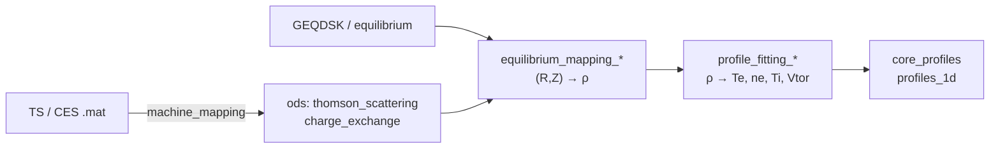

Kinetic diagnostics on VEST — Thomson scattering (TS) and charge exchange spectroscopy (CES) — measure
$T_e$, $n_e$, $T_i$ and $V_{tor}$ at discrete $(R, Z)$ points. To become a `core_profiles` IDS these
point measurements must first be mapped onto a flux coordinate using an equilibrium, then fitted to a
smooth 1D profile in $\rho$.

`vaft.process` implements that two-stage pipeline, and `vaft.formula.fit_profile` provides the
underlying 1D fitting engine.

## Pipeline



The two stages are deliberately separate: mapping depends on the equilibrium, fitting does not. You can
re-fit with a different model without recomputing the mapping.

## Loading kinetic diagnostics

Raw TS/CES `.mat` files are turned into IDS nodes by the machine mapping layer:

```python
import vaft
from omas import ODS
from vaft.machine_mapping.thomson_scattering import thomson_scattering
from vaft.machine_mapping.charge_exchange import charge_exchange

ods = ODS()

# thomson_scattering(ods, shotnumber, data_root=None, mat_file=None)
thomson_scattering(ods, 46051, vaft.data.data_path("legacy/46051_NeTe.mat"))

# charge_exchange(ods, shotnumber, options="ces", data_root=None, mat_file=None)
charge_exchange(ods, 47514, data_root=vaft.data.data_path("legacy/CES_47514.mat"))
```

`data_root` accepts either a directory or a path to a specific `*.mat` file. This populates
`thomson_scattering.channel[:].position.{r,z}`, `.t_e.data`, `.n_e.data` (plus `_error_upper`
siblings), and for CES `charge_exchange.channel[:].ion[:].{t_i,velocity_tor}.data`.

Sample files ship inside the package — see [Data structures]({{ site.baseurl }}/guide/Data_structures/)
for the ODS/IDS conventions, and use `vaft.data.data_path()` to resolve them:

| Sample | Packaged path |
|---|---|
| Thomson (shot 46051) | `legacy/46051_NeTe.mat` |
| Thomson (shot 39915) | `legacy/NeTe_Shot39915_v9_rev.mat` |
| CES (shot 47514) | `legacy/CES_47514.mat` |
| GEQDSK (shot 40330) | `efit/g040330.00320` |

## Stage 1 — equilibrium mapping

Each diagnostic channel sits at a fixed $(R, Z)$. The mapping functions interpolate $\psi(R,Z)$ from the
equilibrium and return **every radial coordinate the equilibrium supports**, one value per channel, as a
`MappedPositions` record:

$$\psi_N = \frac{\psi(R,Z) - \psi_{axis}}{\psi_{boundary} - \psi_{axis}}, \qquad
\rho_{pol,N} = \sqrt{\psi_N}, \qquad
\rho_{tor,N} = \sqrt{\Phi(\psi)/\Phi_{boundary}},\ \Phi = \int q\,d\psi$$

<!-- docs-snippet: skip needs-data (the packaged sample carries no Thomson scattering channels) -->
```python
geq = vaft.data.read_geqdsk(vaft.data.data_path("efit/g040330.00320"))

mapped = vaft.process.equilibrium_mapping_thomson_scattering(ods, geq)
mapped_ces = vaft.process.equilibrium_mapping_charge_exchange(ods, geq)

mapped.psi_norm, mapped.rho_pol_norm, mapped.rho_tor_norm   # one array each, NaN outside the LCFS
mapped.available()                                          # ('rho_tor_norm', 'rho_pol_norm', 'psi_norm')
```

Both accept a `vaft.data.GEQDSK`, an OMAS equilibrium ODS, or a legacy flux-surface mapping as `geq`.
Channels outside the last closed flux surface are `NaN` in every coordinate and are dropped by the
fitters. $\rho_{tor,N}$ needs the equilibrium's $q$ profile; a legacy flux-surface mapping cannot supply
it, and the record says so (`mapped.rho_tor_norm_unavailable`) rather than substituting $\sqrt{\psi_N}$,
which is a different coordinate.

> **The coordinate is a choice, and the default is $\rho_{tor,N}$.** Before issue #420 the mappers
> returned a bare $\psi_N$ array under the name "rho" and every fit was made in it. Fits are now made in
> the coordinate you select (`coordinate=`), `rho_tor_norm` by default; pass `coordinate="psi_norm"` to
> reproduce the old numbers. A bare array is still accepted, but only together with
> `coordinate="psi_norm"`, because that is the only thing it ever meant.
Building an equilibrium is covered in [Equilibrium]({{ site.baseurl }}/guide/Equilibrium/).

## Stage 2 — profile fitting

<!-- docs-snippet: skip fragment (placeholder name mapped is never defined on the page) -->
```python
n_e_fn, T_e_fn, coeffs_ne, coeffs_te, n_e_rho, T_e_rho = \
    vaft.process.profile_fitting_thomson_scattering(
        ods,
        time_ms=320.0,
        mapped_positions=mapped,
        coordinate="rho_tor_norm",  # the default; "rho_pol_norm" and "psi_norm" are the alternatives
        Te_order=3,
        Ne_order=3,
        uncertainty_option=1,       # weight the fit by per-channel error bars
        rho_points=100,
        fitting_function_te="polynomial",
        fitting_function_ne="polynomial",
    )
```

Note the return order: **density first, then temperature**. `n_e_fn` and `T_e_fn` are `FittedProfile`
objects: callable on any $x \in [0,1]$ of the coordinate they were fitted in, and carrying `.coordinate`,
`.method` and `.order` so that `core_profiles` evaluates them on the right grid and records what produced
them. `n_e_rho` and `T_e_rho` are those functions already sampled on a uniform grid of `rho_points`.
`coeffs_*` is `None` for the `gp` and `linear` methods.

The CES counterpart mirrors it, with `ion_index` selecting the ion species:

<!-- docs-snippet: skip fragment (placeholder name mapped_ces is never defined on the page) -->
```python
Vtor_fn, Ti_fn, coeffs_vtor, coeffs_ti, Vtor_rho, Ti_rho = \
    vaft.process.profile_fitting_charge_exchange(
        ods,
        time_ms=300.0,
        mapped_positions=mapped_ces,
        Ti_order=3,
        Vtor_order=3,
        fitting_function_ti="polynomial",
        fitting_function_vtor="polynomial",
        ion_index=0,
    )
```

Here too the velocity function comes back before the temperature function.

### Fitting methods

`fitting_function_*` selects the model, and every variant is dispatched to `vaft.formula.fit_profile`:

| Value | Model |
|---|---|
| `polynomial` | $(1-\rho)\cdot P_n(\rho)$ — polynomial with an edge roll-off factor |
| `exponential` | $(1-\rho)\cdot \exp(P_n(\rho))$ — enforces positivity |
| `sqrt` / `sqrt_poly` | fits $P_n$ to $y^2$, returns $\sqrt{P_n}$ |
| `sqrt_exp` | same square-space trick with an exponential basis |
| `core_poly_edge_exp` | core polynomial blended into an edge exponential via a $\tanh$ transition |
| `eped_tanh` | EPED-style pedestal: a $\tanh$ pedestal plus a gated core shape — see [Pedestal top](#pedestal-top) |
| `gp` | Gaussian process regression (scikit-learn), with optional anchor points |
| `linear` | 1D interpolation through the data — no smoothing |

The `(1-\rho)` factor in the polynomial and exponential bases drives the fitted profile toward zero at
the boundary, which is usually what you want for $T_e$ and $n_e$ but is a real assumption — `gp`,
`core_poly_edge_exp` and `eped_tanh` do not impose it.

`order` only affects the polynomial-family methods; it is ignored by `gp`, `linear` and `eped_tanh`.
`eped_tanh` exists for `pedestal_top` below rather than as a general profile fitter: it has seven
parameters of its own, so passing it through the `enforce_physical` retry loop of the IDS fitters
re-runs an identical fit at every order.

### Calling the fitting engine directly

For data that is not in an IDS, use the engine itself:

<!-- docs-snippet: skip fragment (placeholder name x is never defined on the page) -->
```python
y_eval, y_std_eval, fit_function, coeffs = vaft.formula.fit_profile(
    x, y, y_std,
    x_eval,
    order=3,
    uncertainty_option=1,
    fitting_function="gp",
    gp_anchor=(x_anchor, y_anchor, y_std_anchor),   # GP only
    n_restarts_optimizer=5,
)
```

It returns the profile on `x_eval`, its standard deviation (zeros for methods that carry no uncertainty
estimate), a callable, and the coefficients. `vaft.formula.make_fit_function(mode)` builds the bare
`polynomial` / `exponential` basis function if you want to fit it yourself. See
[Physics formulas]({{ site.baseurl }}/guide/Formula/) for the rest of the formula namespace.

## Pedestal top

Region reductions — core versus edge, pedestal metrics — need a boundary, and a *fixed* one makes
results from different studies incomparable. `vaft.process.profile.pedestal_top` finds it from the
profile instead, and records how:

<!-- docs-snippet: skip fragment (placeholder name psi_norm is never defined on the page) -->
```python
from vaft.process.profile import pedestal_top

top = pedestal_top(psi_norm, p_total, quantity="p_total")
top.position   # 0.9134
top.method     # "eped_fit", or "fallback"
top.reason     # why the fallback was taken; empty when it was not
top.fit        # the FittedProfile behind it, or None
```

It takes arrays rather than an ODS, so it works on a profile from a kinetic-profile file just as well
as on a fitted diagnostic one. `quantity` is required and is not defaulted: EPED defines the pedestal
from total pressure, and a fit to a density or a temperature puts the top somewhere else — on one
MAST discharge (45453 at 750 ms) $n_e$ gives 0.949 and $p_e$ 0.911, while $T_e$ **falls back**: its
best tanh is 0.215 wide, which is a ramp rather than a pedestal. That is the behaviour to expect, and
the reason the result carries the quantity and the method rather than just a number.

`position` is the tanh's centre. The pedestal's inner knee is `inner_edge`, half a width further in;
which of the two a study calls "the pedestal top" differs, so both are available and neither is
implied.

The fallback is `PEDESTAL_FALLBACK_PSI_NORM = 0.85`, and it fires when there is nothing to fit: too
few points in the window, a fit that did not converge, a fitted `x_ped` resting on a bound, or a
fitted curve that does not vary across the window by `PEDESTAL_RESOLUTION_FACTOR` times the residual
scatter, or a tanh wider than `PEDESTAL_MAX_WIDTH`. That last width test matters more than it looks:
the model's own box allows a width of 0.3, and over the 171 fits of one MAST campaign 25 came back
between 0.20 and 0.29 — curves that ramp across half the minor radius while reporting themselves as
measured pedestals. The variation test is the interesting one — the model's `f_ped - f_sep` is the $\tanh$'s
*asymptotic* amplitude, which a wide, shallow fit through noise can make look large while the curve
it actually draws is almost flat. The test is on the curve, not the parameters.

## Writing `core_profiles`

`vaft.process.core_profiles` evaluates the fit callables and stores the result as a `profiles_1d` slice:

<!-- docs-snippet: skip fragment (placeholder name mapped is never defined on the page) -->
```python
ods = vaft.process.core_profiles(
    ods,
    time_ms=320.0,
    mapped_positions=mapped,
    n_e_function=n_e_fn,
    T_e_function=T_e_fn,
    tol_ms=0.1,
)
```

The fits are evaluated on the equilibrium grid **in their own coordinate** and stored on
`grid.rho_tor_norm`, `grid.psi` and `grid.rho_pol_norm`. What produced the slice is written beside it:
`electrons.temperature_fit.parameters` records the coordinate, method and order, and
`core_profiles.code.parameters` carries one line per slice. A slice written before #420 has no such
record; that absence marks a legacy product fitted in $\psi_N$.

Thomson-only slices need an ion temperature. The statistical Ti/Te coefficient is **VEST policy**, not a
processing default: it lives in `vest.yaml` (`diagnostics.core_profiles.ti_te_ratio`, status
`inferred`, with its derivation record) and the kinetic-EFIT pipeline resolves it per shot with
`vaft.machine_mapping.core_profiles.vest_core_profiles_policy(shot)` before calling `core_profiles`.

It writes, for the new slice index `i`:

- `core_profiles.profiles_1d[i].time` — **seconds** (`time_ms` is divided by 1000)
- `core_profiles.profiles_1d[i].grid.rho_tor_norm` — 100 uniform points on $[0,1]$
- `.electrons.temperature` (eV) and `.electrons.density` / `.density_thermal` (m⁻³)
- `.electrons.temperature_fit` / `.density_fit` — the *measured* channel values on their mapped $\rho$,
  kept alongside the fit so you can overplot data against model
- `.ion[0]` labelled `H+`, populated with the electron profiles

That last point is an explicit simplification: **`core_profiles` copies $n_e$ and $T_e$ into the ion
channel**, it does not use CES data. Treat `ion[0]` as a placeholder unless you overwrite it yourself.

If a slice already exists within `tol_ms` of `time_ms` it is replaced rather than duplicated, so
re-fitting the same time in a loop is safe.

### Synthetic profiles from equilibrium pressure

When there is no Thomson data, profiles can be back-derived from the equilibrium pressure by assuming
$n_e$ and $T_e$ share a shape, with $P = 2 n_e T_e e$ and $g(\rho) = \sqrt{P(\rho)/P(0)}$:

```python
ods = vaft.omas.sample_ods()      # any ODS that holds an equilibrium

# Pin the on-axis temperature (eV) and let density follow
vaft.process.core_profiles_from_eq(ods, Te0_eV=100.0, eq_time_index=0)

# Or pin the density/temperature ratio (m^-3 per eV)
vaft.process.core_profiles_from_eq_ratio(ods, C_ne_over_Te=1.0e17, eq_time_index=0)
```

Both read `equilibrium.time_slice[i].profiles_1d.pressure` and write a `core_profiles` slice at the
matching equilibrium time. The factor of 2 absorbs the assumption $T_i = T_e$; there is no $Z_{eff}$ or
impurity modelling. These are synthetic profiles — useful to seed a code that needs *some* kinetic
input, not a measurement.

## Plotting

Each stage has a canonical plot, reached through the `vaft.omas.plot_*` adapters. They draw what the ODS
already holds — fitting is a `vaft.process` step, not a plotting option:

<!-- docs-snippet: skip needs-data (the packaged sample carries no Thomson scattering geometry) -->
```python
vaft.omas.plot_thomson_scattering_geometry_poloidal(ods)            # channel positions in the poloidal plane
vaft.omas.plot_thomson_scattering_time_electron_temperature(ods)    # per-channel Te history
vaft.omas.plot_thomson_scattering_time_electron_density(ods)        # per-channel ne history
vaft.omas.plot_thomson_scattering_profile_electron_temperature(ods) # measured Te versus position
vaft.omas.plot_electron_temperature_profile(ods)                    # the fitted core_profiles Te
vaft.omas.plot_core_profiles_time_volume_averaged(ods)
vaft.omas.plot_equilibrium_profile_pressure(ods)                    # consistency check
```

`plot_equilibrium_profile_pressure` is the useful sanity check after a fit: if the pressure implied by the
kinetic profiles disagrees badly with the equilibrium pressure, the fit or the mapping is wrong.

Measurement and fit are separate plots now. `plot_thomson_scattering_profile_electron_temperature` shows
the channels; `plot_electron_temperature_profile` shows whatever `core_profiles` holds — a fit from
`vaft.process.profile_fitting_thomson_scattering`, or the synthetic profiles written by the
`core_profiles_from_eq*` helpers above. It takes `coordinate=` — `rho_tor_norm` by default, or `psi_norm`. (The
equilibrium profiles accept more, including `r_major`; a core-profile plot does not.)

For CES, map the channels onto the equilibrium and fit in `vaft.process`, then plot:

<!-- docs-snippet: skip needs-data (the packaged sample carries no charge-exchange channels) -->
```python
mapped = vaft.process.equilibrium_mapping_charge_exchange(ods, geq)
fit = vaft.process.profile_fitting_charge_exchange(
    ods, time_ms=300.0, mapped_positions=mapped, ion_index=0,
    fitting_function_ti="polynomial", Ti_order=3,
)

vaft.omas.plot_charge_exchange_profile_ion_temperature(ods)   # measured Ti versus position
vaft.omas.plot_charge_exchange_time_ion_temperature(ods)      # per-channel Ti history
```

## Kinetic-profile files

`vaft.data.kinetic_profiles` is the container the kinetic-profile file formats read into and write
from — GPEC's `.kin` today, the Osborne pfile and MARS `PROF*.IN` to follow:

<!-- docs-snippet: skip needs-file (reads a user-supplied file that the repository does not ship) -->
```python
from vaft.data import read_kin, write_kin, normalize_psi

profiles = read_kin("g045453.00750.kin")
profiles.psi_norm[0]              # 0.00494621873 — exactly what the file said
profiles.available()              # ('n_e', 'n_i', 'T_e', 'T_i', 'omega_exb')
profiles.normalization.method     # "as_read"
write_kin(profiles, "again.kin")  # byte-identical to this file; see below
```

A file VAFT wrote round-trips byte for byte, and so do the files the MAST-U workflow produces —
59 of the 65 `.kin` files in the reference tree, the named example among them. The other six are
not VAFT's: GPEC's bundled DIII-D example right-aligns its columns, so a negative rotation eats a
separator space, and the MARS-input file uses no leading indent at all. Both read correctly; they
are simply written back in this writer's layout.

The container fixes one unit set — densities in m⁻³, temperatures in eV, angular frequencies in
rad/s, pressures in Pa — because those are what GPEC's own reader consumes. A reader converts into
them; nothing carries free-text units around.

**The radial coordinate is never rescaled on read.** Making it span exactly [0, 1] is
`normalize_psi()`, an explicit operation whose result records that it happened. It has no
default `method=`: passing `axis=`/`edge=` and getting a min–max stretch instead would be the same
silent rescale, only now with a provenance record vouching for it. This is not
fastidiousness: GPEC's `read_kin` re-splines a `.kin` onto a uniform 101-point [0, 1] grid *with
extrapolation* (`nkin = 100` intervals), so it expects a truncated edge and handles it. A real MAST-U file spans
ψ_N = 0.00495 → 1.0, so stretching it moves every interior point — and once the stretched values are
written back, permanently.

**Toroidal rotation and the E×B frequency are separate fields.** `omega_tor` and `omega_exb` are
never merged, and `write_kin` refuses a profile set carrying only the former: the `.kin` rotation
column is ω_E, and a toroidal rotation written there is wrong in a way nothing downstream detects.
`write_kin` also refuses to write a file GPEC would read as something other than what it says:
`omega_exb` holding **any** zero (GPEC substitutes 1e-9 element by element — pass
`allow_zero_rotation=True` for a set converted from an all-zero `PROFROT.IN`, which
`sample/output/converted_from_transp.kin` is), a value that is not finite, or a radial coordinate
that does not increase. Line endings are LF, so a CRLF file does not round-trip byte-identically.

### Osborne pfiles

A pfile is read in two steps, because it carries more than a profile set does: per-section units, a
derivative column, and an `N Z A of ION SPECIES` block.

<!-- docs-snippet: skip needs-file (reads a user-supplied file that the repository does not ship) -->
```python
from vaft.data import read_pfile, write_pfile, kinetic_profiles_from_pfile

pf = read_pfile("p045453.00750")
pf.keys()                        # the 22 sections, in file order
pf.unit("te")                    # 'KeV' — what the file declares, not what we assume
pf.section("omgeb").derivative   # the file's own third column, kept

write_pfile(pf, "again")         # byte-identical: see below

profiles = kinetic_profiles_from_pfile(pf)   # now in m^-3, eV, rad/s, Pa, V/m
```

`PFile` is the file as written and converts nothing; `kinetic_profiles_from_pfile` applies the one
unit ladder. Writing puts the sections back into the format's own order, so a file that was already
canonical — as all 57 reference files are — comes back byte for byte, and one that was not is
normalised rather than reproduced. Line endings are LF. The conversion is deliberately lossy in one
direction: `KineticProfiles` holds profiles, so the derivative columns and the per-section units stay
on the `PFile`, which is where a future pfile writer has to take them from. Keeping them apart means "this is byte-for-byte the file we read" and "these are the
right units" can fail independently.

**The derivative column is data, not something to recompute.** Writing it back as read reproduces
all 57 reference files byte for byte; recomputing it with `np.gradient` reproduces none of them —
at most 8 of a file's 22 sections agree with a recomputation to one part in a million, and no section
agrees across every file. `write_pfile` therefore preserves
it and computes one only for a section built in memory, or when you pass
`recompute_derivatives=True` because you changed the values.

**The rotation family is ten sections whose names differ by two letters and whose meanings do not.**
Three get fields of their own, and the mapping is by exact section name:

| pfile | → | what it is |
| --- | --- | --- |
| `omeg` | `omega_tor` | toroidal angular velocity |
| `omgeb` | `omega_exb` | E×B rotation, −dΦ/dψ |
| `omegp` | `omega_pol` | poloidal rotation contribution |

The other seven — `omgvb`, `omgpp`, `ommvb`, `ommpp`, `omevb`, `omepp`, `omghb` — keep their pfile
names in `extras`, in the file's own units, with those units recorded in `provenance`, as do `kpol`,
`vtor1` and `vpol1`. `ptot` maps to `p_total` as the file's own total, fast ions included, and `pb`
to `p_fast`; `T_z` has no pfile source.

A section on a different ψ column from the rest is refused rather than quietly reprojected — all 22
sections share one coordinate bit-for-bit in every reference file — and so is a short or ragged
section. An unrecognised unit raises on a mapped section, where guessing a factor would be a
silent factor of a million, but not on one kept in `extras`.

### MARS `PROF*.IN`

MARS reads its kinetic profiles as a deck of two-column ASCII files, one quantity each.

<!-- docs-snippet: skip needs-file (reads a user-supplied file that the repository does not ship) -->
```python
from vaft.data import read_mars_profiles, write_mars_profiles

profiles = read_mars_profiles("mars_input/")      # the whole deck
profiles.omega_tor                                 # PROFROT.IN, rad/s
profiles.omega_exb                                 # PROFWE.IN, rad/s
profiles.normalization.method                      # "mars_s_squared" — see below
write_mars_profiles(profiles, "out/")
```

**The header's second field names the abscissa, and it is not ψ_N.** MARS branches on it in every
one of its profile readers and stops on anything else: key `1` means the column is `s`, the square
root of the normalised poloidal flux, and key `2` means the toroidal equivalent (`marsq.f:16269`,
"RAD = SQRT(TOROIDAL FLUX)"). So a key-1 deck's column is `s`, and `psi_norm` is `s²` — reading it
straight through puts every point at the square root of where it belongs, so 0.5 in the file becomes
ψ_N = 0.25. The conversion is recorded as `normalization.method == "mars_s_squared"`, the writer
converts back (`sqrt(psi_norm)`, header key `1`), and a key-2 deck is **refused**: reaching poloidal
flux from a toroidal-flux coordinate needs an equilibrium, which a file-format reader has not got.

**The two rotation files are two different quantities**, and this is where C-27 finally closes. MARS's
own source settles which is which: `PROFROT.IN` is the bulk toroidal **fluid** rotation ω_φ, read
under `NPROFR`, and `PROFWE.IN` is the toroidal **E×B** rotation ω_E, read under `NPROFWE` into a
different array. MARS states the relation between them in its own analytic branch — `ROTWE = ROT -
OMEGAI*`, i.e. they differ by the ion diamagnetic frequency. So there is no precedence rule here: a
deck carrying both reads as two fields, and `write_mars_profiles` will not fill `PROFROT.IN` from
`omega_exb`, which is what produced every committed deck's byte-identical pair.

| file | → | what MARS calls it |
| --- | --- | --- |
| `PROFDEN.IN` | `n_e` | plasma density (`NPROFN`) |
| `PROFTE.IN` / `PROFTI.IN` | `T_e` / `T_i` | electron and ion temperature |
| `PROFROT.IN` | `omega_tor` | fluid rotation ω_φ (`NPROFR`) |
| `PROFWE.IN` | `omega_exb` | E×B rotation ω_E (`NPROFWE`) |

`PROFDEN.IN` fills `n_e` and nothing else — MARS carries one density, so equating the ion density
with it is a modelling choice a caller makes. Any other `PROF*.IN` is kept in `extras` under its
stem.

**Nothing is scaled**, which is a finding rather than an assumption: "a MARS input is
Alfvén-normalised" is the obvious wrong guess. The committed profiles run 1.4e4–1.0e5 rad/s against
an Alfvén frequency of order 1.4e6 for MAST, and MARS converts the file itself when its `NEXPV` flag
says the file carries absolute values — multiplying the on-axis value by the Alfvén time, which is
only dimensionally sensible if the file is in rad/s. Note the corollary: under MARS's default
`NEXPV = 0` only the *shape* of each profile is used, the scale coming from a namelist amplitude, so
whether a deck's numbers reach a run at all is a property of its `RUN.IN` rather than of these files.

Files whose ψ columns disagree, in value or in length, are refused rather than reprojected onto one
another, and so is a header row count that disagrees with the rows beneath it.

## Exporting

To hand fitted electron profiles to an external code:

<!-- docs-snippet: skip fragment (placeholder name n_e_fn is never defined on the page) -->
```python
vaft.process.export_electron_profile_txt(
    n_e_fn, T_e_fn, coeffs_ne, coeffs_te,
    rho_points=100,
    filename="electron_profiles.txt",
)
```

The file is CSV with the header `psi_N, T_e [eV], n_e [m-3]`.

## Full example

```python
import numpy as np
import vaft
from omas import ODS
from vaft.machine_mapping.dataset_description import dataset_description
from vaft.machine_mapping.thomson_scattering import thomson_scattering

shot = 40330

geq = vaft.data.read_geqdsk(vaft.data.data_path("efit/g040330.00320"))
ods = geq.to_omas()
dataset_description(
    ods, source=shot, options={"source_type": "shot"},
)
thomson_scattering(
    ods, 46051, vaft.data.data_path("legacy/46051_NeTe.mat"),
)

mapped = vaft.process.equilibrium_mapping_thomson_scattering(ods, geq)

for t_s in np.asarray(ods["thomson_scattering.time"], dtype=float):
    time_ms = float(t_s) * 1e3
    n_e_fn, T_e_fn, *_ = vaft.process.profile_fitting_thomson_scattering(
        ods, time_ms, mapped,
        Te_order=2, Ne_order=2,
        fitting_function_te="polynomial",
        fitting_function_ne="polynomial",
    )
    ods = vaft.process.core_profiles(ods, time_ms, mapped, n_e_fn, T_e_fn)

vaft.omas.plot_thomson_scattering_profile_electron_temperature(ods)
```

Note that `thomson_scattering.time` is in **seconds** while the fitting and `core_profiles` functions
take `time_ms` in **milliseconds** — the conversion above is not optional.

## Choosing a fitting method

VEST Thomson systems have few channels, so the fit is under-constrained and the method choice matters
more than it would on a large device:

- Start with `polynomial` at `order=2`. Higher orders oscillate between sparse channels.
- Use `gp` when you want an uncertainty band rather than a point estimate — it is the only method that
  returns a meaningful `y_std_eval`.
- Use `core_poly_edge_exp` when the edge gradient is the quantity of interest, since the polynomial
  bases force the profile to zero at $\rho = 1$ regardless of the data.
- `linear` is a diagnostic aid, not a physics result: it interpolates the channels exactly and will
  happily reproduce measurement noise.

Always keep `uncertainty_option=1` if error bars exist. With it disabled every channel is weighted
equally, including ones the diagnostic itself flagged as unreliable.

## References

- Notebook: [profile_fitting_using_equilibrium_and_kinetic_diagnostics.ipynb](https://github.com/VEST-Tokamak/vaft/blob/main/notebooks/profile_fitting_using_equilibrium_and_kinetic_diagnostics.ipynb)
- Source: [vaft/process/profile.py](https://github.com/VEST-Tokamak/vaft/blob/main/vaft/process/profile.py)
- Source: [vaft/plot/profile.py](https://github.com/VEST-Tokamak/vaft/blob/main/vaft/plot/profile.py)
- Source: [vaft/formula/utils.py](https://github.com/VEST-Tokamak/vaft/blob/main/vaft/formula/utils.py)
- Batch pipeline: [workflow/automatic_pipeline_2_corrective_data_update/update_thomson_scattering_and_core_profile.py](https://github.com/VEST-Tokamak/vaft/blob/main/workflow/automatic_pipeline_2_corrective_data_update/update_thomson_scattering_and_core_profile.py)
- Related: [Equilibrium]({{ site.baseurl }}/guide/Equilibrium/) ·
  [Data structures]({{ site.baseurl }}/guide/Data_structures/) ·
  [Physics formulas]({{ site.baseurl }}/guide/Formula/) ·
  [Examples]({{ site.baseurl }}/guide/examples/)
