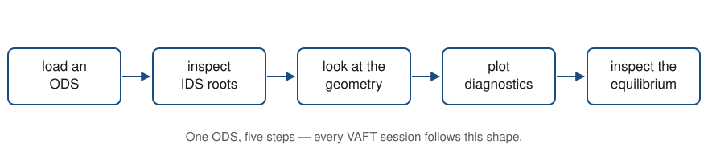

# What VAFT is

## A shot, and what we do with it

**VEST** is the spherical tokamak at Seoul National University. One **shot** is
one discharge: a few hundred milliseconds in which coil currents ramp, a plasma
forms, and every diagnostic records a signal.

**VAFT** is the analysis interface for that data [@yun2025vaft]. It loads a
discharge, gives you its measurements in a standard structure, and plots them.

::: {.notes}
[2 min]

NARRATE:
Set the scene before any code. The audience needs to know that a shot is a few
hundred milliseconds, not a steady state — everything downstream depends on that.

WARN:
Do not call VAFT a file format. It is an analysis interface over OMAS.

TRANSITION:
From what a shot is, to how its data is organised.
:::

## The workflow

{#fig-workflow width="95%"}

Every session in this course follows @fig-workflow.

::: {.notes}
[1 min]

NARRATE:
This diagram is the spine of the whole tutorial. Point at each box and say which
notebook section covers it.
:::

# The data model

## ODS, IDS, and where things live

:::: {.columns}

::: {.column width="50%"}
**ODS** is how the data is held in memory — a dictionary whose keys are dotted
paths:

```python
ods["magnetics.ip.0.data"]
```

**IDS** is the vocabulary those paths use, from IMAS [@imbeaux2015imas], through
OMAS [@omas].
:::

::: {.column width="50%"}
Each top-level name is one IDS:

- `magnetics`
- `pf_active`
- `equilibrium`
- `wall`

A diagnostic that did not run is simply **absent**.
:::

::::

::: {.notes}
[3 min]

NARRATE:
Stress the two-column split: the left is syntax, the right is vocabulary.

WARN:
Students reliably assume every shot has every IDS. It does not, and checking the
keys first is the habit to build.
:::

## Subject is not storage

Plot functions are named for **what the data physically is**, not where it sits:

```python
vaft.omas.plot_plasma_current_time(ods)   # reads the `magnetics` IDS
vaft.omas.plot_pf_coil_time_current(ods)  # reads the `pf_active` IDS
```

The canonical grammar is

$$\texttt{plot\_\{subject\}\_\{view\}[\_\{quantity\}]}$$

::: {.notes}
[2 min]

WARN:
This is the single most common misconception. The name is *not* the IDS. Say it
twice.
:::

# Reading the data

## One pattern, repeated

```python
import vaft
import matplotlib.pyplot as plt

ods = vaft.omas.sample_ods()
vaft.omas.plot_plasma_current_time(ods)
plt.show()
```

That is the whole interface: a canonical name, the ODS, and `plt.show()`.

::: {.notes}
[2 min]

NARRATE:
Type this live if the room allows it. The point is how little there is to
memorise.

TRANSITION:
Hand over to the notebook for the remaining diagnostics.
:::

## Units are chosen, and they are honest

A discharge reads as $84.1\ \mathrm{kA}$, not $8.41\times10^{4}\ \mathrm{A}$.

The stored value never changes — `ods["magnetics.ip.0.data"]` is in amperes. What
changes is the display, and the rule is:

> Unit and scaling always move together. A label saying `kA` is a promise that
> the numbers beside it were divided by 1000.

An unsupported unit is refused rather than silently relabelling correct numbers.

::: {.notes}
[2 min]

NARRATE:
The refusal is the interesting part — demonstrate `yunit="furlongs"` in the
notebook if there is time.
:::

## References

::: {#refs}
:::
